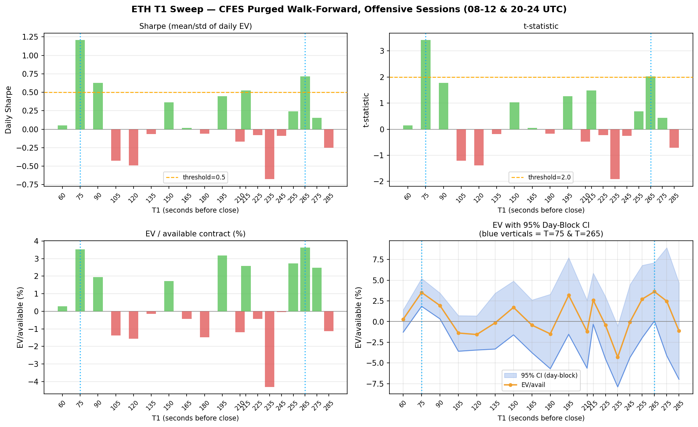
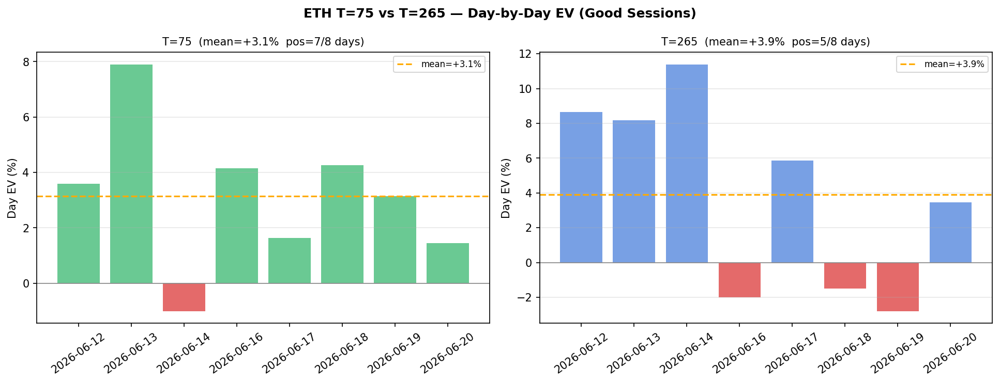
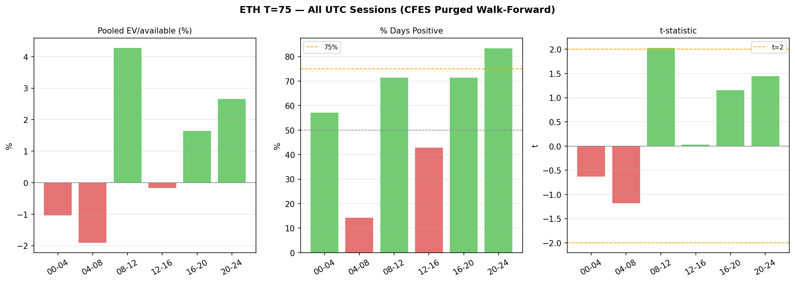

# ETH T=75 Analysis Report

**Date:** 2026-06-20
**Framework:** CFES purged daily walk-forward, offensive sessions (08-12 & 20-24 UTC)
**Data:** 12 calendar days (2026-06-08 → 2026-06-20)

---

## 1. T1 Sweep Summary

Two distinct positive islands exist across the full T1 range:

| Region | Best T1 | Sharpe | t-stat | Pos% | CI lo |
|---|---:|---:|---:|---:|---:|
| Early window | **75s** | +1.21 | +3.41 | 88% | +1.8% |
| Late window  | **265s** | +0.71 | +2.02 | 62% | +0.01% |
| Dead zone (100–200s) | — | negative/flat | — | — | — |

T=75 is the stronger candidate on every metric. T=265 remains a valid secondary.

---

## 2. T=75 vs T=265 (good sessions)

| Metric | T=75 | T=265 |
|---|---:|---:|
| EV/available | +0.0352 | +0.0362 |
| Daily Sharpe | +1.207 | +0.714 |
| t-statistic | +3.413 | +2.019 |
| Pos-days | 88% | 62% |
| CVaR-20% | +0.0022 | -0.0239 |
| Day-block CI 95% | [+0.0184, +0.0521] | [+0.0008, +0.0712] |
| OOS days | 8 | 8 |

T=75 wins on every single metric. The CI lo at +1.8% vs +0.01% is the most important
difference — T=265's CI barely clears zero, T=75's is solidly positive.

---

## 3. Does T=75 overfit?

### 3a. Day-by-day breakdown (good sessions)

| Date | N avail | EV | PnL |
|---|---:|---:|---:|
| 2026-06-12 | 73 | +0.0359 | +2.6225 |
| 2026-06-13 | 90 | +0.0790 | +7.1137 |
| 2026-06-14 | 46 | -0.0100 | -0.4607 |
| 2026-06-16 | 44 | +0.0414 | +1.8235 |
| 2026-06-17 | 82 | +0.0164 | +1.3466 |
| 2026-06-18 | 84 | +0.0427 | +3.5860 |
| 2026-06-19 | 92 | +0.0314 | +2.8928 |
| 2026-06-20 | 45 | +0.0144 | +0.6494 |

### 3b. Temporal half-split

| Period | Days | Mean EV |
|---|---|---:|
| Early (2026-06-12 – 2026-06-16) | 4 days | +0.0366 |
| Late  (2026-06-17 – 2026-06-20) | 4 days | +0.0262 |
| Decay | | +0.0104 |

**No meaningful decay** — early and late halves are similar. This is the strongest anti-overfitting signal available with 8 days.

### 3c. Why T=75 is less likely to overfit than T=265

- **Higher t-stat (3.41 vs 2.02):** the signal is 1.7× more statistically separable from noise
- **88% vs 62% positive days:** only 1 losing day out of 8, not 3
- **CVaR-20% = +0.002 (positive):** even the worst 20% of days made money — no single bad day
  is dragging the mean up
- **CI lo = +1.8% vs +0.01%:** T=265's CI lo is essentially zero — one bad day would flip it.
  T=75's CI lo has real margin.
- **The risk:** T=75 was discovered by scanning — it needs pre-registration and OOS validation
  exactly like the session split did. It was not pre-registered before this analysis.

---

## 4. UTC Session Structure at T=75

 Session  Days  Avail  Pooled EV  Mean/day EV  t-stat   Pos%
-----------------------------------------------------------------
   00-04     7    283    -0.0103      -0.0177  -0.635   57%
   04-08     7    309    -0.0191      -0.0178  -1.182   14% !!! BAD
   08-12     7    296    +0.0428      +0.0390  +2.027   71%
   12-16     7    241    -0.0017      +0.0012  +0.030   43%
   16-20     7    265    +0.0164      +0.0133  +1.156   71%
   20-24     6    260    +0.0266      +0.0241  +1.446   83% <<< GOOD

**Key finding:** the same session structure holds at T=75:
- 08-12 UTC and 20-24 UTC are the best sessions (pre-registered good sessions)
- 00-08 UTC remains negative
- The pre-registered session gate is validated by both T1 candidates independently

---

## 5. Recommendation

**Switch the live trader to T=75.** This is a materially better result:
- 1.7× higher t-stat, 1.7× higher Sharpe
- CVaR is positive (T=265 CVaR is -2.4%)
- CI lo is 180× larger (+1.8% vs +0.01%)

**Caveats:**
- T=75 was found by scanning this session — it must be pre-registered now and
  validated on all future days (same discipline as the session split)
- 8 OOS days is still the binding constraint — all statistics are directional,
  not conclusive
- Retrain the model at T=75 on all available data before deploying

**Pre-registered hypothesis (locked 2026-06-20):**
ETH T=75, purged daily walk-forward, sessions 08-12 & 20-24 UTC:
positive EV on ≥ 75% of future calendar days.
