# CLI Trader Tick Flow

This is a flow chart and description of an arbitrage bot trading on Kalshi and Polymarket's BTC 15m direction market. This flow describes one pass through the `while True` loop in `cli_trader.py`. The final sleep/continue path loops back into the next tick.

The bot has two separate cadences:

- `--interval` controls the decision loop cadence: how often the bot calculates arbitrage, evaluates entry/hold/exit checks, writes CSV rows, and may act.
- `--log-interval` controls routine snapshot logging only. The default is 10 seconds. Actionable arbitrage, preflight, trade, partial-entry, hold, and exit logs are still emitted immediately.

When websocket mode is enabled, background websocket tasks continuously update cached market state. The decision loop waits for a websocket event or a timeout, calculates once, and then sleeps out the remaining `--interval`. Rapid websocket messages are therefore coalesced into the next decision tick unless the loop is already waiting.

```mermaid
flowchart TD
    TickStart([Tick start])

    TickStart --> DataMode{{"Websocket enabled?"}}
    DataMode -- yes --> WaitUpdate{{"wait_for_update"}}
    DataMode -- no --> FetchMarketState{{fetch_market_state}}
    WaitUpdate --> CachedState["Read cached market state"]
    CachedState --> TickContext

    FetchMarketState --> ParallelFetchA["Parallel: Kalshi market/orderbook"]
    FetchMarketState --> ParallelFetchB["Parallel: Polymarket market"]
    ParallelFetchA --> BuildSnapshots["Build snapshots"]
    ParallelFetchB --> BuildSnapshots

    BuildSnapshots --> ParallelFetchC["Parallel: Polymarket orderbooks"]
    BuildSnapshots --> ParallelFetchD["Parallel: source prices"]
    ParallelFetchC --> TickContext["Tick context"]
    ParallelFetchD --> TickContext

    TickContext --> CalcArb["Calculate best_arbitrage"]
    CalcArb --> CsvBuffer["Append CSV row"]
    CsvBuffer --> LogGate{{"Routine log due or actionable arbitrage?"}}
    LogGate -- yes --> PrintSnapshot["Print snapshot/log signal"]
    LogGate -- no --> ContractChanged
    PrintSnapshot --> ContractChanged

    ContractChanged{{"New contract?"}}
    ContractChanged -- yes --> ContractSetup["Reset contract state"]
    ContractChanged -- no --> HasPosition
    ContractSetup --> HasPosition

    HasPosition{{"Open position?"}}
    HasPosition -- no --> EntryGate
    HasPosition -- yes --> PendingExit{{"Pending exit?"}}

    PendingExit -- yes --> RetryExit{{execute_position_exit}}
    RetryExit --> ExitDone{{"All remaining legs exited?"}}
    ExitDone -- yes --> ClearPosition["Cooldown and clear position"]
    ExitDone -- no --> KeepPending["Keep pending exit"]
    ClearPosition --> EntryGate
    KeepPending --> FlushCheck

    PendingExit -- no --> BoundaryCheck{{"Inside no-trade boundary?"}}
    BoundaryCheck -- yes --> BoundaryReview["Position review"]
    BoundaryReview --> HoldReview{{"Hold checks pass?"}}
    BoundaryCheck -- no --> HoldReview

    HoldReview --> StrategyDecision{{"Exit strategy says exit?"}}
    StrategyDecision -- no --> EntryGate
    StrategyDecision -- yes --> ExitBothLegs{{execute_position_exit}}

    ExitBothLegs --> ExitPoly["Try Polymarket sell"]
    ExitPoly --> PolyExitOK{{"Polymarket exit filled?"}}
    PolyExitOK -- no liquidity or FOK fail --> ExitPartial["Exit partial remains"]
    PolyExitOK -- yes --> ExitKalshi["Try Kalshi sell or opposite hedge"]
    ExitKalshi --> KalshiExitOK{{"Kalshi exit filled?"}}
    KalshiExitOK -- yes --> ClearPosition
    KalshiExitOK -- no liquidity or FOK fail --> ExitPartial
    ExitPartial --> KeepPending

    EntryGate{{"Entry gate passes?"}}
    EntryGate -- no --> FlushCheck
    EntryGate -- yes --> PreliminaryEntryFilter{{"Preliminary source checks pass?"}}
    PreliminaryEntryFilter -- no --> FlushCheck

    PreliminaryEntryFilter -- pass --> Preflight{{trade_preflight}}
    Preflight --> PreflightParallelA["Parallel: Kalshi buy liquidity"]
    Preflight --> PreflightParallelB["Parallel: Polymarket buy liquidity"]
    PreflightParallelA --> EntryFilter
    PreflightParallelB --> EntryFilter

    EntryFilter{{"Executable entry checks pass?"}}
    EntryFilter -- no liquidity --> NoEntryLiquidity["No trade"]
    EntryFilter -- no edge --> NoEntryEdge["No trade"]
    NoEntryLiquidity --> FlushCheck
    NoEntryEdge --> FlushCheck

    EntryFilter -- pass --> ExecuteArb{{execute_arbitrage}}
    ExecuteArb --> LiveRecheck{{"Live recheck passes?"}}
    LiveRecheck -- no --> Cooldown["Cooldown"]
    Cooldown --> FlushCheck
    LiveRecheck -- yes --> KalshiFirst["Kalshi FOK buy"]

    KalshiFirst --> KalshiFill{{"Kalshi filled full size?"}}
    KalshiFill -- no fill --> FlushCheck
    KalshiFill -- partial fill --> CleanupKalshi["Cleanup Kalshi leg"]
    KalshiFill -- unknown --> KeepPending
    KalshiFill -- yes --> PostFillCheck{{"Post-fill Polymarket liquidity and edge valid?"}}

    PostFillCheck -- no liquidity --> CleanupKalshi
    PostFillCheck -- no edge --> CleanupKalshi
    CleanupKalshi --> CleanupDone{{"Cleanup complete?"}}
    CleanupDone -- yes --> Cooldown
    CleanupDone -- no --> KeepPending

    PostFillCheck -- yes --> PolymarketSecond["Polymarket FOK buy"]
    PolymarketSecond --> PolyFill{{"Polymarket filled?"}}
    PolyFill -- yes --> OpenMatched["Open matched position"]
    PolyFill -- no liquidity or FOK fail --> CleanupKalshi
    OpenMatched --> FlushCheck

    FlushCheck{{"Flush or stop?"}}
    FlushCheck -- continue --> Sleep["Sleep remaining time until next interval"]
    Sleep --> TickStart
    FlushCheck -- stop --> End([Stop])

    FetchMarketState -. exception .-> ErrorHandler{{"On KeyboardInterrupt: flush pending rows and raise; on FatalTradeError: log fatal and flush; on other exception: log traceback path in surrounding handler"}}
    WaitUpdate -. exception .-> ErrorHandler
    ErrorHandler --> TickStart
```

## Check Details

| Area | Checks and outcomes |
| --- | --- |
| `DataMode` | Uses `AsyncMarketContext.wait_for_update()` unless `--disable-websocket` is set. Websocket updates run in background tasks; the decision loop still runs at the `--interval` cadence after each tick. |
| `LogGate` | Prints routine snapshot lines only when `--log-interval` has elapsed, on `--once`, on a new contract, or when an actionable raw arbitrage exceeds `--min-profit`. Operational logs are not throttled by this gate. |
| `EntryGate` | Requires no open position, outside no-trade boundary, an arbitrage candidate, raw expected profit above `min_profit`, `trades_done` below `max_trades`, and no contract cooldown. Failure means no new entry this tick. |
| `PreliminaryEntryFilter` | Requires Polymarket data, active Kalshi market, both targets, direction agreement, source gap within `source_gap_threshold`, entry distance above `entry_required_distance`, target divergence within `target_divergence_threshold`, and fee-aware profit at least `min_profit_after_fees`. Failure means no new entry this tick. |
| `EntryFilter` | Requires executable contracts, Kalshi liquidity, Polymarket liquidity, Polymarket notional at least `POLYMARKET_MIN_ORDER_NOTIONAL`, adjusted profit above `min_adjusted_profit`, and source checks still passing with executable cost. No Kalshi or Polymarket liquidity means no trade before any order is placed. |
| `LiveRecheck` | Repeats preflight immediately before live order placement. If liquidity disappears or adjusted profit falls below `min_adjusted_profit`, the trade is skipped and cooldown is applied. This matches the `entry aborted before Polymarket placement` concise-log path. |
| `HoldReview` | Checks data availability, direction agreement, source gap, hold distance, and target divergence. Failure does not automatically exit; it moves to `ExitStrategy`. |
| `ExitStrategy` | Exits on data-incomplete cushioned unwind, `held_winners` zero emergency, profit capture by liquidation edge, profit capture by total liquidation value plus cushion, favorable two-winner near-expiry/near-target state, or urgent one-winner negative unwind. Otherwise it holds. |
| `execute_position_exit` | When both legs remain, Polymarket is sold first. If Polymarket FOK fails, both legs remain pending and the bot retries next tick. If Polymarket exits, Kalshi is sold next; if Kalshi sell liquidity is missing, it tries the opposite-side hedge. Remaining unfilled legs become `EXIT PARTIAL`, matching the concise-log pending cleanup lines. |

## Bubble Details

| Bubble | Meaning | Why it is necessary |
| --- | --- | --- |
| `Tick start` | Begins one loop iteration. | Provides the loop anchor so the chart shows continuous polling. |
| `Websocket enabled?` | Chooses websocket-backed state or legacy HTTP polling. | Keeps the trading logic shared while allowing lower-latency websocket state. |
| `wait_for_update` | Waits for a websocket event or `--ws-report-interval` timeout. | Allows background websocket updates to wake the decision loop without making every websocket message a separate trade decision. |
| `Read cached market state` | Reads the latest `AsyncMarketContext` state. | Uses continuously refreshed websocket state for this tick's calculations. |
| `fetch_market_state` | Gets the active markets, orderbooks, and source prices. | Without fresh state, entry and exit decisions would use stale prices and liquidity. |
| `Parallel: Kalshi market/orderbook` | Fetches Kalshi market and book data. | Needed for Kalshi price, liquidity, contract status, and target context. |
| `Parallel: Polymarket market` | Finds or reuses the matching Polymarket market. | Without a matched market, the bot cannot form the hedge leg. |
| `Build snapshots` | Converts raw market data into normalized snapshots. | Keeps later checks using consistent fields. |
| `Parallel: Polymarket orderbooks` | Fetches Polymarket CLOB books. | Needed to know whether the Polymarket leg is actually executable. |
| `Parallel: source prices` | Fetches Kalshi and Polymarket BTC reference prices. | Needed for direction, target, distance, and source-gap filters. |
| `Tick context` | Prepares per-tick contract and state context. | Without this, the bot cannot detect contract changes or write the correct CSV row. |
| `Calculate best_arbitrage` | Runs `cli.best_arbitrage()` against the current Kalshi and Polymarket snapshots. | This is the raw opportunity calculation and happens every decision tick, independent of routine log frequency. |
| `Append CSV row` | Buffers the current tick's CSV row. | Preserves per-tick data even when routine terminal/log snapshots are throttled. |
| `Routine log due or actionable arbitrage?` | Checks `--log-interval`, `--once`, new-contract status, and raw arbitrage above `--min-profit`. | Separates high-frequency scanning from lower-frequency routine logging while keeping signals immediate. |
| `Print snapshot/log signal` | Prints the market snapshot when due or when raw arbitrage is actionable. | Keeps `trader_log.txt` readable without hiding actionable opportunities. |
| `New contract?` | Detects a transition to a different BTC 15m contract. | Prevents old SMA/context from leaking into the next contract. |
| `Reset contract state` | Clears per-contract tracking and logs the new contract context. | Without this, boundary checks and reference deltas can be wrong. |
| `Open position?` | Checks whether the bot is already holding a matched or cleanup position. | Prevents overlapping trades unless the current one is resolved. |
| `Pending exit?` | Checks whether prior cleanup or exit is incomplete. | Ensures unfinished exits are retried before new entries. |
| `execute_position_exit` | Attempts to close remaining position legs. | Without this, partial entries or failed exits can remain exposed until settlement. |
| `All remaining legs exited?` | Confirms whether cleanup is complete. | Separates clean closure from pending retry state. |
| `Cooldown and clear position` | Applies a safety pause and removes the open position. | Prevents immediate re-entry into the same unstable contract after an exit. |
| `Keep pending exit` | Preserves unfinished leg state for retry. | Without this, the bot could forget live exposure. |
| `Inside no-trade boundary?` | Checks whether the contract is near open or expiry. | Near-boundary markets are unstable; this triggers position review and blocks new entry. |
| `Position review` | Reviews an open position near the no-trade boundary. | Makes late-window exposure visible before exit logic runs. |
| `Hold checks pass?` | Evaluates whether the original hold conditions still look valid. | Prevents blind holding after source, distance, or direction assumptions fail. |
| `Exit strategy says exit?` | Decides whether a failed hold check or profit opportunity should trigger exit. | Avoids exiting every failed hold check when liquidation is poor. |
| `Try Polymarket sell` | Attempts to close the Polymarket leg first when both legs remain. | Matches the current code path; a failed FOK keeps both legs pending. |
| `Polymarket exit filled?` | Confirms whether the Polymarket sell actually executed. | Without this, the bot could assume a hedge was closed when it was not. |
| `Try Kalshi sell or opposite hedge` | Attempts to close Kalshi, falling back to buying the opposite side. | Handles cases where direct Kalshi sell liquidity is missing. |
| `Kalshi exit filled?` | Confirms whether the Kalshi exit or hedge executed. | Needed to avoid clearing an exposed Kalshi leg. |
| `Exit partial remains` | Records that at least one exit leg is still open. | This is the path seen in concise logs when FOK sell or Kalshi liquidity fails. |
| `Entry gate passes?` | Checks high-level conditions for considering a new trade. | Avoids expensive preflight and live orders when basic requirements fail. |
| `Preliminary source checks pass?` | Validates source, target, direction, distance, and fee-aware profit before preflight. | Prevents trades based on raw market edge when source context is unsafe. |
| `trade_preflight` | Builds executable Kalshi and Polymarket plans. | Converts displayed arbitrage into actual book-aware tradeability. |
| `Parallel: Kalshi buy liquidity` | Checks executable Kalshi buy liquidity. | Without it, Kalshi FOK orders may fail or partially expose cleanup logic. |
| `Parallel: Polymarket buy liquidity` | Checks executable Polymarket buy liquidity. | Without it, the bot can buy Kalshi first and then fail to hedge. |
| `Executable entry checks pass?` | Confirms size, liquidity, notional, adjusted profit, and source checks. | Blocks trades that are profitable only on displayed top-of-book quotes. |
| `No trade` | Ends entry attempt when liquidity or edge is insufficient. | Avoids unnecessary live order placement. |
| `execute_arbitrage` | Starts the live or dry-run entry sequence. | Encapsulates recheck, Kalshi-first execution, Polymarket hedge, and cleanup. |
| `Live recheck passes?` | Repeats preflight immediately before orders. | Catches edge decay like the concise-log `entry aborted before Polymarket placement` case. |
| `Cooldown` | Pauses re-entry after execution failure or edge decay. | Prevents repeated attempts into the same unstable book state. |
| `Kalshi FOK buy` | Places the Kalshi leg first as fill-or-kill. | This is the current execution order; without verification the bot could hedge the wrong size. |
| `Kalshi filled full size?` | Verifies the Kalshi order outcome. | Separates no-fill, partial-fill, unknown-state, and fully hedgable states. |
| `Cleanup Kalshi leg` | Unwinds a Kalshi fill that should not be kept. | Needed after Polymarket liquidity disappears or edge fails post-fill. |
| `Post-fill Polymarket liquidity and edge valid?` | Rechecks Polymarket book and adjusted profit after Kalshi fills. | Protects against stale preflight causing unhedged Kalshi exposure. |
| `Cleanup complete?` | Confirms whether Kalshi cleanup succeeded. | If cleanup fails, the position must stay pending. |
| `Polymarket FOK buy` | Places the Polymarket hedge leg. | Completes the matched position when filled. |
| `Polymarket filled?` | Confirms the hedge fill. | If it fails, the bot must clean up the already-filled Kalshi leg. |
| `Open matched position` | Stores the active two-leg position. | Without this, the bot could not monitor, exit, or settle the trade. |
| `Flush or stop?` | Handles CSV flushing, one-shot exit, and loop continuation. | Prevents data loss and gives the loop a controlled end path. |
| `Sleep remaining time until next interval` | Sleeps `max(0, interval - elapsed)` after each tick. | Keeps the decision loop near the configured cadence without adding a full extra delay after work already took time. |
| `Stop` | Ends the loop when requested. | Needed for `--once` behavior. |
| `ErrorHandler` | Handles interrupts and fatal errors. | Ensures pending rows are flushed and exceptions do not silently corrupt state. |

## Parameters

| Parameter | Default value | Purpose |
| --- | ---: | --- |
| `SETTLEMENT_PAYOUT_AFTER_FEES` | `0.98` | Winner payout value used for fee-aware expected settlement PnL. |
| `CONTRACT_WINDOW_SECONDS` | `15 * 60` | Expected contract duration. |
| `CONTRACT_BOUNDARY_NO_TRADE_SECONDS` | `60.0` | No-entry boundary at the beginning and end of a contract. |
| `EXIT_LIMIT_DEVIATION` | `0.01` | Amount crossed from best bid/ask for exit orders. |
| `POLYMARKET_MIN_ORDER_NOTIONAL` | `1.0` | Minimum Polymarket order notional. |
| `KALSHI_ORDER_VERIFY_ATTEMPTS` | `5` | Number of Kalshi order verification attempts. |
| `KALSHI_ORDER_VERIFY_DELAY_SECONDS` | `0.25` | Base delay between Kalshi verification attempts. |
| `POLYMARKET_SELL_BALANCE_ATTEMPTS` | `8` | Number of conditional token balance checks before Polymarket sell cleanup. |
| `POLYMARKET_SELL_BALANCE_DELAY_SECONDS` | `0.75` | Delay between Polymarket conditional balance checks. |
| `CONTRACT_FAILURE_COOLDOWN_SECONDS` | `60.0` | Cooldown after contract-specific failures. |
| `EDGE_RECHECK_COOLDOWN_SECONDS` | `30.0` | Cooldown after edge recheck failure. |
| `EXECUTION_FAILURE_COOLDOWN_SECONDS` | `5 * 60.0` | Cooldown after execution or hedge cleanup failures. |
| `PROFIT_CAPTURE_MIN_EDGE` | `0.06` | Minimum liquidation edge over entry for profit capture. |
| `EXIT_CUSHION` | `0.03` | Minimum non-emergency exit edge over entry. |
| `ONE_WINNER_NEGATIVE_EXIT_DISTANCE` | `3.0` | Distance threshold for urgent one-winner negative unwind. |
| `ONE_WINNER_NEGATIVE_EXIT_SECONDS` | `45.0` | Time threshold for urgent one-winner negative unwind. |
| `TWO_WINNER_PROFIT_EXIT_SECONDS` | `90.0` | Time threshold for favorable two-winner near-expiry profit exit. |
| `TWO_WINNER_PROFIT_EXIT_DISTANCE` | `20.0` | Distance threshold for favorable two-winner near-target profit exit. |
| `--interval` | `btc.POLL_SECONDS` | Decision-loop interval for arbitrage calculation, entry/hold/exit checks, CSV buffering, and possible actions. |
| `--log-interval` | `10.0` | Routine snapshot log interval. Actionable arbitrage and trading/exit signals still log immediately. |
| `--csv-dir` | `btc.DATA_DIR` | Directory for per-contract CSV output. |
| `--flush-every` | `1` | Number of pending CSV rows before append. |
| `--min-profit` | `0.0` | Minimum raw displayed profit before preflight. |
| `--min-adjusted-profit` | `0.02` | Minimum executable adjusted profit before placement. |
| `--min-profit-after-fees` | `0.05` | Minimum fee-aware profit after winner payout fees. |
| `--source-gap-threshold` | `100.0` | Maximum allowed Kalshi/Polymarket BTC source gap. |
| `--target-divergence-threshold` | `35.0` | Maximum allowed target divergence. |
| `--hold-distance-multiplier` | `0.25` | Multiplier for required hold distance. |
| `--take-profit-exit-value` | `1.04` | Total executable liquidation value that can trigger take profit. |
| `--profit-capture-min-edge` | `PROFIT_CAPTURE_MIN_EDGE` | CLI override for minimum profit capture edge. |
| `--exit-cushion` | `EXIT_CUSHION` | CLI override for minimum non-emergency exit cushion. |
| `--contracts` | `1` | Maximum matched contracts/shares per leg. |
| `--max-trades` | `1` | Maximum live arbitrage executions per process. |
| `--live` | `False` | Submit real orders when set. |
| `--once` | `False` | Run one polling cycle when set. |
| `--print-arb-orderbook` | `False` | Print orderbook details on profitable raw arbitrage. |
| `--book-depth-levels` | `6` | Maximum orderbook levels to print. |
| `--disable-websocket` | `False` | Use legacy HTTP polling instead of websocket-backed cached market state. |
| `--ws-report-interval` | `2.0` | Maximum wait for a websocket event before the decision loop continues anyway. |
| `--ws-stale-seconds` | `5.0` | Treat websocket books as stale for live exit handling after this many seconds without updates. |
| `--chase-interval` | `2.0` | Seconds to wait for a passive walking-limit exit order before checking/canceling/repricing. |
| `--chase-max-steps` | `6` | Maximum cancel/replace attempts for walking-limit live exits. |
