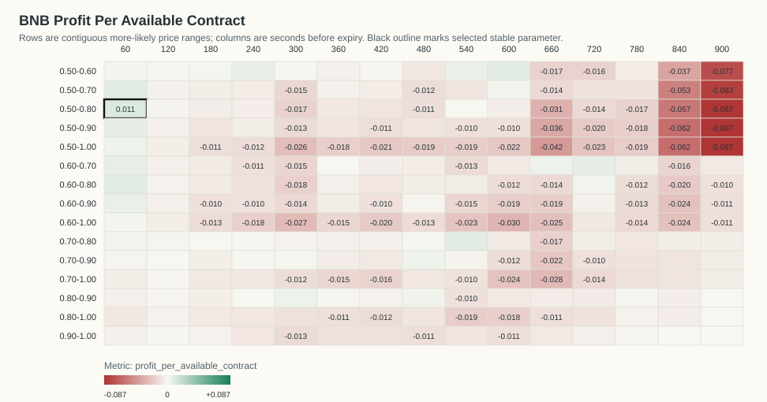
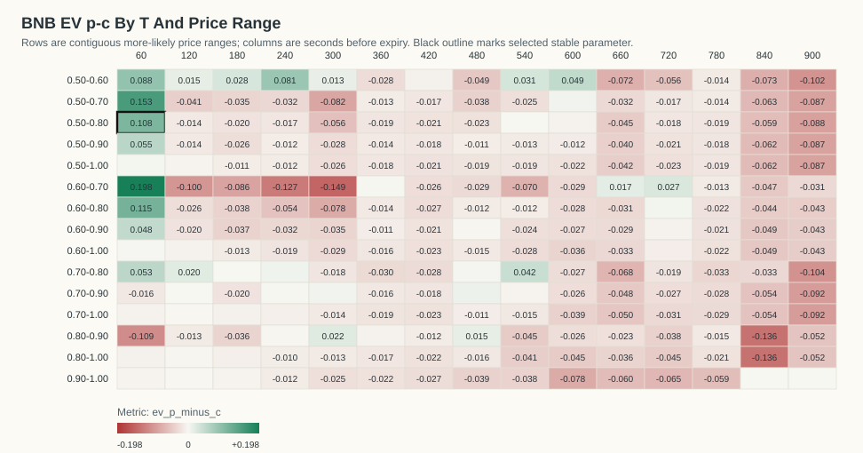
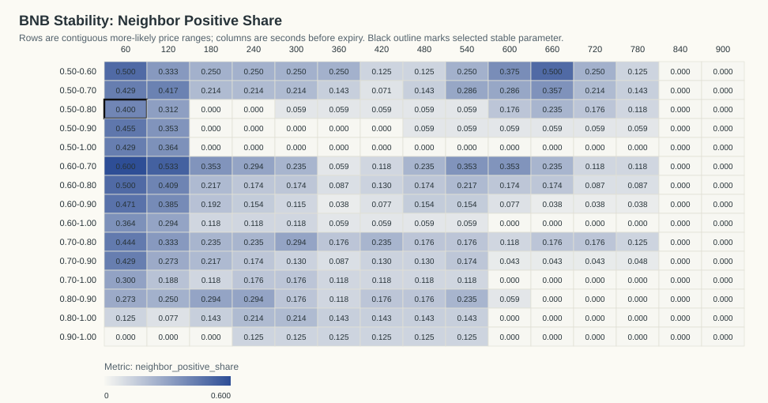
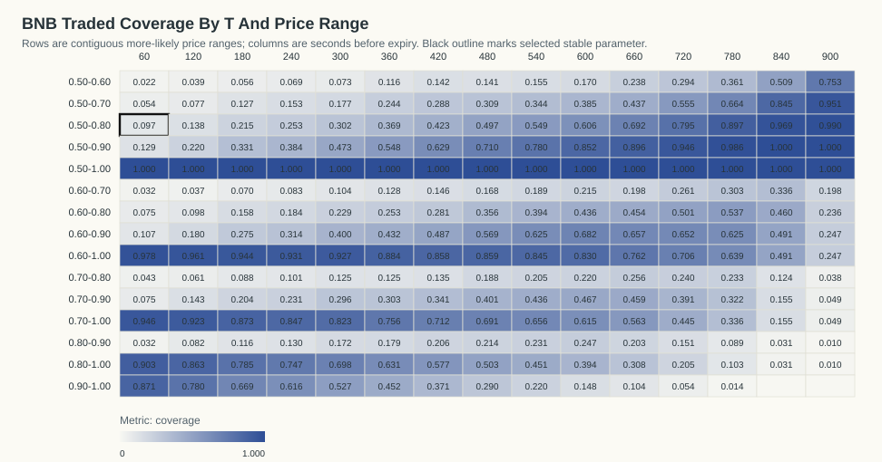

# BNB Kalshi Profit-Per-Available Stability Analysis

Generated: `2026-06-07T14:35:24Z`

## Table Of Contents

- [Objective](#objective)
- [Result](#result)
- [Stability Criteria](#stability-criteria)
- [Visualizations](#visualizations)
- [Top Objective Cells](#top-objective-cells)
- [Top Stable Cells](#top-stable-cells)
- [Time And Day Check For Selected Parameter](#time-and-day-check-for-selected-parameter)
- [Date/Time Dependency Tests](#datetime-dependency-tests)
- [Artifacts](#artifacts)

## Objective

The requested objective is:

```text
(p - c) * N_traded_in_range / N_total_backtested_at_T
```

This equals gross P&L per available contract at that horizon. `N_total_backtested_at_T` is the count of resolved contracts with a usable Kalshi quote row at that T.

## Result

No profitable parameter passed the stability criteria. The best exploratory objective cell is `T=60s`, price range `0.50-0.80`.

- Stability classification: `not stable`
- Profit per available contract: `0.0106`
- Gross P&L: `5.6400` across `534` available contracts
- N traded in range: `52`
- Coverage: `9.74%`
- P(success): `80.77%`
- Average cost c: `0.6992`
- EV p-c inside range: `0.1085`
- One-sided break-even p-value: `0.0528754`
- Contracts in source data: `577`
- Resolved official Kalshi outcomes: `577`

The raw objective argmax with `N >= 20` is this same exploratory cell: `T=60s`, range `0.50-0.80`, profit/available `0.0106`.

The p-value is an exact one-sided Poisson-binomial tail probability under the break-even null that each selected contract resolves correctly with probability equal to its own buy cost. It measures `P(X >= observed wins)` under that cost-implied null.

## Stability Criteria

A cell is classified stable when it has positive profit per available contract, `N >= 20`, at least four valid immediate neighbors, at least 70% of those neighbors are positive, average neighbor profit is positive, and it belongs to a positive connected component of at least eight cells.

Selected cell neighbor positive share: `40.00%` (`4/10` neighbors).
Selected cell neighbor mean profit/available: `0.0011`.
Positive connected component size: `15` cells.

## Visualizations

### Profit Per Available Contract Heatmap



### EV p-c Heatmap



### Neighbor Positive Share Heatmap



### Traded Coverage Heatmap



- 3D Profit Surface HTML: `plots/bnb_profit_surface_3d.html`
- 3D Stability Surface HTML: `plots/bnb_stability_surface_3d.html`

## Top Objective Cells

| T seconds | Price range | N traded | N total | Coverage | P(success) | Avg cost c | EV p-c | Gross P&L | Profit/available | p-value | Stable |
|---:|---|---:|---:|---:|---:|---:|---:|---:|---:|---:|---:|
| 60 | 0.50-0.80 | 52 | 534 | 9.74% | 80.77% | 0.6992 | 0.1085 | 5.6400 | 0.0106 | 0.05288 | 0 |
| 540 | 0.70-0.80 | 118 | 576 | 20.49% | 80.51% | 0.7631 | 0.0419 | 4.9500 | 0.0086 | 0.1672 | 0 |
| 60 | 0.60-0.80 | 40 | 534 | 7.49% | 85.00% | 0.7355 | 0.1145 | 4.5800 | 0.0086 | 0.0646 | 0 |
| 600 | 0.50-0.60 | 98 | 576 | 17.01% | 61.22% | 0.5635 | 0.0488 | 4.7800 | 0.0083 | 0.1915 | 0 |
| 60 | 0.50-0.70 | 29 | 534 | 5.43% | 79.31% | 0.6403 | 0.1528 | 4.4300 | 0.0083 | 0.05859 | 0 |
| 60 | 0.50-0.90 | 69 | 534 | 12.92% | 79.71% | 0.7423 | 0.0548 | 3.7810 | 0.0071 | 0.1765 | 0 |
| 720 | 0.60-0.70 | 150 | 575 | 26.09% | 69.33% | 0.6664 | 0.0269 | 4.0360 | 0.0070 | 0.2718 | 0 |
| 240 | 0.50-0.60 | 40 | 576 | 6.94% | 65.00% | 0.5690 | 0.0810 | 3.2390 | 0.0056 | 0.1912 | 0 |
| 60 | 0.60-0.90 | 57 | 534 | 10.67% | 82.46% | 0.7768 | 0.0477 | 2.7210 | 0.0051 | 0.2399 | 0 |
| 540 | 0.50-0.60 | 89 | 576 | 15.45% | 59.55% | 0.5648 | 0.0307 | 2.7300 | 0.0047 | 0.3178 | 0 |
| 60 | 0.50-1.00 | 534 | 534 | 100.00% | 96.44% | 0.9607 | 0.0037 | 2.0010 | 0.0037 | 0.3589 | 0 |
| 300 | 0.80-0.90 | 99 | 577 | 17.16% | 88.89% | 0.8672 | 0.0217 | 2.1460 | 0.0037 | 0.3223 | 0 |
| 480 | 0.70-0.90 | 231 | 576 | 40.10% | 83.12% | 0.8219 | 0.0093 | 2.1410 | 0.0037 | 0.3938 | 0 |
| 660 | 0.60-0.70 | 114 | 575 | 19.83% | 68.42% | 0.6675 | 0.0168 | 1.9100 | 0.0033 | 0.3934 | 0 |
| 480 | 0.80-0.90 | 123 | 576 | 21.35% | 88.62% | 0.8712 | 0.0150 | 1.8420 | 0.0032 | 0.3694 | 0 |
| 720 | 0.60-0.80 | 288 | 575 | 50.09% | 71.88% | 0.7140 | 0.0048 | 1.3780 | 0.0024 | 0.4576 | 0 |
| 60 | 0.70-0.80 | 23 | 534 | 4.31% | 82.61% | 0.7735 | 0.0526 | 1.2100 | 0.0023 | 0.3774 | 0 |
| 600 | 0.50-0.70 | 222 | 576 | 38.54% | 62.61% | 0.6209 | 0.0052 | 1.1640 | 0.0020 | 0.4653 | 0 |
| 60 | 0.60-1.00 | 522 | 534 | 97.75% | 97.13% | 0.9695 | 0.0018 | 0.9410 | 0.0018 | 0.462 | 0 |
| 180 | 0.50-0.60 | 32 | 568 | 5.63% | 59.38% | 0.5654 | 0.0283 | 0.9070 | 0.0016 | 0.4454 | 0 |

## Top Stable Cells

| T seconds | Price range | N traded | N total | Coverage | P(success) | Avg cost c | EV p-c | Gross P&L | Profit/available | p-value | Stable |
|---:|---|---:|---:|---:|---:|---:|---:|---:|---:|---:|---:|

## Time And Day Check For Selected Parameter

By ET date:

| ET date | N traded | N total | Coverage | P(success) | Avg cost c | EV p-c | Gross P&L | Profit/available | p-value |
|---|---:|---:|---:|---:|---:|---:|---:|---:|---:|
| 2026-05-31 | 4 | 39 | 10.26% | 75.00% | 0.7300 | 0.0200 | 0.0800 | 0.0021 | 0.7048 |
| 2026-06-01 | 9 | 88 | 10.23% | 66.67% | 0.7167 | -0.0500 | -0.4500 | -0.0051 | 0.7702 |
| 2026-06-02 | 7 | 95 | 7.37% | 85.71% | 0.6929 | 0.1643 | 1.1500 | 0.0121 | 0.3091 |
| 2026-06-03 | 9 | 84 | 10.71% | 77.78% | 0.7178 | 0.0600 | 0.5400 | 0.0064 | 0.5098 |
| 2026-06-04 | 3 | 72 | 4.17% | 100.00% | 0.7600 | 0.2400 | 0.7200 | 0.0100 | 0.438 |
| 2026-06-05 | 8 | 85 | 9.41% | 75.00% | 0.6863 | 0.0638 | 0.5100 | 0.0060 | 0.5154 |
| 2026-06-06 | 12 | 71 | 16.90% | 91.67% | 0.6592 | 0.2575 | 3.0900 | 0.0435 | 0.04657 |

By ET 4-hour close bucket:

| ET close-hour bucket | N traded | N total | Coverage | P(success) | Avg cost c | EV p-c | Gross P&L | Profit/available | p-value |
|---|---:|---:|---:|---:|---:|---:|---:|---:|---:|
| 00-03 | 6 | 73 | 8.22% | 83.33% | 0.6983 | 0.1350 | 0.8100 | 0.0111 | 0.4134 |
| 04-07 | 6 | 85 | 7.06% | 100.00% | 0.6700 | 0.3300 | 1.9800 | 0.0233 | 0.0866 |
| 08-11 | 8 | 90 | 8.89% | 75.00% | 0.6937 | 0.0563 | 0.4500 | 0.0050 | 0.5349 |
| 12-15 | 16 | 101 | 15.84% | 81.25% | 0.6937 | 0.1187 | 1.9000 | 0.0188 | 0.2263 |
| 16-19 | 7 | 101 | 6.93% | 85.71% | 0.7086 | 0.1486 | 1.0400 | 0.0103 | 0.3382 |
| 20-23 | 9 | 84 | 10.71% | 66.67% | 0.7267 | -0.0600 | -0.5400 | -0.0064 | 0.7909 |

## Date/Time Dependency Tests

These tests ask whether the selected rule's win/loss outcomes vary by date or by time bucket. They condition on the total number of wins and group sizes. For small tables the p-value is exact over all fixed-margin allocations; otherwise it uses deterministic fixed-margin permutation sampling.

| Grouping | Chi-square statistic | p-value | Method | Tables/permutations | Interpretation |
|---|---:|---:|---|---:|---|
| ET date | 3.2033 | 0.8301 | exact_fixed_margin | 6592 | no clear dependence |
| ET 4-hour bucket | 2.8904 | 0.7730 | exact_fixed_margin | 2863 | no clear dependence |

Conclusion: profitability may vary economically by date/time, but only p-values below 0.05 are flagged as statistically clear win-rate dependence in this report.

## Artifacts

- Entry ledger: `bnb_more_likely_entries_official.csv`
- Profit-per-available grid: `bnb_profit_per_available_grid.csv`
- Machine-readable summary: `bnb_profit_stability_summary.json`
- Official market cache: `bnb_official_market_results.json`

Fees are not included. Fees reduce expected value, especially near 0.50.
