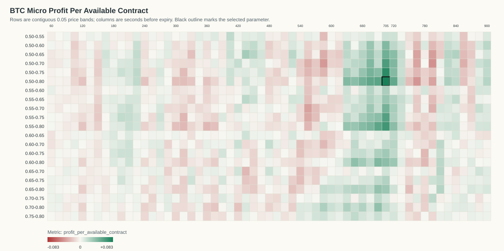
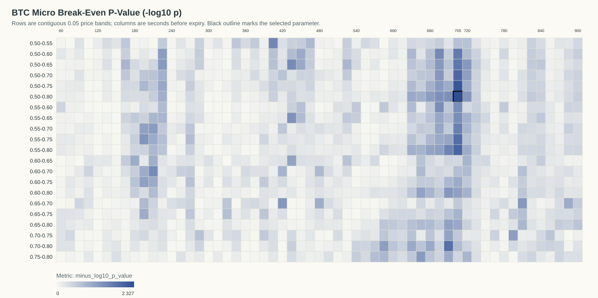
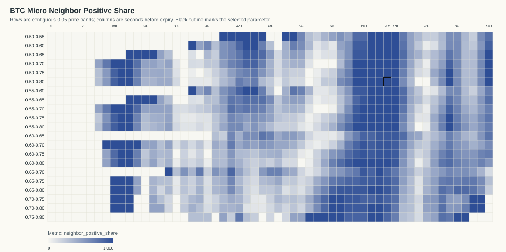

# BTC Price-Time Micro Optimization

Generated: `2026-06-07T14:51:04Z`

## Table Of Contents

- [Objective](#objective)
- [Result](#result)
- [P-Value Interpretation](#p-value-interpretation)
- [Stability Analysis](#stability-analysis)
- [Visualizations](#visualizations)
- [Top Micro Grid Cells](#top-micro-grid-cells)
- [Date/Time Dependency](#datetime-dependency)
- [Artifacts](#artifacts)

## Objective

Refine the BTC rule from the prior stable result `T=720s`, price range `0.50-0.80`.

Primary search grid:

- Time: `60` to `900` seconds before expiry in `15` second increments.
- Price bands: every contiguous band with endpoints from `0.50` to `0.80` in `0.05` increments.
- Minimum traded count for ranking: `N >= 20`.
- Row selection tolerance: `45` seconds, matching the prior BTC report for comparability.

The objective remains:

```text
(p - c) * N_traded_in_range / N_total_backtested_at_T
```

This is gross P&L per available contract before fees. Outcomes are official Kalshi API outcomes from the cached market results, not spot-price-derived outcomes.

## Result

Selected micro-optimized parameter: `T=705s`, price range `0.50-0.80`.

- Profit per available contract: `0.0825`
- Gross P&L: `15.2700` across `185` available contracts
- N traded in range: `155`
- Coverage: `83.78%`
- P(success): `75.48%`
- Average cost c: `0.6563`
- EV p-c inside range: `0.0985`
- One-sided break-even p-value: `0.00470758`
- Bonferroni p-value across all primary cells: `1`
- Bonferroni p-value across primary cells with `N >= 20`: `1`

Compared with the prior baseline `T=720s`, `0.50-0.80`, profit/available improves by `0.0278` and gross P&L improves by `5.1400` before fees.

Important price-range conclusion: the fine grid did not find a strictly narrower BTC band that beats `0.50-0.80` on profit per available contract. The best improvement is moving the timing from `720s` to `705s`, while keeping the same `0.50-0.80` price range.

Best strict narrower alternative: `T=705s`, `0.50-0.75`, profit/available `0.0750`, p-value `0.00607263`.

The exploratory full-grid argmax over `0.50-1.00` with 0.05 endpoints is `T=705s`, `0.50-0.80`, profit/available `0.0825`.

## P-Value Interpretation

Each grid row has an exact one-sided Poisson-binomial break-even p-value: under the null, each selected contract succeeds independently with probability equal to its own buy cost. The p-value is `P(X >= observed wins)` under that cost-implied null.

The CSV contains the p-value for every tested parameter. The raw row p-values are cell-level p-values. Because the best cell is selected after scanning a grid, the Bonferroni values above are included as conservative multiple-testing context.

## Stability Analysis

Stable cells in the primary grid: `225` of `1197` total cells.
Raw objective argmax: `T=705s`, `0.50-0.80`, profit/available `0.0825`, stable `1`.

Best stable cell: `T=705s`, `0.50-0.80`, profit/available `0.0825`.

Selected neighbor positive share: `100.00%` (`11/11` neighbors).
Selected neighbor mean profit/available: `0.0511`.
Selected positive connected component size: `183` cells.

A cell is classified stable when it has positive profit/available, `N >= 20`, at least four valid immediate neighbors, at least 70% positive neighbors, positive neighbor mean profit, and a positive connected component of at least eight cells.

## Visualizations

### Profit Per Available Heatmap



### Break-Even P-Value Heatmap



### Neighbor Positive Share Heatmap



- 3D Profit Surface HTML: `plots/btc_micro_profit_surface_3d.html`

## Top Micro Grid Cells

Top primary cells with `N >= 20`:

| T seconds | Price range | Width | N traded | N total | Coverage | P(success) | Avg cost c | EV p-c | Gross P&L | Profit/available | p-value | Neighbor + share | Stable |
|---:|---|---:|---:|---:|---:|---:|---:|---:|---:|---:|---:|---:|---:|
| 705 | 0.50-0.80 | 0.30 | 155 | 185 | 83.78% | 75.48% | 0.6563 | 0.0985 | 15.2700 | 0.0825 | 0.004708 | 100.00% | 1 |
| 705 | 0.50-0.75 | 0.25 | 131 | 185 | 70.81% | 74.05% | 0.6345 | 0.1060 | 13.8800 | 0.0750 | 0.006073 | 100.00% | 1 |
| 705 | 0.55-0.80 | 0.25 | 130 | 185 | 70.27% | 77.69% | 0.6808 | 0.0961 | 12.4900 | 0.0675 | 0.009661 | 100.00% | 1 |
| 705 | 0.50-0.70 | 0.20 | 104 | 185 | 56.22% | 72.12% | 0.6092 | 0.1119 | 11.6400 | 0.0629 | 0.01084 | 100.00% | 1 |
| 705 | 0.55-0.75 | 0.20 | 106 | 185 | 57.30% | 76.42% | 0.6594 | 0.1047 | 11.1000 | 0.0600 | 0.01251 | 100.00% | 1 |
| 690 | 0.50-0.80 | 0.30 | 152 | 185 | 82.16% | 73.03% | 0.6601 | 0.0702 | 10.6700 | 0.0577 | 0.0366 | 100.00% | 1 |
| 690 | 0.55-0.80 | 0.25 | 128 | 185 | 69.19% | 76.56% | 0.6841 | 0.0815 | 10.4300 | 0.0564 | 0.02589 | 100.00% | 1 |
| 675 | 0.50-0.80 | 0.30 | 148 | 184 | 80.43% | 73.65% | 0.6667 | 0.0698 | 10.3300 | 0.0561 | 0.03871 | 100.00% | 1 |
| 720 | 0.50-0.80 | 0.30 | 153 | 185 | 82.70% | 71.90% | 0.6527 | 0.0662 | 10.1300 | 0.0548 | 0.04689 | 100.00% | 1 |
| 705 | 0.50-0.65 | 0.15 | 71 | 185 | 38.38% | 70.42% | 0.5751 | 0.1292 | 9.1700 | 0.0496 | 0.01704 | 100.00% | 1 |
| 660 | 0.50-0.80 | 0.30 | 138 | 184 | 75.00% | 73.19% | 0.6669 | 0.0650 | 8.9700 | 0.0488 | 0.05816 | 100.00% | 1 |
| 705 | 0.55-0.70 | 0.15 | 79 | 185 | 42.70% | 74.68% | 0.6347 | 0.1122 | 8.8600 | 0.0479 | 0.02267 | 100.00% | 1 |
| 675 | 0.50-0.75 | 0.25 | 118 | 184 | 64.13% | 71.19% | 0.6379 | 0.0740 | 8.7300 | 0.0474 | 0.05365 | 100.00% | 1 |
| 675 | 0.55-0.80 | 0.25 | 127 | 184 | 69.02% | 75.59% | 0.6899 | 0.0660 | 8.3800 | 0.0455 | 0.06084 | 100.00% | 1 |
| 720 | 0.50-0.70 | 0.20 | 106 | 185 | 57.30% | 68.87% | 0.6113 | 0.0774 | 8.2000 | 0.0443 | 0.05968 | 100.00% | 1 |
| 690 | 0.60-0.80 | 0.20 | 106 | 185 | 57.30% | 78.30% | 0.7065 | 0.0765 | 8.1100 | 0.0438 | 0.04817 | 100.00% | 1 |
| 675 | 0.50-0.70 | 0.20 | 90 | 184 | 48.91% | 70.00% | 0.6104 | 0.0896 | 8.0600 | 0.0438 | 0.04808 | 100.00% | 1 |
| 705 | 0.50-0.60 | 0.10 | 54 | 185 | 29.19% | 70.37% | 0.5559 | 0.1478 | 7.9800 | 0.0431 | 0.01876 | 100.00% | 1 |
| 630 | 0.50-0.80 | 0.30 | 134 | 184 | 72.83% | 72.39% | 0.6653 | 0.0586 | 7.8500 | 0.0427 | 0.08359 | 72.73% | 1 |
| 720 | 0.50-0.75 | 0.25 | 138 | 185 | 74.59% | 69.57% | 0.6389 | 0.0567 | 7.8300 | 0.0423 | 0.09334 | 100.00% | 1 |
| 660 | 0.55-0.80 | 0.25 | 118 | 184 | 64.13% | 75.42% | 0.6892 | 0.0651 | 7.6800 | 0.0417 | 0.07219 | 100.00% | 1 |
| 690 | 0.50-0.75 | 0.25 | 129 | 185 | 69.73% | 69.77% | 0.6387 | 0.0590 | 7.6100 | 0.0411 | 0.0925 | 100.00% | 1 |
| 720 | 0.50-0.65 | 0.15 | 76 | 185 | 41.08% | 68.42% | 0.5857 | 0.0986 | 7.4900 | 0.0405 | 0.04949 | 100.00% | 1 |
| 720 | 0.55-0.80 | 0.25 | 128 | 185 | 69.19% | 73.44% | 0.6767 | 0.0577 | 7.3800 | 0.0399 | 0.09317 | 100.00% | 1 |
| 690 | 0.55-0.75 | 0.20 | 105 | 185 | 56.76% | 73.33% | 0.6631 | 0.0702 | 7.3700 | 0.0398 | 0.07457 | 100.00% | 1 |

Best strict narrower cells inside `0.50-0.80`:

| T seconds | Price range | Width | N traded | N total | Coverage | P(success) | Avg cost c | EV p-c | Gross P&L | Profit/available | p-value | Neighbor + share | Stable |
|---:|---|---:|---:|---:|---:|---:|---:|---:|---:|---:|---:|---:|---:|
| 705 | 0.50-0.75 | 0.25 | 131 | 185 | 70.81% | 74.05% | 0.6345 | 0.1060 | 13.8800 | 0.0750 | 0.006073 | 100.00% | 1 |
| 705 | 0.55-0.80 | 0.25 | 130 | 185 | 70.27% | 77.69% | 0.6808 | 0.0961 | 12.4900 | 0.0675 | 0.009661 | 100.00% | 1 |
| 705 | 0.50-0.70 | 0.20 | 104 | 185 | 56.22% | 72.12% | 0.6092 | 0.1119 | 11.6400 | 0.0629 | 0.01084 | 100.00% | 1 |
| 705 | 0.55-0.75 | 0.20 | 106 | 185 | 57.30% | 76.42% | 0.6594 | 0.1047 | 11.1000 | 0.0600 | 0.01251 | 100.00% | 1 |
| 690 | 0.55-0.80 | 0.25 | 128 | 185 | 69.19% | 76.56% | 0.6841 | 0.0815 | 10.4300 | 0.0564 | 0.02589 | 100.00% | 1 |
| 705 | 0.50-0.65 | 0.15 | 71 | 185 | 38.38% | 70.42% | 0.5751 | 0.1292 | 9.1700 | 0.0496 | 0.01704 | 100.00% | 1 |
| 705 | 0.55-0.70 | 0.15 | 79 | 185 | 42.70% | 74.68% | 0.6347 | 0.1122 | 8.8600 | 0.0479 | 0.02267 | 100.00% | 1 |
| 675 | 0.50-0.75 | 0.25 | 118 | 184 | 64.13% | 71.19% | 0.6379 | 0.0740 | 8.7300 | 0.0474 | 0.05365 | 100.00% | 1 |
| 675 | 0.55-0.80 | 0.25 | 127 | 184 | 69.02% | 75.59% | 0.6899 | 0.0660 | 8.3800 | 0.0455 | 0.06084 | 100.00% | 1 |
| 720 | 0.50-0.70 | 0.20 | 106 | 185 | 57.30% | 68.87% | 0.6113 | 0.0774 | 8.2000 | 0.0443 | 0.05968 | 100.00% | 1 |
| 690 | 0.60-0.80 | 0.20 | 106 | 185 | 57.30% | 78.30% | 0.7065 | 0.0765 | 8.1100 | 0.0438 | 0.04817 | 100.00% | 1 |
| 675 | 0.50-0.70 | 0.20 | 90 | 184 | 48.91% | 70.00% | 0.6104 | 0.0896 | 8.0600 | 0.0438 | 0.04808 | 100.00% | 1 |
| 705 | 0.50-0.60 | 0.10 | 54 | 185 | 29.19% | 70.37% | 0.5559 | 0.1478 | 7.9800 | 0.0431 | 0.01876 | 100.00% | 1 |
| 720 | 0.50-0.75 | 0.25 | 138 | 185 | 74.59% | 69.57% | 0.6389 | 0.0567 | 7.8300 | 0.0423 | 0.09334 | 100.00% | 1 |
| 660 | 0.55-0.80 | 0.25 | 118 | 184 | 64.13% | 75.42% | 0.6892 | 0.0651 | 7.6800 | 0.0417 | 0.07219 | 100.00% | 1 |

Baseline row:

| T seconds | Price range | Width | N traded | N total | Coverage | P(success) | Avg cost c | EV p-c | Gross P&L | Profit/available | p-value | Neighbor + share | Stable |
|---:|---|---:|---:|---:|---:|---:|---:|---:|---:|---:|---:|---:|---:|
| 720 | 0.50-0.80 | 0.30 | 153 | 185 | 82.70% | 71.90% | 0.6527 | 0.0662 | 10.1300 | 0.0548 | 0.04689 | 100.00% | 1 |

## Date/Time Dependency

Selected parameter by ET date:

| ET date | N traded | N total | Coverage | P(success) | Avg cost c | EV p-c | Gross P&L | Profit/available | p-value |
|---|---:|---:|---:|---:|---:|---:|---:|---:|---:|
| 2026-06-01 | 15 | 17 | 88.24% | 86.67% | 0.6520 | 0.2147 | 3.2200 | 0.1894 | 0.06054 |
| 2026-06-02 | 80 | 96 | 83.33% | 73.75% | 0.6575 | 0.0800 | 6.4000 | 0.0667 | 0.0765 |
| 2026-06-03 | 60 | 72 | 83.33% | 75.00% | 0.6558 | 0.0942 | 5.6500 | 0.0785 | 0.0752 |

Selected parameter by ET 4-hour close-time bucket:

| ET close-hour bucket | N traded | N total | Coverage | P(success) | Avg cost c | EV p-c | Gross P&L | Profit/available | p-value |
|---|---:|---:|---:|---:|---:|---:|---:|---:|---:|
| 00-03 | 23 | 32 | 71.88% | 69.57% | 0.6396 | 0.0561 | 1.2900 | 0.0403 | 0.371 |
| 04-07 | 29 | 32 | 90.62% | 79.31% | 0.6631 | 0.1300 | 3.7700 | 0.1178 | 0.09261 |
| 08-11 | 28 | 32 | 87.50% | 75.00% | 0.6725 | 0.0775 | 2.1700 | 0.0678 | 0.2515 |
| 12-15 | 29 | 32 | 90.62% | 72.41% | 0.6414 | 0.0828 | 2.4000 | 0.0750 | 0.2298 |
| 16-19 | 17 | 25 | 68.00% | 76.47% | 0.6676 | 0.0971 | 1.6500 | 0.0660 | 0.2792 |
| 20-23 | 29 | 32 | 90.62% | 79.31% | 0.6555 | 0.1376 | 3.9900 | 0.1247 | 0.07919 |

Fixed-margin dependency tests:

| Grouping | Chi-square statistic | p-value | Method | Interpretation |
|---|---:|---:|---|---|
| ET date | 1.1512 | 0.584 | exact_fixed_margin | no clear dependence |
| ET 4-hour bucket | 1.0545 | 0.9601 | exact_fixed_margin | no clear dependence |

## Artifacts

- Official-outcome micro entries: `btc_micro_price_time_entries_official.csv`
- Primary micro grid with p-values: `btc_micro_price_time_grid.csv`
- Exploratory full price grid with p-values: `btc_micro_price_time_full_grid.csv`
- Machine-readable summary: `btc_micro_price_time_optimization_summary.json`
- Official market cache: `btc_official_market_results.json`

Fees are not included. Fees reduce every profit estimate, especially near 0.50.

