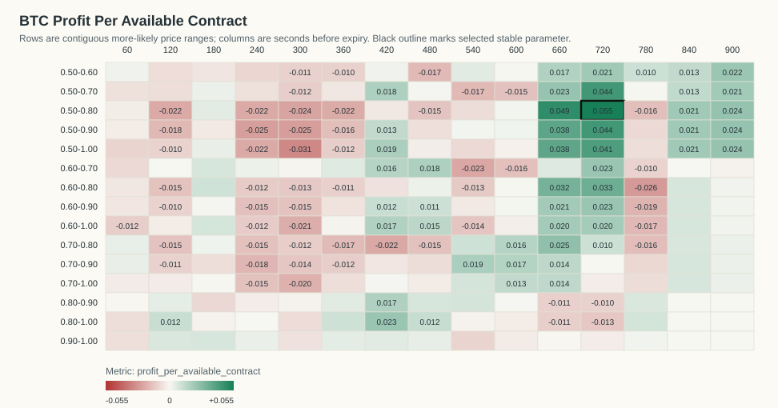
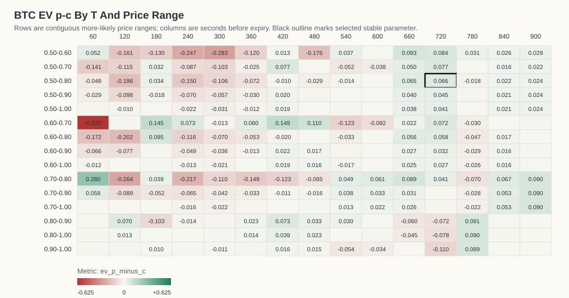
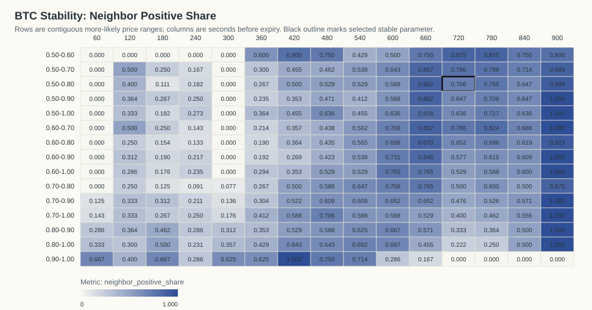
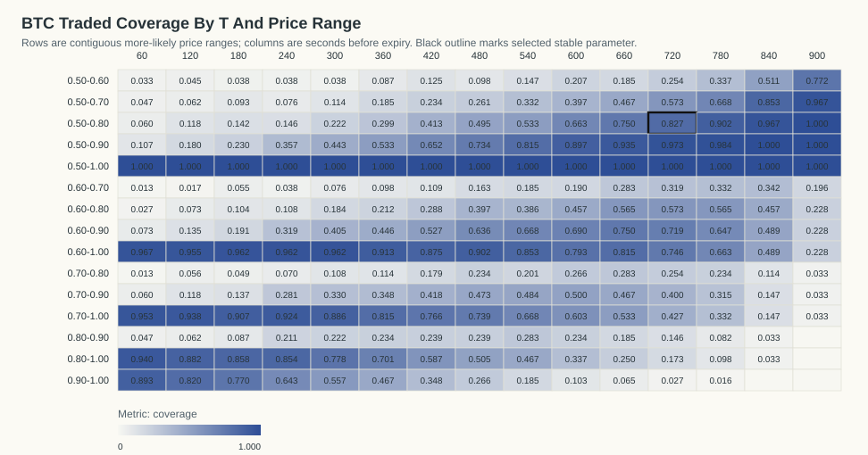

# BTC Kalshi Profit-Per-Available Stability Analysis

Generated: `2026-06-07T14:35:16Z`

## Table Of Contents

- [Objective](#objective)
- [Result](#result)
- [Stability Criteria](#stability-criteria)
- [Visualizations](#visualizations)
- [Top Objective Cells](#top-objective-cells)
- [Top Stable Cells](#top-stable-cells)
- [Time And Day Check For Selected Parameter](#time-and-day-check-for-selected-parameter)
- [Date/Time Dependency Tests](#datetime-dependency-tests)
- [Artifacts](#artifacts)

## Objective

The requested objective is:

```text
(p - c) * N_traded_in_range / N_total_backtested_at_T
```

This equals gross P&L per available contract at that horizon. `N_total_backtested_at_T` is the count of resolved contracts with a usable Kalshi quote row at that T.

## Result

The best parameter that is both profitable and stable is `T=720s`, price range `0.50-0.80`.

- Stability classification: `stable`
- Profit per available contract: `0.0548`
- Gross P&L: `10.1300` across `185` available contracts
- N traded in range: `153`
- Coverage: `82.70%`
- P(success): `71.90%`
- Average cost c: `0.6527`
- EV p-c inside range: `0.0662`
- One-sided break-even p-value: `0.0468877`
- Contracts in source data: `186`
- Resolved official Kalshi outcomes: `186`

The raw objective argmax with `N >= 20` is `T=720s`, range `0.50-0.80`, profit/available `0.0548`.

The p-value is an exact one-sided Poisson-binomial tail probability under the break-even null that each selected contract resolves correctly with probability equal to its own buy cost. It measures `P(X >= observed wins)` under that cost-implied null.

## Stability Criteria

A cell is classified stable when it has positive profit per available contract, `N >= 20`, at least four valid immediate neighbors, at least 70% of those neighbors are positive, average neighbor profit is positive, and it belongs to a positive connected component of at least eight cells.

Selected cell neighbor positive share: `70.59%` (`12/17` neighbors).
Selected cell neighbor mean profit/available: `0.0151`.
Positive connected component size: `81` cells.

## Visualizations

### Profit Per Available Contract Heatmap



### EV p-c Heatmap



### Neighbor Positive Share Heatmap



### Traded Coverage Heatmap



- 3D Profit Surface HTML: `plots/btc_profit_surface_3d.html`
- 3D Stability Surface HTML: `plots/btc_stability_surface_3d.html`

## Top Objective Cells

| T seconds | Price range | N traded | N total | Coverage | P(success) | Avg cost c | EV p-c | Gross P&L | Profit/available | p-value | Stable |
|---:|---|---:|---:|---:|---:|---:|---:|---:|---:|---:|---:|
| 720 | 0.50-0.80 | 153 | 185 | 82.70% | 71.90% | 0.6527 | 0.0662 | 10.1300 | 0.0548 | 0.04689 | 1 |
| 660 | 0.50-0.80 | 138 | 184 | 75.00% | 73.19% | 0.6669 | 0.0650 | 8.9700 | 0.0488 | 0.05816 | 1 |
| 720 | 0.50-0.70 | 106 | 185 | 57.30% | 68.87% | 0.6113 | 0.0774 | 8.2000 | 0.0443 | 0.05968 | 1 |
| 720 | 0.50-0.90 | 180 | 185 | 97.30% | 72.78% | 0.6823 | 0.0455 | 8.1900 | 0.0443 | 0.1024 | 0 |
| 720 | 0.50-1.00 | 185 | 185 | 100.00% | 72.97% | 0.6884 | 0.0413 | 7.6380 | 0.0413 | 0.1213 | 0 |
| 660 | 0.50-0.90 | 172 | 184 | 93.48% | 74.42% | 0.7038 | 0.0404 | 6.9460 | 0.0377 | 0.1335 | 1 |
| 660 | 0.50-1.00 | 184 | 184 | 100.00% | 75.54% | 0.7179 | 0.0375 | 6.9040 | 0.0375 | 0.1382 | 1 |
| 720 | 0.60-0.80 | 106 | 185 | 57.30% | 75.47% | 0.6963 | 0.0584 | 6.1900 | 0.0335 | 0.1118 | 0 |
| 660 | 0.60-0.80 | 104 | 184 | 56.52% | 75.96% | 0.7038 | 0.0558 | 5.8000 | 0.0315 | 0.1243 | 1 |
| 660 | 0.70-0.80 | 52 | 184 | 28.26% | 84.62% | 0.7567 | 0.0894 | 4.6500 | 0.0253 | 0.08489 | 1 |
| 900 | 0.50-0.80 | 184 | 184 | 100.00% | 60.33% | 0.5794 | 0.0239 | 4.3900 | 0.0239 | 0.2803 | 1 |
| 900 | 0.50-0.90 | 184 | 184 | 100.00% | 60.33% | 0.5794 | 0.0239 | 4.3900 | 0.0239 | 0.2803 | 1 |
| 900 | 0.50-1.00 | 184 | 184 | 100.00% | 60.33% | 0.5794 | 0.0239 | 4.3900 | 0.0239 | 0.2803 | 1 |
| 660 | 0.50-0.70 | 86 | 184 | 46.74% | 66.28% | 0.6126 | 0.0502 | 4.3200 | 0.0235 | 0.1981 | 1 |
| 720 | 0.60-0.70 | 59 | 185 | 31.89% | 72.88% | 0.6566 | 0.0722 | 4.2600 | 0.0230 | 0.1507 | 1 |
| 720 | 0.60-0.90 | 133 | 185 | 71.89% | 75.94% | 0.7274 | 0.0320 | 4.2500 | 0.0230 | 0.2311 | 0 |
| 420 | 0.80-1.00 | 108 | 184 | 58.70% | 95.37% | 0.9147 | 0.0390 | 4.2090 | 0.0229 | 0.08913 | 0 |
| 900 | 0.50-0.60 | 142 | 184 | 77.17% | 58.45% | 0.5554 | 0.0292 | 4.1400 | 0.0225 | 0.2698 | 1 |
| 720 | 0.50-0.60 | 47 | 185 | 25.41% | 63.83% | 0.5545 | 0.0838 | 3.9400 | 0.0213 | 0.1559 | 1 |
| 840 | 0.50-0.90 | 184 | 184 | 100.00% | 63.59% | 0.6147 | 0.0211 | 3.8900 | 0.0211 | 0.3026 | 0 |

## Top Stable Cells

| T seconds | Price range | N traded | N total | Coverage | P(success) | Avg cost c | EV p-c | Gross P&L | Profit/available | p-value | Stable |
|---:|---|---:|---:|---:|---:|---:|---:|---:|---:|---:|---:|
| 720 | 0.50-0.80 | 153 | 185 | 82.70% | 71.90% | 0.6527 | 0.0662 | 10.1300 | 0.0548 | 0.04689 | 1 |
| 660 | 0.50-0.80 | 138 | 184 | 75.00% | 73.19% | 0.6669 | 0.0650 | 8.9700 | 0.0488 | 0.05816 | 1 |
| 720 | 0.50-0.70 | 106 | 185 | 57.30% | 68.87% | 0.6113 | 0.0774 | 8.2000 | 0.0443 | 0.05968 | 1 |
| 660 | 0.50-0.90 | 172 | 184 | 93.48% | 74.42% | 0.7038 | 0.0404 | 6.9460 | 0.0377 | 0.1335 | 1 |
| 660 | 0.50-1.00 | 184 | 184 | 100.00% | 75.54% | 0.7179 | 0.0375 | 6.9040 | 0.0375 | 0.1382 | 1 |
| 660 | 0.60-0.80 | 104 | 184 | 56.52% | 75.96% | 0.7038 | 0.0558 | 5.8000 | 0.0315 | 0.1243 | 1 |
| 660 | 0.70-0.80 | 52 | 184 | 28.26% | 84.62% | 0.7567 | 0.0894 | 4.6500 | 0.0253 | 0.08489 | 1 |
| 900 | 0.50-0.80 | 184 | 184 | 100.00% | 60.33% | 0.5794 | 0.0239 | 4.3900 | 0.0239 | 0.2803 | 1 |
| 900 | 0.50-0.90 | 184 | 184 | 100.00% | 60.33% | 0.5794 | 0.0239 | 4.3900 | 0.0239 | 0.2803 | 1 |
| 900 | 0.50-1.00 | 184 | 184 | 100.00% | 60.33% | 0.5794 | 0.0239 | 4.3900 | 0.0239 | 0.2803 | 1 |
| 660 | 0.50-0.70 | 86 | 184 | 46.74% | 66.28% | 0.6126 | 0.0502 | 4.3200 | 0.0235 | 0.1981 | 1 |
| 720 | 0.60-0.70 | 59 | 185 | 31.89% | 72.88% | 0.6566 | 0.0722 | 4.2600 | 0.0230 | 0.1507 | 1 |
| 900 | 0.50-0.60 | 142 | 184 | 77.17% | 58.45% | 0.5554 | 0.0292 | 4.1400 | 0.0225 | 0.2698 | 1 |
| 720 | 0.50-0.60 | 47 | 185 | 25.41% | 63.83% | 0.5545 | 0.0838 | 3.9400 | 0.0213 | 0.1559 | 1 |
| 900 | 0.50-0.70 | 178 | 184 | 96.74% | 59.55% | 0.5739 | 0.0216 | 3.8500 | 0.0209 | 0.306 | 1 |
| 660 | 0.60-0.90 | 138 | 184 | 75.00% | 76.81% | 0.7408 | 0.0274 | 3.7760 | 0.0205 | 0.2612 | 1 |
| 660 | 0.60-1.00 | 150 | 184 | 81.52% | 78.00% | 0.7551 | 0.0249 | 3.7340 | 0.0203 | 0.2675 | 1 |
| 660 | 0.50-0.60 | 34 | 184 | 18.48% | 64.71% | 0.5538 | 0.0932 | 3.1700 | 0.0172 | 0.1785 | 1 |
| 600 | 0.70-0.80 | 49 | 184 | 26.63% | 81.63% | 0.7553 | 0.0610 | 2.9900 | 0.0163 | 0.2061 | 1 |
| 840 | 0.50-0.70 | 157 | 184 | 85.33% | 60.51% | 0.5894 | 0.0157 | 2.4600 | 0.0134 | 0.3761 | 1 |

## Time And Day Check For Selected Parameter

By ET date:

| ET date | N traded | N total | Coverage | P(success) | Avg cost c | EV p-c | Gross P&L | Profit/available | p-value |
|---|---:|---:|---:|---:|---:|---:|---:|---:|---:|
| 2026-06-01 | 14 | 17 | 82.35% | 78.57% | 0.6400 | 0.1457 | 2.0400 | 0.1200 | 0.1941 |
| 2026-06-02 | 78 | 96 | 81.25% | 67.95% | 0.6547 | 0.0247 | 1.9300 | 0.0201 | 0.3689 |
| 2026-06-03 | 61 | 72 | 84.72% | 75.41% | 0.6531 | 0.1010 | 6.1600 | 0.0856 | 0.05851 |

By ET 4-hour close bucket:

| ET close-hour bucket | N traded | N total | Coverage | P(success) | Avg cost c | EV p-c | Gross P&L | Profit/available | p-value |
|---|---:|---:|---:|---:|---:|---:|---:|---:|---:|
| 00-03 | 23 | 32 | 71.88% | 69.57% | 0.6387 | 0.0570 | 1.3100 | 0.0409 | 0.3679 |
| 04-07 | 28 | 32 | 87.50% | 78.57% | 0.6604 | 0.1254 | 3.5100 | 0.1097 | 0.1081 |
| 08-11 | 30 | 32 | 93.75% | 73.33% | 0.6710 | 0.0623 | 1.8700 | 0.0584 | 0.3005 |
| 12-15 | 28 | 32 | 87.50% | 67.86% | 0.6386 | 0.0400 | 1.1200 | 0.0350 | 0.4091 |
| 16-19 | 18 | 25 | 72.00% | 72.22% | 0.6678 | 0.0544 | 0.9800 | 0.0392 | 0.414 |
| 20-23 | 26 | 32 | 81.25% | 69.23% | 0.6408 | 0.0515 | 1.3400 | 0.0419 | 0.3709 |

## Date/Time Dependency Tests

These tests ask whether the selected rule's win/loss outcomes vary by date or by time bucket. They condition on the total number of wins and group sizes. For small tables the p-value is exact over all fixed-margin allocations; otherwise it uses deterministic fixed-margin permutation sampling.

| Grouping | Chi-square statistic | p-value | Method | Tables/permutations | Interpretation |
|---|---:|---:|---|---:|---|
| ET date | 1.2830 | 0.5556 | exact_fixed_margin | 555 | no clear dependence |
| ET 4-hour bucket | 1.0284 | 0.9621 | exact_fixed_margin | 1501253 | no clear dependence |

Conclusion: profitability may vary economically by date/time, but only p-values below 0.05 are flagged as statistically clear win-rate dependence in this report.

## Artifacts

- Entry ledger: `btc_more_likely_entries_official.csv`
- Profit-per-available grid: `btc_profit_per_available_grid.csv`
- Machine-readable summary: `btc_profit_stability_summary.json`
- Official market cache: `btc_official_market_results.json`

Fees are not included. Fees reduce expected value, especially near 0.50.
