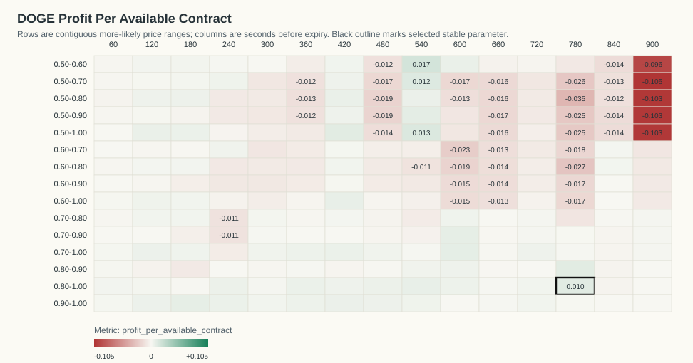
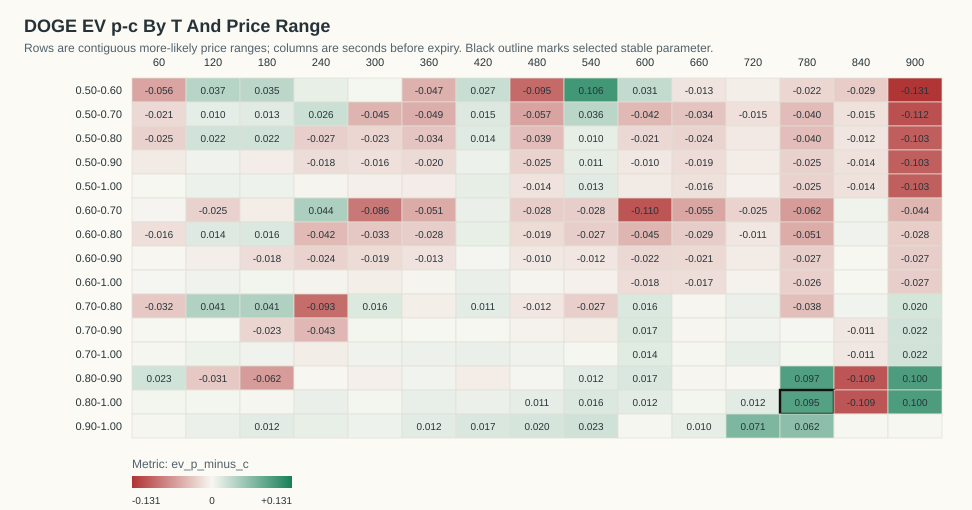
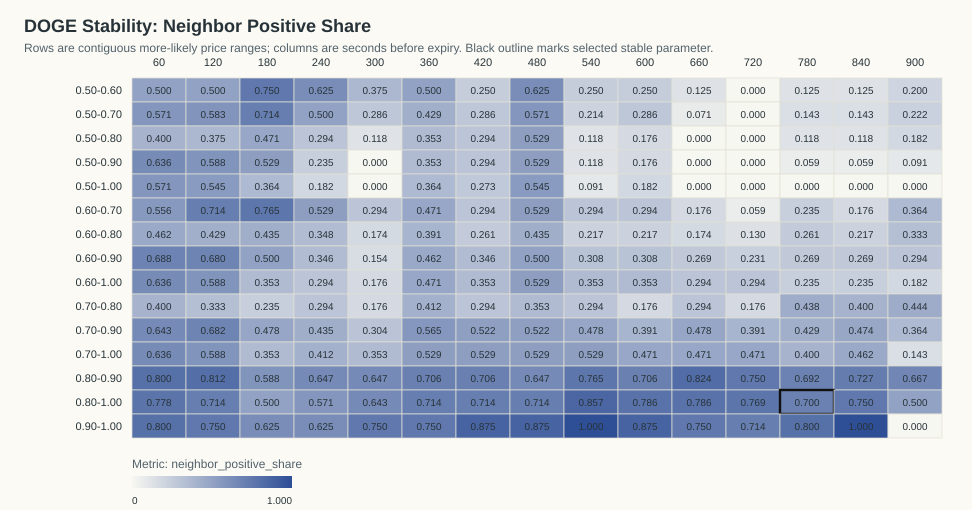
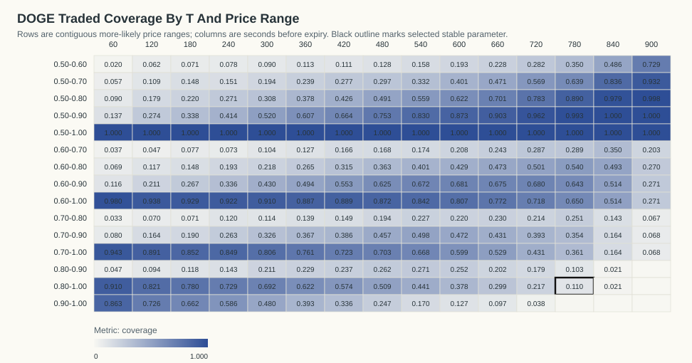

# DOGE Kalshi Profit-Per-Available Stability Analysis

Generated: `2026-06-07T14:35:39Z`

## Table Of Contents

- [Objective](#objective)
- [Result](#result)
- [Stability Criteria](#stability-criteria)
- [Visualizations](#visualizations)
- [Top Objective Cells](#top-objective-cells)
- [Top Stable Cells](#top-stable-cells)
- [Time And Day Check For Selected Parameter](#time-and-day-check-for-selected-parameter)
- [Date/Time Dependency Tests](#datetime-dependency-tests)
- [Artifacts](#artifacts)

## Objective

The requested objective is:

```text
(p - c) * N_traded_in_range / N_total_backtested_at_T
```

This equals gross P&L per available contract at that horizon. `N_total_backtested_at_T` is the count of resolved contracts with a usable Kalshi quote row at that T.

## Result

The best parameter that is both profitable and stable is `T=780s`, price range `0.80-1.00`.

- Stability classification: `stable`
- Profit per available contract: `0.0104`
- Gross P&L: `5.9730` across `574` available contracts
- N traded in range: `63`
- Coverage: `10.98%`
- P(success): `95.24%`
- Average cost c: `0.8576`
- EV p-c inside range: `0.0948`
- One-sided break-even p-value: `0.0151074`
- Contracts in source data: `577`
- Resolved official Kalshi outcomes: `577`

The raw objective argmax with `N >= 20` is `T=540s`, range `0.50-0.60`, profit/available `0.0167`.

The p-value is an exact one-sided Poisson-binomial tail probability under the break-even null that each selected contract resolves correctly with probability equal to its own buy cost. It measures `P(X >= observed wins)` under that cost-implied null.

## Stability Criteria

A cell is classified stable when it has positive profit per available contract, `N >= 20`, at least four valid immediate neighbors, at least 70% of those neighbors are positive, average neighbor profit is positive, and it belongs to a positive connected component of at least eight cells.

Selected cell neighbor positive share: `70.00%` (`7/10` neighbors).
Selected cell neighbor mean profit/available: `0.0018`.
Positive connected component size: `82` cells.

## Visualizations

### Profit Per Available Contract Heatmap



### EV p-c Heatmap



### Neighbor Positive Share Heatmap



### Traded Coverage Heatmap



- 3D Profit Surface HTML: `plots/doge_profit_surface_3d.html`
- 3D Stability Surface HTML: `plots/doge_stability_surface_3d.html`

## Top Objective Cells

| T seconds | Price range | N traded | N total | Coverage | P(success) | Avg cost c | EV p-c | Gross P&L | Profit/available | p-value | Stable |
|---:|---|---:|---:|---:|---:|---:|---:|---:|---:|---:|---:|
| 540 | 0.50-0.60 | 91 | 576 | 15.80% | 67.03% | 0.5644 | 0.1060 | 9.6430 | 0.0167 | 0.02532 | 0 |
| 540 | 0.50-1.00 | 576 | 576 | 100.00% | 78.82% | 0.7753 | 0.0129 | 7.4120 | 0.0129 | 0.2348 | 0 |
| 540 | 0.50-0.70 | 191 | 576 | 33.16% | 65.44% | 0.6185 | 0.0360 | 6.8730 | 0.0119 | 0.1695 | 0 |
| 780 | 0.80-1.00 | 63 | 574 | 10.98% | 95.24% | 0.8576 | 0.0948 | 5.9730 | 0.0104 | 0.01511 | 1 |
| 780 | 0.80-0.90 | 59 | 574 | 10.28% | 94.92% | 0.8522 | 0.0970 | 5.7230 | 0.0100 | 0.01823 | 0 |
| 420 | 0.50-1.00 | 577 | 577 | 100.00% | 82.67% | 0.8167 | 0.0100 | 5.7420 | 0.0100 | 0.275 | 0 |
| 540 | 0.50-0.90 | 478 | 576 | 82.99% | 75.10% | 0.7402 | 0.0108 | 5.1630 | 0.0090 | 0.3091 | 0 |
| 600 | 0.70-1.00 | 345 | 576 | 59.90% | 86.09% | 0.8472 | 0.0136 | 4.7090 | 0.0082 | 0.2634 | 0 |
| 600 | 0.70-0.90 | 272 | 576 | 47.22% | 83.82% | 0.8213 | 0.0170 | 4.6140 | 0.0080 | 0.2582 | 0 |
| 180 | 0.90-1.00 | 380 | 574 | 66.20% | 99.21% | 0.9802 | 0.0119 | 4.5290 | 0.0079 | 0.05408 | 0 |
| 540 | 0.80-1.00 | 254 | 576 | 44.10% | 91.34% | 0.8972 | 0.0162 | 4.1110 | 0.0071 | 0.2284 | 1 |
| 420 | 0.60-1.00 | 513 | 577 | 88.91% | 85.58% | 0.8480 | 0.0078 | 3.9870 | 0.0069 | 0.3295 | 0 |
| 120 | 0.50-1.00 | 530 | 530 | 100.00% | 92.45% | 0.9184 | 0.0061 | 3.2320 | 0.0061 | 0.3163 | 0 |
| 600 | 0.50-0.60 | 111 | 576 | 19.27% | 60.36% | 0.5726 | 0.0310 | 3.4430 | 0.0060 | 0.287 | 0 |
| 420 | 0.50-0.80 | 246 | 577 | 42.63% | 69.11% | 0.6772 | 0.0139 | 3.4100 | 0.0059 | 0.3458 | 0 |
| 420 | 0.90-1.00 | 194 | 577 | 33.62% | 97.42% | 0.9570 | 0.0172 | 3.3400 | 0.0058 | 0.1544 | 1 |
| 540 | 0.50-0.80 | 322 | 576 | 55.90% | 68.94% | 0.6792 | 0.0103 | 3.3010 | 0.0057 | 0.369 | 0 |
| 420 | 0.70-1.00 | 417 | 577 | 72.27% | 89.69% | 0.8890 | 0.0079 | 3.2760 | 0.0057 | 0.3329 | 0 |
| 360 | 0.80-1.00 | 359 | 577 | 62.22% | 93.87% | 0.9298 | 0.0089 | 3.2050 | 0.0056 | 0.2912 | 1 |
| 180 | 0.50-1.00 | 574 | 574 | 100.00% | 90.42% | 0.8987 | 0.0055 | 3.1400 | 0.0055 | 0.3456 | 0 |

## Top Stable Cells

| T seconds | Price range | N traded | N total | Coverage | P(success) | Avg cost c | EV p-c | Gross P&L | Profit/available | p-value | Stable |
|---:|---|---:|---:|---:|---:|---:|---:|---:|---:|---:|---:|
| 780 | 0.80-1.00 | 63 | 574 | 10.98% | 95.24% | 0.8576 | 0.0948 | 5.9730 | 0.0104 | 0.01511 | 1 |
| 540 | 0.80-1.00 | 254 | 576 | 44.10% | 91.34% | 0.8972 | 0.0162 | 4.1110 | 0.0071 | 0.2284 | 1 |
| 420 | 0.90-1.00 | 194 | 577 | 33.62% | 97.42% | 0.9570 | 0.0172 | 3.3400 | 0.0058 | 0.1544 | 1 |
| 360 | 0.80-1.00 | 359 | 577 | 62.22% | 93.87% | 0.9298 | 0.0089 | 3.2050 | 0.0056 | 0.2912 | 1 |
| 480 | 0.80-1.00 | 293 | 576 | 50.87% | 91.81% | 0.9075 | 0.0105 | 3.0880 | 0.0054 | 0.3047 | 1 |
| 120 | 0.90-1.00 | 385 | 530 | 72.64% | 99.22% | 0.9853 | 0.0069 | 2.6630 | 0.0050 | 0.178 | 1 |
| 480 | 0.90-1.00 | 142 | 576 | 24.65% | 97.18% | 0.9522 | 0.0196 | 2.7880 | 0.0048 | 0.1849 | 1 |
| 360 | 0.90-1.00 | 227 | 577 | 39.34% | 97.36% | 0.9615 | 0.0120 | 2.7330 | 0.0047 | 0.2249 | 1 |
| 600 | 0.80-1.00 | 218 | 576 | 37.85% | 90.37% | 0.8917 | 0.0120 | 2.6200 | 0.0045 | 0.328 | 1 |
| 600 | 0.80-0.90 | 145 | 576 | 25.17% | 88.28% | 0.8653 | 0.0174 | 2.5250 | 0.0044 | 0.3185 | 1 |
| 420 | 0.80-1.00 | 331 | 577 | 57.37% | 92.75% | 0.9204 | 0.0070 | 2.3320 | 0.0040 | 0.3611 | 1 |
| 540 | 0.90-1.00 | 98 | 576 | 17.01% | 96.94% | 0.9464 | 0.0229 | 2.2490 | 0.0039 | 0.2229 | 1 |
| 540 | 0.80-0.90 | 156 | 576 | 27.08% | 87.82% | 0.8663 | 0.0119 | 1.8620 | 0.0032 | 0.3837 | 1 |
| 720 | 0.90-1.00 | 22 | 575 | 3.83% | 100.00% | 0.9294 | 0.0706 | 1.5540 | 0.0027 | 0.199 | 1 |
| 300 | 0.90-1.00 | 277 | 577 | 48.01% | 97.11% | 0.9656 | 0.0055 | 1.5180 | 0.0026 | 0.3847 | 1 |
| 720 | 0.80-1.00 | 125 | 575 | 21.74% | 88.80% | 0.8760 | 0.0120 | 1.4990 | 0.0026 | 0.4047 | 1 |
| 180 | 0.50-0.60 | 41 | 574 | 7.14% | 60.98% | 0.5750 | 0.0348 | 1.4270 | 0.0025 | 0.3876 | 1 |
| 60 | 0.80-1.00 | 446 | 490 | 91.02% | 98.88% | 0.9863 | 0.0025 | 1.1110 | 0.0023 | 0.4215 | 1 |
| 120 | 0.80-1.00 | 435 | 530 | 82.08% | 97.47% | 0.9722 | 0.0026 | 1.1100 | 0.0021 | 0.4431 | 1 |
| 180 | 0.50-0.70 | 85 | 574 | 14.81% | 63.53% | 0.6223 | 0.0130 | 1.1030 | 0.0019 | 0.4496 | 1 |

## Time And Day Check For Selected Parameter

By ET date:

| ET date | N traded | N total | Coverage | P(success) | Avg cost c | EV p-c | Gross P&L | Profit/available | p-value |
|---|---:|---:|---:|---:|---:|---:|---:|---:|---:|
| 2026-05-31 | 5 | 38 | 13.16% | 100.00% | 0.8616 | 0.1384 | 0.6920 | 0.0182 | 0.4728 |
| 2026-06-01 | 4 | 90 | 4.44% | 100.00% | 0.8678 | 0.1323 | 0.5290 | 0.0059 | 0.5651 |
| 2026-06-02 | 5 | 96 | 5.21% | 80.00% | 0.8440 | -0.0440 | -0.2200 | -0.0023 | 0.8245 |
| 2026-06-03 | 12 | 96 | 12.50% | 91.67% | 0.8711 | 0.0456 | 0.5470 | 0.0057 | 0.5284 |
| 2026-06-04 | 17 | 84 | 20.24% | 100.00% | 0.8536 | 0.1464 | 2.4880 | 0.0296 | 0.06735 |
| 2026-06-05 | 12 | 96 | 12.50% | 91.67% | 0.8519 | 0.0648 | 0.7770 | 0.0081 | 0.4498 |
| 2026-06-06 | 8 | 74 | 10.81% | 100.00% | 0.8550 | 0.1450 | 1.1600 | 0.0157 | 0.2844 |

By ET 4-hour close bucket:

| ET close-hour bucket | N traded | N total | Coverage | P(success) | Avg cost c | EV p-c | Gross P&L | Profit/available | p-value |
|---|---:|---:|---:|---:|---:|---:|---:|---:|---:|
| 00-03 | 9 | 83 | 10.84% | 88.89% | 0.8523 | 0.0366 | 0.3290 | 0.0040 | 0.6069 |
| 04-07 | 7 | 91 | 7.69% | 100.00% | 0.8544 | 0.1456 | 1.0190 | 0.0112 | 0.3312 |
| 08-11 | 8 | 96 | 8.33% | 100.00% | 0.8601 | 0.1399 | 1.1190 | 0.0117 | 0.2974 |
| 12-15 | 14 | 103 | 13.59% | 85.71% | 0.8494 | 0.0077 | 0.1080 | 0.0010 | 0.6456 |
| 16-19 | 13 | 106 | 12.26% | 100.00% | 0.8692 | 0.1308 | 1.7000 | 0.0160 | 0.1594 |
| 20-23 | 12 | 95 | 12.63% | 100.00% | 0.8585 | 0.1415 | 1.6980 | 0.0179 | 0.1596 |

## Date/Time Dependency Tests

These tests ask whether the selected rule's win/loss outcomes vary by date or by time bucket. They condition on the total number of wins and group sizes. For small tables the p-value is exact over all fixed-margin allocations; otherwise it uses deterministic fixed-margin permutation sampling.

| Grouping | Chi-square statistic | p-value | Method | Tables/permutations | Interpretation |
|---|---:|---:|---|---:|---|
| ET date | 4.9350 | 0.6148 | exact_fixed_margin | 84 | no clear dependence |
| ET 4-hour bucket | 5.6000 | 0.3306 | exact_fixed_margin | 56 | no clear dependence |

Conclusion: profitability may vary economically by date/time, but only p-values below 0.05 are flagged as statistically clear win-rate dependence in this report.

## Artifacts

- Entry ledger: `doge_more_likely_entries_official.csv`
- Profit-per-available grid: `doge_profit_per_available_grid.csv`
- Machine-readable summary: `doge_profit_stability_summary.json`
- Official market cache: `doge_official_market_results.json`

Fees are not included. Fees reduce expected value, especially near 0.50.
