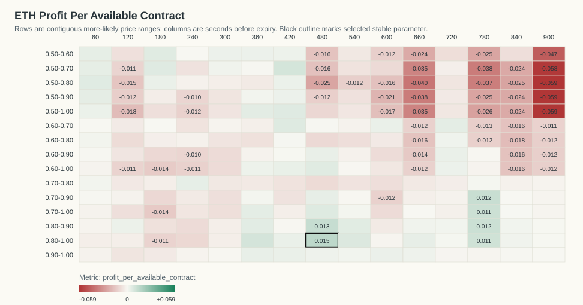
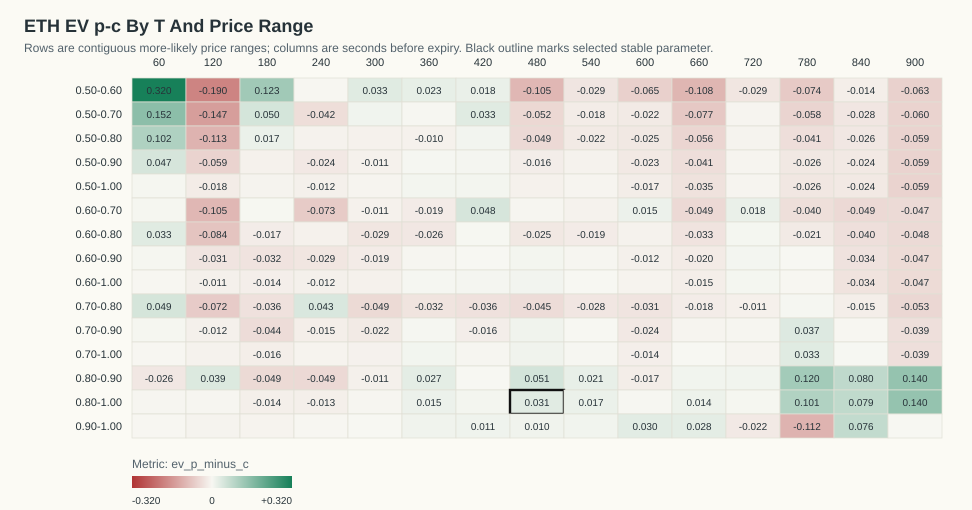
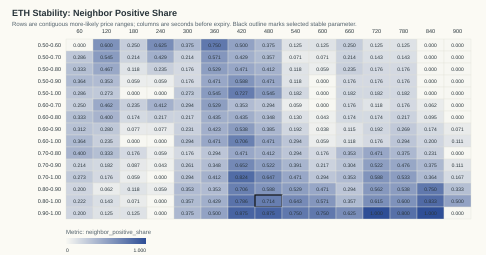
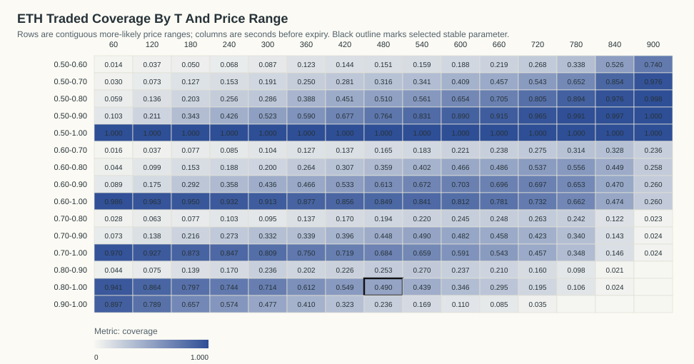

# ETH Kalshi Profit-Per-Available Stability Analysis

Generated: `2026-06-07T14:35:21Z`

## Table Of Contents

- [Objective](#objective)
- [Result](#result)
- [Stability Criteria](#stability-criteria)
- [Visualizations](#visualizations)
- [Top Objective Cells](#top-objective-cells)
- [Top Stable Cells](#top-stable-cells)
- [Time And Day Check For Selected Parameter](#time-and-day-check-for-selected-parameter)
- [Date/Time Dependency Tests](#datetime-dependency-tests)
- [Artifacts](#artifacts)

## Objective

The requested objective is:

```text
(p - c) * N_traded_in_range / N_total_backtested_at_T
```

This equals gross P&L per available contract at that horizon. `N_total_backtested_at_T` is the count of resolved contracts with a usable Kalshi quote row at that T.

## Result

The best parameter that is both profitable and stable is `T=480s`, price range `0.80-1.00`.

- Stability classification: `stable`
- Profit per available contract: `0.0153`
- Gross P&L: `8.8190` across `576` available contracts
- N traded in range: `282`
- Coverage: `48.96%`
- P(success): `93.26%`
- Average cost c: `0.9014`
- EV p-c inside range: `0.0313`
- One-sided break-even p-value: `0.040815`
- Contracts in source data: `577`
- Resolved official Kalshi outcomes: `577`

The raw objective argmax with `N >= 20` is `T=480s`, range `0.80-1.00`, profit/available `0.0153`.

The p-value is an exact one-sided Poisson-binomial tail probability under the break-even null that each selected contract resolves correctly with probability equal to its own buy cost. It measures `P(X >= observed wins)` under that cost-implied null.

## Stability Criteria

A cell is classified stable when it has positive profit per available contract, `N >= 20`, at least four valid immediate neighbors, at least 70% of those neighbors are positive, average neighbor profit is positive, and it belongs to a positive connected component of at least eight cells.

Selected cell neighbor positive share: `71.43%` (`10/14` neighbors).
Selected cell neighbor mean profit/available: `0.0028`.
Positive connected component size: `46` cells.

## Visualizations

### Profit Per Available Contract Heatmap



### EV p-c Heatmap



### Neighbor Positive Share Heatmap



### Traded Coverage Heatmap



- 3D Profit Surface HTML: `plots/eth_profit_surface_3d.html`
- 3D Stability Surface HTML: `plots/eth_stability_surface_3d.html`

## Top Objective Cells

| T seconds | Price range | N traded | N total | Coverage | P(success) | Avg cost c | EV p-c | Gross P&L | Profit/available | p-value | Stable |
|---:|---|---:|---:|---:|---:|---:|---:|---:|---:|---:|---:|
| 480 | 0.80-1.00 | 282 | 576 | 48.96% | 93.26% | 0.9014 | 0.0313 | 8.8190 | 0.0153 | 0.04082 | 1 |
| 480 | 0.80-0.90 | 146 | 576 | 25.35% | 91.10% | 0.8600 | 0.0509 | 7.4370 | 0.0129 | 0.04257 | 0 |
| 780 | 0.70-0.90 | 195 | 574 | 33.97% | 81.54% | 0.7788 | 0.0366 | 7.1300 | 0.0124 | 0.1234 | 0 |
| 780 | 0.80-0.90 | 56 | 574 | 9.76% | 96.43% | 0.8446 | 0.1197 | 6.7010 | 0.0117 | 0.004861 | 0 |
| 780 | 0.70-1.00 | 200 | 574 | 34.84% | 81.50% | 0.7821 | 0.0329 | 6.5720 | 0.0114 | 0.1466 | 0 |
| 780 | 0.80-1.00 | 61 | 574 | 10.63% | 95.08% | 0.8501 | 0.1007 | 6.1430 | 0.0107 | 0.01298 | 0 |
| 360 | 0.80-1.00 | 352 | 575 | 61.22% | 94.03% | 0.9250 | 0.0153 | 5.4000 | 0.0094 | 0.1555 | 0 |
| 420 | 0.50-0.70 | 162 | 576 | 28.12% | 64.20% | 0.6092 | 0.0328 | 5.3060 | 0.0092 | 0.2185 | 0 |
| 540 | 0.80-1.00 | 252 | 574 | 43.90% | 90.08% | 0.8843 | 0.0165 | 4.1580 | 0.0072 | 0.2363 | 0 |
| 480 | 0.70-1.00 | 394 | 576 | 68.40% | 87.06% | 0.8608 | 0.0097 | 3.8330 | 0.0067 | 0.3136 | 0 |
| 420 | 0.60-0.70 | 79 | 576 | 13.72% | 70.89% | 0.6610 | 0.0478 | 3.7790 | 0.0066 | 0.219 | 0 |
| 420 | 0.50-1.00 | 576 | 576 | 100.00% | 80.90% | 0.8027 | 0.0064 | 3.6650 | 0.0064 | 0.3641 | 1 |
| 180 | 0.50-0.70 | 73 | 575 | 12.70% | 67.12% | 0.6216 | 0.0496 | 3.6220 | 0.0063 | 0.2255 | 0 |
| 480 | 0.60-1.00 | 489 | 576 | 84.90% | 82.82% | 0.8209 | 0.0073 | 3.5790 | 0.0062 | 0.3561 | 0 |
| 180 | 0.50-0.60 | 29 | 575 | 5.04% | 68.97% | 0.5666 | 0.1231 | 3.5690 | 0.0062 | 0.1239 | 0 |
| 60 | 0.50-0.80 | 33 | 564 | 5.85% | 78.79% | 0.6855 | 0.1024 | 3.3780 | 0.0060 | 0.1341 | 0 |
| 540 | 0.80-0.90 | 155 | 574 | 27.00% | 87.10% | 0.8498 | 0.0211 | 3.2740 | 0.0057 | 0.2711 | 0 |
| 360 | 0.80-0.90 | 116 | 575 | 20.17% | 88.79% | 0.8610 | 0.0269 | 3.1250 | 0.0054 | 0.2449 | 0 |
| 360 | 0.50-1.00 | 575 | 575 | 100.00% | 82.96% | 0.8242 | 0.0053 | 3.0620 | 0.0053 | 0.384 | 0 |
| 720 | 0.60-0.70 | 158 | 575 | 27.48% | 67.09% | 0.6525 | 0.0184 | 2.9120 | 0.0051 | 0.3459 | 0 |

## Top Stable Cells

| T seconds | Price range | N traded | N total | Coverage | P(success) | Avg cost c | EV p-c | Gross P&L | Profit/available | p-value | Stable |
|---:|---|---:|---:|---:|---:|---:|---:|---:|---:|---:|---:|
| 480 | 0.80-1.00 | 282 | 576 | 48.96% | 93.26% | 0.9014 | 0.0313 | 8.8190 | 0.0153 | 0.04082 | 1 |
| 420 | 0.50-1.00 | 576 | 576 | 100.00% | 80.90% | 0.8027 | 0.0064 | 3.6650 | 0.0064 | 0.3641 | 1 |
| 420 | 0.60-1.00 | 493 | 576 | 85.59% | 84.79% | 0.8435 | 0.0043 | 2.1380 | 0.0037 | 0.4203 | 1 |
| 420 | 0.90-1.00 | 186 | 576 | 32.29% | 96.24% | 0.9516 | 0.0108 | 2.0080 | 0.0035 | 0.3157 | 1 |
| 420 | 0.80-1.00 | 316 | 576 | 54.86% | 92.09% | 0.9149 | 0.0060 | 1.9060 | 0.0033 | 0.3961 | 1 |
| 600 | 0.90-1.00 | 63 | 575 | 10.96% | 96.83% | 0.9386 | 0.0297 | 1.8700 | 0.0033 | 0.2477 | 1 |
| 360 | 0.50-0.60 | 71 | 575 | 12.35% | 57.75% | 0.5548 | 0.0227 | 1.6120 | 0.0028 | 0.3968 | 1 |
| 480 | 0.90-1.00 | 136 | 576 | 23.61% | 95.59% | 0.9457 | 0.0102 | 1.3820 | 0.0024 | 0.3882 | 1 |
| 540 | 0.90-1.00 | 97 | 574 | 16.90% | 94.85% | 0.9393 | 0.0091 | 0.8840 | 0.0015 | 0.4594 | 1 |

## Time And Day Check For Selected Parameter

By ET date:

| ET date | N traded | N total | Coverage | P(success) | Avg cost c | EV p-c | Gross P&L | Profit/available | p-value |
|---|---:|---:|---:|---:|---:|---:|---:|---:|---:|
| 2026-05-31 | 22 | 40 | 55.00% | 90.91% | 0.8955 | 0.0136 | 0.3000 | 0.0075 | 0.5911 |
| 2026-06-01 | 39 | 90 | 43.33% | 97.44% | 0.9069 | 0.0674 | 2.6300 | 0.0292 | 0.1063 |
| 2026-06-02 | 47 | 96 | 48.96% | 93.62% | 0.9055 | 0.0307 | 1.4410 | 0.0150 | 0.3368 |
| 2026-06-03 | 50 | 96 | 52.08% | 94.00% | 0.9032 | 0.0368 | 1.8420 | 0.0192 | 0.2695 |
| 2026-06-04 | 44 | 84 | 52.38% | 100.00% | 0.9077 | 0.0923 | 4.0630 | 0.0484 | 0.01328 |
| 2026-06-05 | 47 | 96 | 48.96% | 82.98% | 0.8984 | -0.0686 | -3.2240 | -0.0336 | 0.9574 |
| 2026-06-06 | 33 | 74 | 44.59% | 93.94% | 0.8858 | 0.0535 | 1.7670 | 0.0239 | 0.2537 |

By ET 4-hour close bucket:

| ET close-hour bucket | N traded | N total | Coverage | P(success) | Avg cost c | EV p-c | Gross P&L | Profit/available | p-value |
|---|---:|---:|---:|---:|---:|---:|---:|---:|---:|
| 00-03 | 37 | 83 | 44.58% | 89.19% | 0.9055 | -0.0136 | -0.5050 | -0.0061 | 0.733 |
| 04-07 | 39 | 91 | 42.86% | 97.44% | 0.8879 | 0.0865 | 3.3720 | 0.0371 | 0.05488 |
| 08-11 | 47 | 96 | 48.96% | 91.49% | 0.9050 | 0.0099 | 0.4640 | 0.0048 | 0.5335 |
| 12-15 | 49 | 104 | 47.12% | 93.88% | 0.8899 | 0.0488 | 2.3930 | 0.0230 | 0.1943 |
| 16-19 | 63 | 106 | 59.43% | 96.83% | 0.9084 | 0.0598 | 3.7700 | 0.0356 | 0.06126 |
| 20-23 | 47 | 96 | 48.96% | 89.36% | 0.9080 | -0.0144 | -0.6750 | -0.0070 | 0.74 |

## Date/Time Dependency Tests

These tests ask whether the selected rule's win/loss outcomes vary by date or by time bucket. They condition on the total number of wins and group sizes. For small tables the p-value is exact over all fixed-margin allocations; otherwise it uses deterministic fixed-margin permutation sampling.

| Grouping | Chi-square statistic | p-value | Method | Tables/permutations | Interpretation |
|---|---:|---:|---|---:|---|
| ET date | 12.4406 | 0.0489 | exact_fixed_margin | 177100 | evidence of dependence |
| ET 4-hour bucket | 4.7335 | 0.4554 | exact_fixed_margin | 42504 | no clear dependence |

Conclusion: profitability may vary economically by date/time, but only p-values below 0.05 are flagged as statistically clear win-rate dependence in this report.

## Artifacts

- Entry ledger: `eth_more_likely_entries_official.csv`
- Profit-per-available grid: `eth_profit_per_available_grid.csv`
- Machine-readable summary: `eth_profit_stability_summary.json`
- Official market cache: `eth_official_market_results.json`

Fees are not included. Fees reduce expected value, especially near 0.50.
