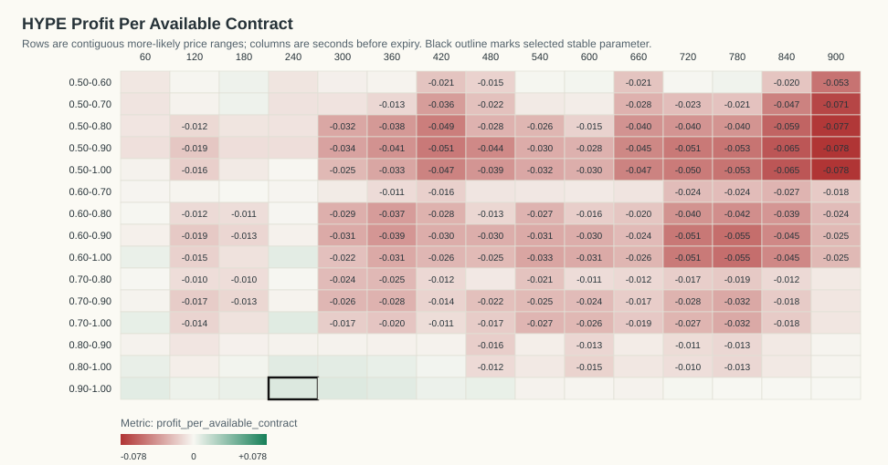
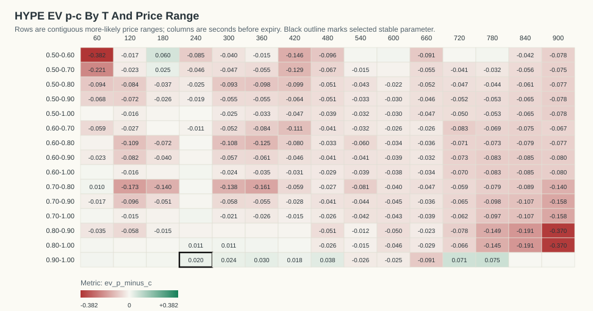
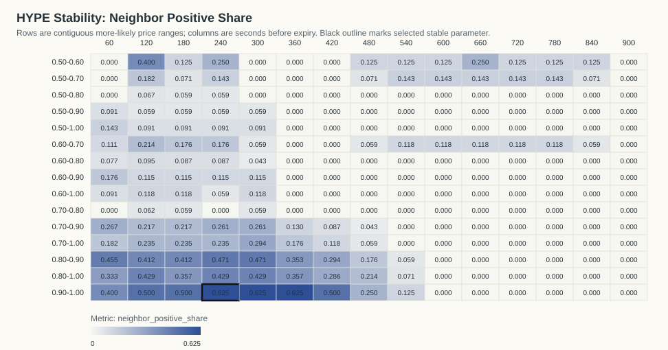
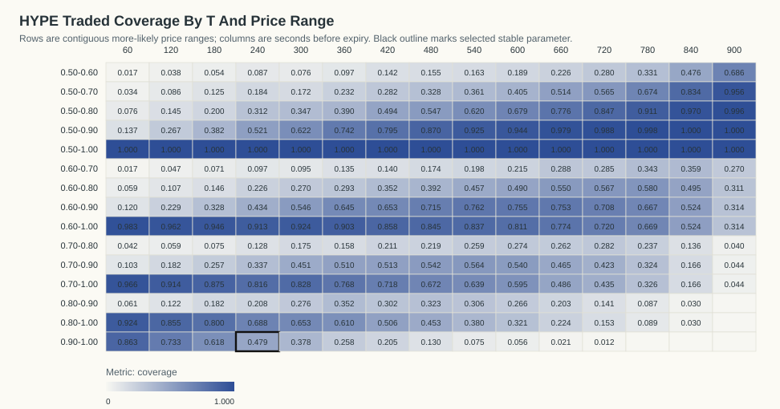

# HYPE Kalshi Profit-Per-Available Stability Analysis

Generated: `2026-06-07T14:35:35Z`

## Table Of Contents

- [Objective](#objective)
- [Result](#result)
- [Stability Criteria](#stability-criteria)
- [Visualizations](#visualizations)
- [Top Objective Cells](#top-objective-cells)
- [Top Stable Cells](#top-stable-cells)
- [Time And Day Check For Selected Parameter](#time-and-day-check-for-selected-parameter)
- [Date/Time Dependency Tests](#datetime-dependency-tests)
- [Artifacts](#artifacts)

## Objective

The requested objective is:

```text
(p - c) * N_traded_in_range / N_total_backtested_at_T
```

This equals gross P&L per available contract at that horizon. `N_total_backtested_at_T` is the count of resolved contracts with a usable Kalshi quote row at that T.

## Result

No profitable parameter passed the stability criteria. The best exploratory objective cell is `T=240s`, price range `0.90-1.00`.

- Stability classification: `not stable`
- Profit per available contract: `0.0096`
- Gross P&L: `5.5380` across `576` available contracts
- N traded in range: `276`
- Coverage: `47.92%`
- P(success): `97.83%`
- Average cost c: `0.9582`
- EV p-c inside range: `0.0201`
- One-sided break-even p-value: `0.0541339`
- Contracts in source data: `577`
- Resolved official Kalshi outcomes: `577`

The raw objective argmax with `N >= 20` is this same exploratory cell: `T=240s`, range `0.90-1.00`, profit/available `0.0096`.

The p-value is an exact one-sided Poisson-binomial tail probability under the break-even null that each selected contract resolves correctly with probability equal to its own buy cost. It measures `P(X >= observed wins)` under that cost-implied null.

## Stability Criteria

A cell is classified stable when it has positive profit per available contract, `N >= 20`, at least four valid immediate neighbors, at least 70% of those neighbors are positive, average neighbor profit is positive, and it belongs to a positive connected component of at least eight cells.

Selected cell neighbor positive share: `62.50%` (`5/8` neighbors).
Selected cell neighbor mean profit/available: `0.0029`.
Positive connected component size: `18` cells.

## Visualizations

### Profit Per Available Contract Heatmap



### EV p-c Heatmap



### Neighbor Positive Share Heatmap



### Traded Coverage Heatmap



- 3D Profit Surface HTML: `plots/hype_profit_surface_3d.html`
- 3D Stability Surface HTML: `plots/hype_stability_surface_3d.html`

## Top Objective Cells

| T seconds | Price range | N traded | N total | Coverage | P(success) | Avg cost c | EV p-c | Gross P&L | Profit/available | p-value | Stable |
|---:|---|---:|---:|---:|---:|---:|---:|---:|---:|---:|---:|
| 240 | 0.90-1.00 | 276 | 576 | 47.92% | 97.83% | 0.9582 | 0.0201 | 5.5380 | 0.0096 | 0.05413 | 0 |
| 300 | 0.90-1.00 | 218 | 577 | 37.78% | 97.25% | 0.9487 | 0.0238 | 5.1870 | 0.0090 | 0.06528 | 0 |
| 240 | 0.70-1.00 | 470 | 576 | 81.60% | 91.49% | 0.9050 | 0.0098 | 4.6290 | 0.0080 | 0.2539 | 0 |
| 360 | 0.90-1.00 | 149 | 577 | 25.82% | 97.32% | 0.9429 | 0.0302 | 4.5070 | 0.0078 | 0.06768 | 0 |
| 240 | 0.80-1.00 | 396 | 576 | 68.75% | 94.19% | 0.9308 | 0.0111 | 4.3910 | 0.0076 | 0.2189 | 0 |
| 60 | 0.90-1.00 | 454 | 526 | 86.31% | 99.56% | 0.9872 | 0.0083 | 3.7910 | 0.0072 | 0.06831 | 0 |
| 240 | 0.60-1.00 | 526 | 576 | 91.32% | 88.78% | 0.8802 | 0.0077 | 4.0360 | 0.0070 | 0.3123 | 0 |
| 300 | 0.80-1.00 | 377 | 577 | 65.34% | 92.57% | 0.9150 | 0.0107 | 4.0380 | 0.0070 | 0.258 | 0 |
| 60 | 0.70-1.00 | 508 | 526 | 96.58% | 97.64% | 0.9707 | 0.0057 | 2.8980 | 0.0055 | 0.2585 | 0 |
| 360 | 0.80-1.00 | 352 | 577 | 61.01% | 91.19% | 0.9033 | 0.0087 | 3.0500 | 0.0053 | 0.3277 | 0 |
| 60 | 0.80-1.00 | 486 | 526 | 92.40% | 98.56% | 0.9801 | 0.0055 | 2.6680 | 0.0051 | 0.2412 | 0 |
| 480 | 0.90-1.00 | 75 | 576 | 13.02% | 97.33% | 0.9358 | 0.0375 | 2.8150 | 0.0049 | 0.1319 | 0 |
| 180 | 0.90-1.00 | 356 | 576 | 61.81% | 97.47% | 0.9673 | 0.0074 | 2.6410 | 0.0046 | 0.2686 | 0 |
| 60 | 0.60-1.00 | 517 | 526 | 98.29% | 97.10% | 0.9664 | 0.0046 | 2.3640 | 0.0045 | 0.3214 | 0 |
| 420 | 0.90-1.00 | 118 | 577 | 20.45% | 95.76% | 0.9393 | 0.0183 | 2.1610 | 0.0037 | 0.2716 | 0 |
| 120 | 0.90-1.00 | 419 | 572 | 73.25% | 98.09% | 0.9763 | 0.0047 | 1.9500 | 0.0034 | 0.333 | 0 |
| 180 | 0.50-0.60 | 31 | 576 | 5.38% | 61.29% | 0.5534 | 0.0595 | 1.8460 | 0.0032 | 0.3152 | 0 |
| 180 | 0.50-0.70 | 72 | 576 | 12.50% | 63.89% | 0.6141 | 0.0248 | 1.7830 | 0.0031 | 0.3803 | 0 |
| 780 | 0.50-0.60 | 190 | 574 | 33.10% | 57.37% | 0.5665 | 0.0072 | 1.3620 | 0.0024 | 0.451 | 0 |
| 180 | 0.80-1.00 | 461 | 576 | 80.03% | 94.79% | 0.9455 | 0.0024 | 1.1030 | 0.0019 | 0.4608 | 0 |

## Top Stable Cells

| T seconds | Price range | N traded | N total | Coverage | P(success) | Avg cost c | EV p-c | Gross P&L | Profit/available | p-value | Stable |
|---:|---|---:|---:|---:|---:|---:|---:|---:|---:|---:|---:|

## Time And Day Check For Selected Parameter

By ET date:

| ET date | N traded | N total | Coverage | P(success) | Avg cost c | EV p-c | Gross P&L | Profit/available | p-value |
|---|---:|---:|---:|---:|---:|---:|---:|---:|---:|
| 2026-05-31 | 15 | 39 | 38.46% | 93.33% | 0.9363 | -0.0029 | -0.0440 | -0.0011 | 0.7527 |
| 2026-06-01 | 40 | 91 | 43.96% | 97.50% | 0.9522 | 0.0228 | 0.9120 | 0.0100 | 0.4223 |
| 2026-06-02 | 46 | 96 | 47.92% | 97.83% | 0.9566 | 0.0216 | 0.9950 | 0.0104 | 0.3996 |
| 2026-06-03 | 51 | 96 | 53.12% | 100.00% | 0.9626 | 0.0374 | 1.9090 | 0.0199 | 0.141 |
| 2026-06-04 | 52 | 84 | 61.90% | 100.00% | 0.9625 | 0.0375 | 1.9520 | 0.0232 | 0.1345 |
| 2026-06-05 | 44 | 96 | 45.83% | 95.45% | 0.9637 | -0.0091 | -0.4010 | -0.0042 | 0.7864 |
| 2026-06-06 | 28 | 74 | 37.84% | 96.43% | 0.9566 | 0.0077 | 0.2150 | 0.0029 | 0.6552 |

By ET 4-hour close bucket:

| ET close-hour bucket | N traded | N total | Coverage | P(success) | Avg cost c | EV p-c | Gross P&L | Profit/available | p-value |
|---|---:|---:|---:|---:|---:|---:|---:|---:|---:|
| 00-03 | 40 | 84 | 47.62% | 95.00% | 0.9558 | -0.0059 | -0.2340 | -0.0028 | 0.7418 |
| 04-07 | 41 | 91 | 45.05% | 100.00% | 0.9536 | 0.0464 | 1.9010 | 0.0209 | 0.1406 |
| 08-11 | 43 | 96 | 44.79% | 100.00% | 0.9630 | 0.0370 | 1.5920 | 0.0166 | 0.1949 |
| 12-15 | 50 | 104 | 48.08% | 98.00% | 0.9547 | 0.0253 | 1.2630 | 0.0121 | 0.3311 |
| 16-19 | 60 | 106 | 56.60% | 98.33% | 0.9610 | 0.0223 | 1.3370 | 0.0126 | 0.3145 |
| 20-23 | 42 | 95 | 44.21% | 95.24% | 0.9600 | -0.0076 | -0.3210 | -0.0034 | 0.7653 |

## Date/Time Dependency Tests

These tests ask whether the selected rule's win/loss outcomes vary by date or by time bucket. They condition on the total number of wins and group sizes. For small tables the p-value is exact over all fixed-margin allocations; otherwise it uses deterministic fixed-margin permutation sampling.

| Grouping | Chi-square statistic | p-value | Method | Tables/permutations | Interpretation |
|---|---:|---:|---|---:|---|
| ET date | 5.1534 | 0.5144 | exact_fixed_margin | 924 | no clear dependence |
| ET 4-hour bucket | 4.7713 | 0.4381 | exact_fixed_margin | 462 | no clear dependence |

Conclusion: profitability may vary economically by date/time, but only p-values below 0.05 are flagged as statistically clear win-rate dependence in this report.

## Artifacts

- Entry ledger: `hype_more_likely_entries_official.csv`
- Profit-per-available grid: `hype_profit_per_available_grid.csv`
- Machine-readable summary: `hype_profit_stability_summary.json`
- Official market cache: `hype_official_market_results.json`

Fees are not included. Fees reduce expected value, especially near 0.50.
