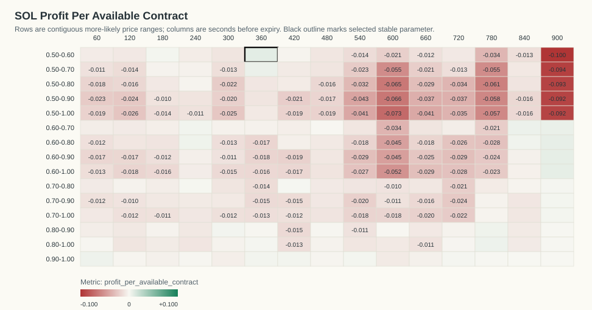
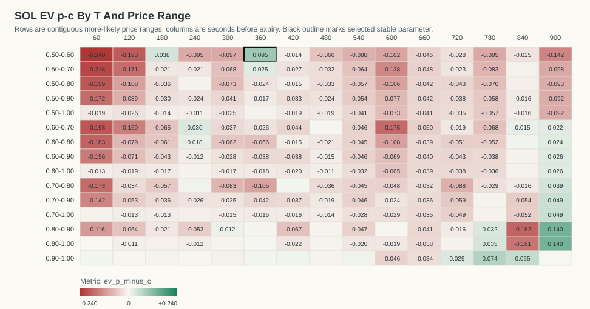
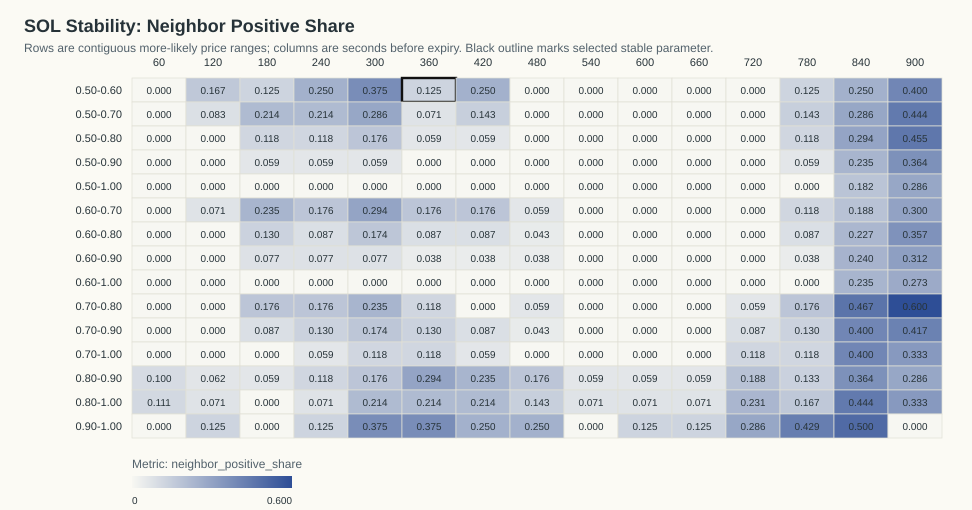
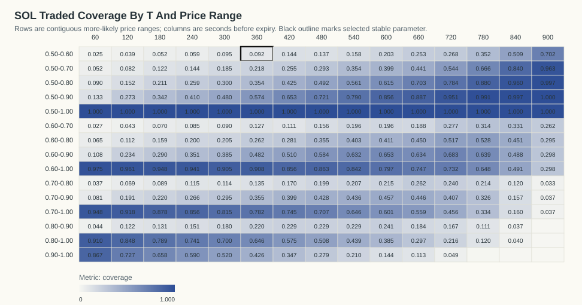

# SOL Kalshi Profit-Per-Available Stability Analysis

Generated: `2026-06-07T14:35:32Z`

## Table Of Contents

- [Objective](#objective)
- [Result](#result)
- [Stability Criteria](#stability-criteria)
- [Visualizations](#visualizations)
- [Top Objective Cells](#top-objective-cells)
- [Top Stable Cells](#top-stable-cells)
- [Time And Day Check For Selected Parameter](#time-and-day-check-for-selected-parameter)
- [Date/Time Dependency Tests](#datetime-dependency-tests)
- [Artifacts](#artifacts)

## Objective

The requested objective is:

```text
(p - c) * N_traded_in_range / N_total_backtested_at_T
```

This equals gross P&L per available contract at that horizon. `N_total_backtested_at_T` is the count of resolved contracts with a usable Kalshi quote row at that T.

## Result

No profitable parameter passed the stability criteria. The best exploratory objective cell is `T=360s`, price range `0.50-0.60`.

- Stability classification: `not stable`
- Profit per available contract: `0.0088`
- Gross P&L: `5.0570` across `577` available contracts
- N traded in range: `53`
- Coverage: `9.19%`
- P(success): `66.04%`
- Average cost c: `0.5650`
- EV p-c inside range: `0.0954`
- One-sided break-even p-value: `0.101776`
- Contracts in source data: `577`
- Resolved official Kalshi outcomes: `577`

The raw objective argmax with `N >= 20` is this same exploratory cell: `T=360s`, range `0.50-0.60`, profit/available `0.0088`.

The p-value is an exact one-sided Poisson-binomial tail probability under the break-even null that each selected contract resolves correctly with probability equal to its own buy cost. It measures `P(X >= observed wins)` under that cost-implied null.

## Stability Criteria

A cell is classified stable when it has positive profit per available contract, `N >= 20`, at least four valid immediate neighbors, at least 70% of those neighbors are positive, average neighbor profit is positive, and it belongs to a positive connected component of at least eight cells.

Selected cell neighbor positive share: `12.50%` (`1/8` neighbors).
Selected cell neighbor mean profit/available: `-0.0046`.
Positive connected component size: `2` cells.

## Visualizations

### Profit Per Available Contract Heatmap



### EV p-c Heatmap



### Neighbor Positive Share Heatmap



### Traded Coverage Heatmap



- 3D Profit Surface HTML: `plots/sol_profit_surface_3d.html`
- 3D Stability Surface HTML: `plots/sol_stability_surface_3d.html`

## Top Objective Cells

| T seconds | Price range | N traded | N total | Coverage | P(success) | Avg cost c | EV p-c | Gross P&L | Profit/available | p-value | Stable |
|---:|---|---:|---:|---:|---:|---:|---:|---:|---:|---:|---:|
| 360 | 0.50-0.60 | 53 | 577 | 9.19% | 66.04% | 0.5650 | 0.0954 | 5.0570 | 0.0088 | 0.1018 | 0 |
| 900 | 0.60-0.90 | 171 | 573 | 29.84% | 70.18% | 0.6760 | 0.0257 | 4.4000 | 0.0077 | 0.2629 | 0 |
| 900 | 0.60-1.00 | 171 | 573 | 29.84% | 70.18% | 0.6760 | 0.0257 | 4.4000 | 0.0077 | 0.2629 | 0 |
| 900 | 0.60-0.80 | 169 | 573 | 29.49% | 69.82% | 0.6738 | 0.0244 | 4.1200 | 0.0072 | 0.2776 | 0 |
| 900 | 0.60-0.70 | 150 | 573 | 26.18% | 68.67% | 0.6642 | 0.0225 | 3.3700 | 0.0059 | 0.3121 | 0 |
| 360 | 0.50-0.70 | 126 | 577 | 21.84% | 65.08% | 0.6254 | 0.0254 | 3.1950 | 0.0055 | 0.3105 | 0 |
| 840 | 0.60-0.70 | 190 | 574 | 33.10% | 67.89% | 0.6643 | 0.0147 | 2.7860 | 0.0049 | 0.3652 | 0 |
| 780 | 0.80-1.00 | 69 | 574 | 12.02% | 89.86% | 0.8632 | 0.0353 | 2.4360 | 0.0042 | 0.2552 | 0 |
| 60 | 0.90-1.00 | 416 | 480 | 86.67% | 99.52% | 0.9906 | 0.0046 | 1.8940 | 0.0039 | 0.2483 | 0 |
| 240 | 0.60-0.80 | 115 | 576 | 19.97% | 73.91% | 0.7210 | 0.0181 | 2.0860 | 0.0036 | 0.3749 | 0 |
| 780 | 0.80-0.90 | 64 | 574 | 11.15% | 89.06% | 0.8583 | 0.0323 | 2.0670 | 0.0036 | 0.2969 | 0 |
| 840 | 0.60-0.80 | 259 | 574 | 45.12% | 69.50% | 0.6884 | 0.0066 | 1.7140 | 0.0030 | 0.4381 | 0 |
| 240 | 0.60-0.70 | 49 | 576 | 8.51% | 69.39% | 0.6635 | 0.0304 | 1.4880 | 0.0026 | 0.3883 | 0 |
| 420 | 0.90-1.00 | 200 | 577 | 34.66% | 97.00% | 0.9629 | 0.0070 | 1.4100 | 0.0024 | 0.3853 | 0 |
| 360 | 0.90-1.00 | 246 | 577 | 42.63% | 97.15% | 0.9661 | 0.0054 | 1.3390 | 0.0023 | 0.402 | 0 |
| 300 | 0.80-0.90 | 104 | 577 | 18.02% | 87.50% | 0.8632 | 0.0118 | 1.2250 | 0.0021 | 0.4308 | 0 |
| 180 | 0.50-0.60 | 30 | 573 | 5.24% | 60.00% | 0.5621 | 0.0379 | 1.1380 | 0.0020 | 0.4101 | 0 |
| 540 | 0.90-1.00 | 121 | 576 | 21.01% | 95.87% | 0.9497 | 0.0090 | 1.0860 | 0.0019 | 0.4265 | 0 |
| 900 | 0.70-0.90 | 21 | 573 | 3.66% | 80.95% | 0.7605 | 0.0490 | 1.0300 | 0.0018 | 0.4095 | 0 |
| 900 | 0.70-1.00 | 21 | 573 | 3.66% | 80.95% | 0.7605 | 0.0490 | 1.0300 | 0.0018 | 0.4095 | 0 |

## Top Stable Cells

| T seconds | Price range | N traded | N total | Coverage | P(success) | Avg cost c | EV p-c | Gross P&L | Profit/available | p-value | Stable |
|---:|---|---:|---:|---:|---:|---:|---:|---:|---:|---:|---:|

## Time And Day Check For Selected Parameter

By ET date:

| ET date | N traded | N total | Coverage | P(success) | Avg cost c | EV p-c | Gross P&L | Profit/available | p-value |
|---|---:|---:|---:|---:|---:|---:|---:|---:|---:|
| 2026-05-31 | 5 | 40 | 12.50% | 60.00% | 0.5720 | 0.0280 | 0.1400 | 0.0035 | 0.6333 |
| 2026-06-01 | 7 | 91 | 7.69% | 71.43% | 0.5771 | 0.1371 | 0.9600 | 0.0105 | 0.3711 |
| 2026-06-02 | 8 | 96 | 8.33% | 62.50% | 0.5737 | 0.0512 | 0.4100 | 0.0043 | 0.5327 |
| 2026-06-03 | 11 | 96 | 11.46% | 72.73% | 0.5537 | 0.1735 | 1.9090 | 0.0199 | 0.1976 |
| 2026-06-04 | 7 | 84 | 8.33% | 42.86% | 0.5830 | -0.1544 | -1.0810 | -0.0129 | 0.8867 |
| 2026-06-05 | 10 | 96 | 10.42% | 60.00% | 0.5571 | 0.0429 | 0.4290 | 0.0045 | 0.5226 |
| 2026-06-06 | 5 | 74 | 6.76% | 100.00% | 0.5420 | 0.4580 | 2.2900 | 0.0309 | 0.04672 |

By ET 4-hour close bucket:

| ET close-hour bucket | N traded | N total | Coverage | P(success) | Avg cost c | EV p-c | Gross P&L | Profit/available | p-value |
|---|---:|---:|---:|---:|---:|---:|---:|---:|---:|
| 00-03 | 14 | 84 | 16.67% | 64.29% | 0.5465 | 0.0964 | 1.3490 | 0.0161 | 0.3273 |
| 04-07 | 9 | 91 | 9.89% | 77.78% | 0.5612 | 0.2166 | 1.9490 | 0.0214 | 0.1653 |
| 08-11 | 4 | 96 | 4.17% | 75.00% | 0.6250 | 0.1250 | 0.5000 | 0.0052 | 0.5175 |
| 12-15 | 7 | 104 | 6.73% | 71.43% | 0.5571 | 0.1571 | 1.1000 | 0.0106 | 0.3302 |
| 16-19 | 7 | 106 | 6.60% | 42.86% | 0.5600 | -0.1314 | -0.9200 | -0.0087 | 0.8601 |
| 20-23 | 12 | 96 | 12.50% | 66.67% | 0.5767 | 0.0899 | 1.0790 | 0.0112 | 0.3735 |

## Date/Time Dependency Tests

These tests ask whether the selected rule's win/loss outcomes vary by date or by time bucket. They condition on the total number of wins and group sizes. For small tables the p-value is exact over all fixed-margin allocations; otherwise it uses deterministic fixed-margin permutation sampling.

| Grouping | Chi-square statistic | p-value | Method | Tables/permutations | Interpretation |
|---|---:|---:|---|---:|---|
| ET date | 4.8472 | 0.6050 | exact_fixed_margin | 75797 | no clear dependence |
| ET 4-hour bucket | 2.4854 | 0.8072 | exact_fixed_margin | 18064 | no clear dependence |

Conclusion: profitability may vary economically by date/time, but only p-values below 0.05 are flagged as statistically clear win-rate dependence in this report.

## Artifacts

- Entry ledger: `sol_more_likely_entries_official.csv`
- Profit-per-available grid: `sol_profit_per_available_grid.csv`
- Machine-readable summary: `sol_profit_stability_summary.json`
- Official market cache: `sol_official_market_results.json`

Fees are not included. Fees reduce expected value, especially near 0.50.
