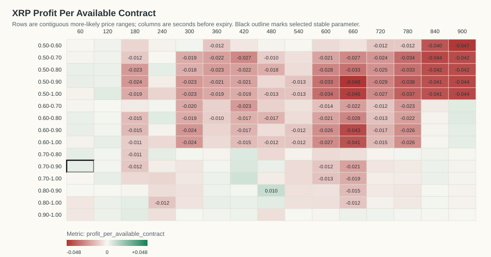
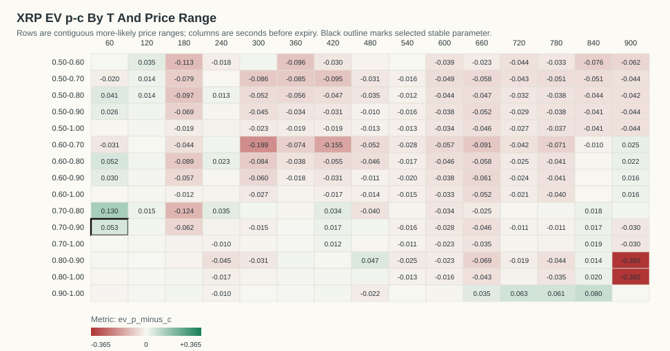
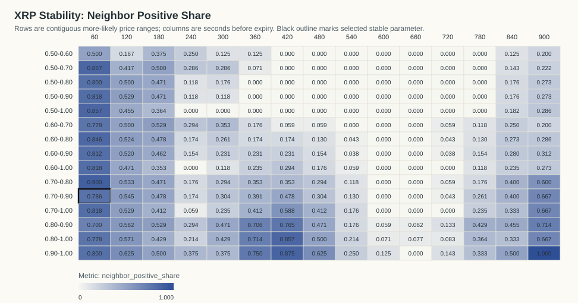
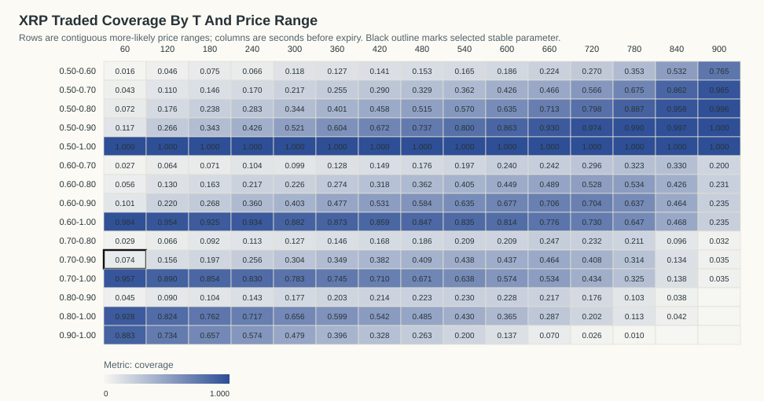

# XRP Kalshi Profit-Per-Available Stability Analysis

Generated: `2026-06-07T14:35:28Z`

## Table Of Contents

- [Objective](#objective)
- [Result](#result)
- [Stability Criteria](#stability-criteria)
- [Visualizations](#visualizations)
- [Top Objective Cells](#top-objective-cells)
- [Top Stable Cells](#top-stable-cells)
- [Time And Day Check For Selected Parameter](#time-and-day-check-for-selected-parameter)
- [Date/Time Dependency Tests](#datetime-dependency-tests)
- [Artifacts](#artifacts)

## Objective

The requested objective is:

```text
(p - c) * N_traded_in_range / N_total_backtested_at_T
```

This equals gross P&L per available contract at that horizon. `N_total_backtested_at_T` is the count of resolved contracts with a usable Kalshi quote row at that T.

## Result

The best parameter that is both profitable and stable is `T=60s`, price range `0.70-0.90`.

- Stability classification: `stable`
- Profit per available contract: `0.0039`
- Gross P&L: `2.0130` across `514` available contracts
- N traded in range: `38`
- Coverage: `7.39%`
- P(success): `89.47%`
- Average cost c: `0.8418`
- EV p-c inside range: `0.0530`
- One-sided break-even p-value: `0.257566`
- Contracts in source data: `577`
- Resolved official Kalshi outcomes: `576`

The raw objective argmax with `N >= 20` is `T=480s`, range `0.80-0.90`, profit/available `0.0104`.

The p-value is an exact one-sided Poisson-binomial tail probability under the break-even null that each selected contract resolves correctly with probability equal to its own buy cost. It measures `P(X >= observed wins)` under that cost-implied null.

## Stability Criteria

A cell is classified stable when it has positive profit per available contract, `N >= 20`, at least four valid immediate neighbors, at least 70% of those neighbors are positive, average neighbor profit is positive, and it belongs to a positive connected component of at least eight cells.

Selected cell neighbor positive share: `78.57%` (`11/14` neighbors).
Selected cell neighbor mean profit/available: `0.0010`.
Positive connected component size: `22` cells.

## Visualizations

### Profit Per Available Contract Heatmap



### EV p-c Heatmap



### Neighbor Positive Share Heatmap



### Traded Coverage Heatmap



- 3D Profit Surface HTML: `plots/xrp_profit_surface_3d.html`
- 3D Stability Surface HTML: `plots/xrp_stability_surface_3d.html`

## Top Objective Cells

| T seconds | Price range | N traded | N total | Coverage | P(success) | Avg cost c | EV p-c | Gross P&L | Profit/available | p-value | Stable |
|---:|---|---:|---:|---:|---:|---:|---:|---:|---:|---:|---:|
| 480 | 0.80-0.90 | 128 | 575 | 22.26% | 91.41% | 0.8675 | 0.0466 | 5.9600 | 0.0104 | 0.07078 | 0 |
| 420 | 0.70-1.00 | 409 | 576 | 71.01% | 90.22% | 0.8900 | 0.0122 | 4.9940 | 0.0087 | 0.2335 | 0 |
| 420 | 0.70-0.90 | 220 | 576 | 38.19% | 84.55% | 0.8283 | 0.0171 | 3.7710 | 0.0065 | 0.2808 | 0 |
| 420 | 0.70-0.80 | 97 | 576 | 16.84% | 80.41% | 0.7700 | 0.0341 | 3.3120 | 0.0057 | 0.2516 | 0 |
| 900 | 0.60-0.80 | 132 | 571 | 23.12% | 70.45% | 0.6824 | 0.0221 | 2.9200 | 0.0051 | 0.3278 | 0 |
| 120 | 0.50-1.00 | 545 | 545 | 100.00% | 93.03% | 0.9252 | 0.0050 | 2.7460 | 0.0050 | 0.3452 | 0 |
| 240 | 0.60-0.80 | 125 | 575 | 21.74% | 75.20% | 0.7292 | 0.0228 | 2.8470 | 0.0050 | 0.3206 | 0 |
| 900 | 0.60-0.70 | 114 | 571 | 19.96% | 69.30% | 0.6684 | 0.0246 | 2.8000 | 0.0049 | 0.3265 | 0 |
| 180 | 0.90-1.00 | 378 | 575 | 65.74% | 98.94% | 0.9824 | 0.0070 | 2.6430 | 0.0046 | 0.2022 | 0 |
| 480 | 0.80-1.00 | 279 | 575 | 48.52% | 92.47% | 0.9155 | 0.0092 | 2.5660 | 0.0045 | 0.3338 | 0 |
| 240 | 0.70-0.80 | 65 | 575 | 11.30% | 81.54% | 0.7804 | 0.0350 | 2.2770 | 0.0040 | 0.3033 | 0 |
| 60 | 0.70-0.90 | 38 | 514 | 7.39% | 89.47% | 0.8418 | 0.0530 | 2.0130 | 0.0039 | 0.2576 | 1 |
| 900 | 0.60-0.90 | 134 | 571 | 23.47% | 70.15% | 0.6851 | 0.0163 | 2.1900 | 0.0038 | 0.3797 | 0 |
| 900 | 0.60-1.00 | 134 | 571 | 23.47% | 70.15% | 0.6851 | 0.0163 | 2.1900 | 0.0038 | 0.3797 | 0 |
| 180 | 0.80-1.00 | 438 | 575 | 76.17% | 97.26% | 0.9676 | 0.0050 | 2.1880 | 0.0038 | 0.3303 | 0 |
| 240 | 0.50-0.80 | 163 | 575 | 28.35% | 70.55% | 0.6922 | 0.0133 | 2.1650 | 0.0038 | 0.3903 | 0 |
| 120 | 0.70-1.00 | 485 | 545 | 88.99% | 96.49% | 0.9611 | 0.0039 | 1.8880 | 0.0035 | 0.3755 | 0 |
| 120 | 0.60-1.00 | 520 | 545 | 95.41% | 94.62% | 0.9425 | 0.0036 | 1.8770 | 0.0034 | 0.3961 | 0 |
| 360 | 0.80-1.00 | 345 | 576 | 59.90% | 93.91% | 0.9338 | 0.0053 | 1.8430 | 0.0032 | 0.3936 | 1 |
| 60 | 0.60-0.90 | 52 | 514 | 10.12% | 82.69% | 0.7965 | 0.0304 | 1.5800 | 0.0031 | 0.3619 | 1 |

## Top Stable Cells

| T seconds | Price range | N traded | N total | Coverage | P(success) | Avg cost c | EV p-c | Gross P&L | Profit/available | p-value | Stable |
|---:|---|---:|---:|---:|---:|---:|---:|---:|---:|---:|---:|
| 60 | 0.70-0.90 | 38 | 514 | 7.39% | 89.47% | 0.8418 | 0.0530 | 2.0130 | 0.0039 | 0.2576 | 1 |
| 360 | 0.80-1.00 | 345 | 576 | 59.90% | 93.91% | 0.9338 | 0.0053 | 1.8430 | 0.0032 | 0.3936 | 1 |
| 60 | 0.60-0.90 | 52 | 514 | 10.12% | 82.69% | 0.7965 | 0.0304 | 1.5800 | 0.0031 | 0.3619 | 1 |
| 60 | 0.50-0.90 | 60 | 514 | 11.67% | 80.00% | 0.7737 | 0.0263 | 1.5790 | 0.0031 | 0.3741 | 1 |
| 60 | 0.60-0.80 | 29 | 514 | 5.64% | 79.31% | 0.7407 | 0.0524 | 1.5190 | 0.0030 | 0.3404 | 1 |
| 60 | 0.50-0.80 | 37 | 514 | 7.20% | 75.68% | 0.7157 | 0.0410 | 1.5180 | 0.0030 | 0.3602 | 1 |
| 420 | 0.80-1.00 | 312 | 576 | 54.17% | 93.27% | 0.9273 | 0.0054 | 1.6820 | 0.0029 | 0.4072 | 1 |
| 420 | 0.90-1.00 | 189 | 576 | 32.81% | 96.83% | 0.9618 | 0.0065 | 1.2230 | 0.0021 | 0.4125 | 1 |
| 360 | 0.80-0.90 | 117 | 576 | 20.31% | 88.03% | 0.8713 | 0.0091 | 1.0620 | 0.0018 | 0.4514 | 1 |
| 360 | 0.90-1.00 | 228 | 576 | 39.58% | 96.93% | 0.9659 | 0.0034 | 0.7810 | 0.0014 | 0.4813 | 1 |
| 420 | 0.80-0.90 | 123 | 576 | 21.35% | 87.80% | 0.8743 | 0.0037 | 0.4590 | 0.0008 | 0.5179 | 1 |
| 60 | 0.80-0.90 | 23 | 514 | 4.47% | 86.96% | 0.8669 | 0.0027 | 0.0610 | 0.0001 | 0.633 | 1 |

## Time And Day Check For Selected Parameter

By ET date:

| ET date | N traded | N total | Coverage | P(success) | Avg cost c | EV p-c | Gross P&L | Profit/available | p-value |
|---|---:|---:|---:|---:|---:|---:|---:|---:|---:|
| 2026-05-31 | 3 | 37 | 8.11% | 100.00% | 0.8433 | 0.1567 | 0.4700 | 0.0127 | 0.5994 |
| 2026-06-01 | 4 | 85 | 4.71% | 75.00% | 0.8153 | -0.0653 | -0.2610 | -0.0031 | 0.8431 |
| 2026-06-02 | 6 | 85 | 7.06% | 100.00% | 0.8450 | 0.1550 | 0.9300 | 0.0109 | 0.3604 |
| 2026-06-03 | 11 | 82 | 13.41% | 81.82% | 0.8298 | -0.0116 | -0.1280 | -0.0016 | 0.7163 |
| 2026-06-04 | 6 | 78 | 7.69% | 100.00% | 0.8702 | 0.1298 | 0.7790 | 0.0100 | 0.4325 |
| 2026-06-05 | 6 | 84 | 7.14% | 83.33% | 0.8495 | -0.0162 | -0.0970 | -0.0012 | 0.7779 |
| 2026-06-06 | 2 | 63 | 3.17% | 100.00% | 0.8400 | 0.1600 | 0.3200 | 0.0051 | 0.7052 |

By ET 4-hour close bucket:

| ET close-hour bucket | N traded | N total | Coverage | P(success) | Avg cost c | EV p-c | Gross P&L | Profit/available | p-value |
|---|---:|---:|---:|---:|---:|---:|---:|---:|---:|
| 00-03 | 3 | 68 | 4.41% | 66.67% | 0.7967 | -0.1300 | -0.3900 | -0.0057 | 0.8943 |
| 04-07 | 8 | 85 | 9.41% | 100.00% | 0.8013 | 0.1988 | 1.5900 | 0.0187 | 0.1676 |
| 08-11 | 5 | 90 | 5.56% | 100.00% | 0.8814 | 0.1186 | 0.5930 | 0.0066 | 0.5298 |
| 12-15 | 9 | 95 | 9.47% | 77.78% | 0.8434 | -0.0657 | -0.5910 | -0.0062 | 0.8452 |
| 16-19 | 5 | 93 | 5.38% | 80.00% | 0.8402 | -0.0402 | -0.2010 | -0.0022 | 0.8187 |
| 20-23 | 8 | 83 | 9.64% | 100.00% | 0.8735 | 0.1265 | 1.0120 | 0.0122 | 0.3349 |

## Date/Time Dependency Tests

These tests ask whether the selected rule's win/loss outcomes vary by date or by time bucket. They condition on the total number of wins and group sizes. For small tables the p-value is exact over all fixed-margin allocations; otherwise it uses deterministic fixed-margin permutation sampling.

| Grouping | Chi-square statistic | p-value | Method | Tables/permutations | Interpretation |
|---|---:|---:|---|---:|---|
| ET date | 3.8144 | 0.7630 | exact_fixed_margin | 202 | no clear dependence |
| ET 4-hour bucket | 5.9111 | 0.3048 | exact_fixed_margin | 125 | no clear dependence |

Conclusion: profitability may vary economically by date/time, but only p-values below 0.05 are flagged as statistically clear win-rate dependence in this report.

## Artifacts

- Entry ledger: `xrp_more_likely_entries_official.csv`
- Profit-per-available grid: `xrp_profit_per_available_grid.csv`
- Machine-readable summary: `xrp_profit_stability_summary.json`
- Official market cache: `xrp_official_market_results.json`

Fees are not included. Fees reduce expected value, especially near 0.50.
