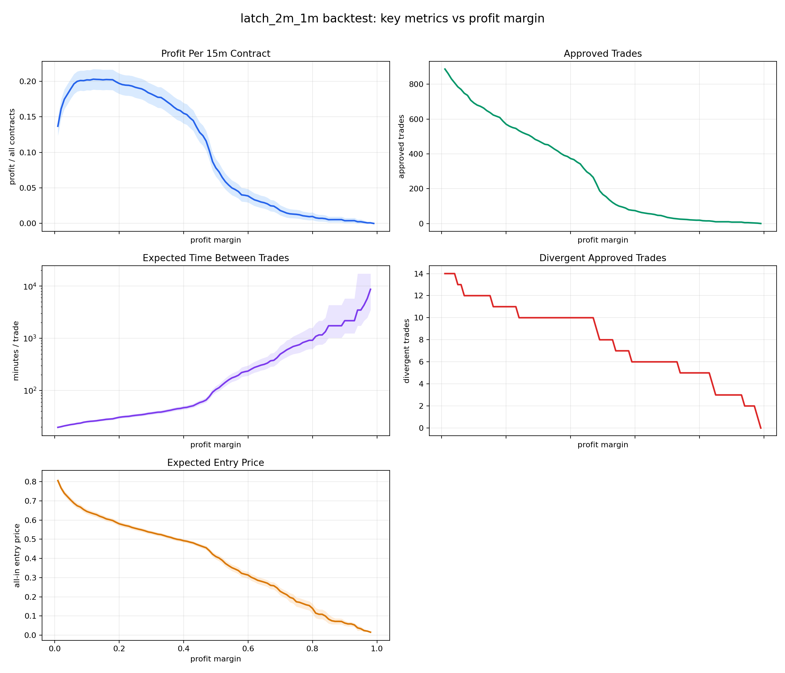

# Backtest Sweep: `latch_2m_1m` Profit Margins `$0.01` To `$0.99`

## Scope

- Data/artifacts: `kp-0529-research`.
- Strategy: current `latch_2m_1m` using the current horizon models.
- Thresholds: `2m < 0.0788`, `1m < 0.1329`.
- Margins swept in `$0.01` increments from `$0.01` through `$0.99`.
- Entry rule: after the first passing latch model, enter at the first historical row where `best_all_in_cost < 1 - profit_margin`.
- Divergence return rule: divergent trades lose the full all-in entry cost; non-divergent trades settle at `1.00`.
- Confidence intervals in the CSV/plot are contract-level bootstrap 95% intervals.

## Best Margin By Profit / All Contracts

The best margin in this sweep is `$0.12` with profit / all contracts `0.2028`.

## Full Sweep

| profit_margin | contracts_evaluated | model_signal_contracts | approved_trades | approved_trade_rate | expected_minutes_between_trades | divergent_trades | divergence_rate | expected_entry_price | expected_profit_per_traded_contract | expected_profit_per_15m_contract | total_profit |
| --- | --- | --- | --- | --- | --- | --- | --- | --- | --- | --- | --- |
| 0.0100 | 1158 | 991 | 887 | 0.7660 | 19.5829 | 14 | 0.0158 | 0.8058 | 0.1785 | 0.1367 | 158.2905 |
| 0.0200 | 1158 | 991 | 861 | 0.7435 | 20.1742 | 14 | 0.0163 | 0.7673 | 0.2165 | 0.1610 | 186.3977 |
| 0.0300 | 1158 | 991 | 831 | 0.7176 | 20.9025 | 14 | 0.0168 | 0.7400 | 0.2432 | 0.1745 | 202.0674 |
| 0.0400 | 1158 | 991 | 808 | 0.6978 | 21.4975 | 14 | 0.0173 | 0.7220 | 0.2606 | 0.1819 | 210.6033 |
| 0.0500 | 1158 | 991 | 785 | 0.6779 | 22.1274 | 13 | 0.0166 | 0.7044 | 0.2791 | 0.1892 | 219.0738 |
| 0.0600 | 1158 | 991 | 770 | 0.6649 | 22.5584 | 13 | 0.0169 | 0.6880 | 0.2951 | 0.1962 | 227.2303 |
| 0.0700 | 1158 | 991 | 748 | 0.6459 | 23.2219 | 12 | 0.0160 | 0.6747 | 0.3092 | 0.1997 | 231.3008 |
| 0.0800 | 1158 | 991 | 736 | 0.6356 | 23.6005 | 12 | 0.0163 | 0.6676 | 0.3161 | 0.2009 | 232.6547 |
| 0.0900 | 1158 | 991 | 708 | 0.6114 | 24.5339 | 12 | 0.0169 | 0.6548 | 0.3283 | 0.2007 | 232.4247 |
| 0.1000 | 1158 | 991 | 692 | 0.5976 | 25.1012 | 12 | 0.0173 | 0.6450 | 0.3377 | 0.2018 | 233.6842 |
| 0.1100 | 1158 | 991 | 680 | 0.5872 | 25.5441 | 12 | 0.0176 | 0.6390 | 0.3433 | 0.2016 | 233.4750 |
| 0.1200 | 1158 | 991 | 673 | 0.5812 | 25.8098 | 12 | 0.0178 | 0.6333 | 0.3489 | 0.2028 | 234.8061 |
| 0.1300 | 1158 | 991 | 663 | 0.5725 | 26.1991 | 12 | 0.0181 | 0.6283 | 0.3536 | 0.2025 | 234.4652 |
| 0.1400 | 1158 | 991 | 648 | 0.5596 | 26.8056 | 12 | 0.0185 | 0.6199 | 0.3615 | 0.2023 | 234.2839 |
| 0.1500 | 1158 | 991 | 637 | 0.5501 | 27.2684 | 12 | 0.0188 | 0.6142 | 0.3670 | 0.2019 | 233.7831 |
| 0.1600 | 1158 | 991 | 623 | 0.5380 | 27.8812 | 11 | 0.0177 | 0.6063 | 0.3760 | 0.2023 | 234.2559 |
| 0.1700 | 1158 | 991 | 616 | 0.5320 | 28.1981 | 11 | 0.0179 | 0.6022 | 0.3800 | 0.2021 | 234.0733 |
| 0.1800 | 1158 | 991 | 609 | 0.5259 | 28.5222 | 11 | 0.0181 | 0.5978 | 0.3841 | 0.2020 | 233.9313 |
| 0.1900 | 1158 | 991 | 588 | 0.5078 | 29.5408 | 11 | 0.0187 | 0.5890 | 0.3923 | 0.1992 | 230.6863 |
| 0.2000 | 1158 | 991 | 570 | 0.4922 | 30.4737 | 11 | 0.0193 | 0.5808 | 0.3999 | 0.1968 | 227.9274 |
| 0.2100 | 1158 | 991 | 559 | 0.4827 | 31.0733 | 11 | 0.0197 | 0.5760 | 0.4043 | 0.1952 | 226.0158 |
| 0.2200 | 1158 | 991 | 551 | 0.4758 | 31.5245 | 11 | 0.0200 | 0.5714 | 0.4086 | 0.1944 | 225.1447 |
| 0.2300 | 1158 | 991 | 546 | 0.4715 | 31.8132 | 11 | 0.0201 | 0.5681 | 0.4117 | 0.1941 | 224.8028 |
| 0.2400 | 1158 | 991 | 533 | 0.4603 | 32.5891 | 10 | 0.0188 | 0.5615 | 0.4197 | 0.1932 | 223.7016 |
| 0.2500 | 1158 | 991 | 523 | 0.4516 | 33.2122 | 10 | 0.0191 | 0.5571 | 0.4238 | 0.1914 | 221.6335 |
| 0.2600 | 1158 | 991 | 515 | 0.4447 | 33.7282 | 10 | 0.0194 | 0.5528 | 0.4278 | 0.1902 | 220.3030 |
| 0.2700 | 1158 | 991 | 508 | 0.4387 | 34.1929 | 10 | 0.0197 | 0.5490 | 0.4313 | 0.1892 | 219.1119 |
| 0.2800 | 1158 | 991 | 497 | 0.4292 | 34.9497 | 10 | 0.0201 | 0.5442 | 0.4356 | 0.1870 | 216.5127 |
| 0.2900 | 1158 | 991 | 483 | 0.4171 | 35.9627 | 10 | 0.0207 | 0.5385 | 0.4408 | 0.1839 | 212.9169 |
| 0.3000 | 1158 | 991 | 475 | 0.4102 | 36.5684 | 10 | 0.0211 | 0.5354 | 0.4436 | 0.1819 | 210.6963 |
| 0.3100 | 1158 | 991 | 465 | 0.4016 | 37.3548 | 10 | 0.0215 | 0.5310 | 0.4475 | 0.1797 | 208.0896 |
| 0.3200 | 1158 | 991 | 455 | 0.3929 | 38.1758 | 10 | 0.0220 | 0.5265 | 0.4515 | 0.1774 | 205.4290 |
| 0.3300 | 1158 | 991 | 452 | 0.3903 | 38.4292 | 10 | 0.0221 | 0.5242 | 0.4536 | 0.1771 | 205.0464 |
| 0.3400 | 1158 | 991 | 440 | 0.3800 | 39.4773 | 10 | 0.0227 | 0.5192 | 0.4581 | 0.1741 | 201.5619 |
| 0.3500 | 1158 | 991 | 427 | 0.3687 | 40.6792 | 10 | 0.0234 | 0.5138 | 0.4628 | 0.1707 | 197.6197 |
| 0.3600 | 1158 | 991 | 416 | 0.3592 | 41.7548 | 10 | 0.0240 | 0.5100 | 0.4660 | 0.1674 | 193.8404 |
| 0.3700 | 1158 | 991 | 402 | 0.3472 | 43.2090 | 10 | 0.0249 | 0.5042 | 0.4710 | 0.1635 | 189.3254 |
| 0.3800 | 1158 | 991 | 391 | 0.3377 | 44.4246 | 10 | 0.0256 | 0.4998 | 0.4747 | 0.1603 | 185.5942 |
| 0.3900 | 1158 | 991 | 385 | 0.3325 | 45.1169 | 10 | 0.0260 | 0.4972 | 0.4768 | 0.1585 | 183.5698 |
| 0.4000 | 1158 | 991 | 373 | 0.3221 | 46.5684 | 10 | 0.0268 | 0.4924 | 0.4808 | 0.1549 | 179.3267 |
| 0.4100 | 1158 | 991 | 367 | 0.3169 | 47.3297 | 10 | 0.0272 | 0.4898 | 0.4830 | 0.1531 | 177.2616 |
| 0.4200 | 1158 | 991 | 353 | 0.3048 | 49.2068 | 10 | 0.0283 | 0.4850 | 0.4867 | 0.1484 | 171.7957 |
| 0.4300 | 1158 | 991 | 342 | 0.2953 | 50.7895 | 10 | 0.0292 | 0.4811 | 0.4897 | 0.1446 | 167.4770 |
| 0.4400 | 1158 | 991 | 318 | 0.2746 | 54.6226 | 10 | 0.0314 | 0.4738 | 0.4947 | 0.1359 | 157.3163 |
| 0.4500 | 1158 | 991 | 297 | 0.2565 | 58.4848 | 10 | 0.0337 | 0.4676 | 0.4987 | 0.1279 | 148.1244 |
| 0.4600 | 1158 | 991 | 284 | 0.2453 | 61.1620 | 10 | 0.0352 | 0.4616 | 0.5032 | 0.1234 | 142.9143 |
| 0.4700 | 1158 | 991 | 265 | 0.2288 | 65.5472 | 10 | 0.0377 | 0.4557 | 0.5066 | 0.1159 | 134.2450 |
| 0.4800 | 1158 | 991 | 228 | 0.1969 | 76.1842 | 9 | 0.0395 | 0.4406 | 0.5199 | 0.1024 | 118.5476 |
| 0.4900 | 1158 | 991 | 188 | 0.1623 | 92.3936 | 8 | 0.0426 | 0.4222 | 0.5352 | 0.0869 | 100.6199 |
| 0.5000 | 1158 | 991 | 167 | 0.1442 | 104.0120 | 8 | 0.0479 | 0.4100 | 0.5421 | 0.0782 | 90.5289 |
| 0.5100 | 1158 | 991 | 154 | 0.1330 | 112.7922 | 8 | 0.0519 | 0.4024 | 0.5457 | 0.0726 | 84.0329 |
| 0.5200 | 1158 | 991 | 136 | 0.1174 | 127.7206 | 8 | 0.0588 | 0.3902 | 0.5510 | 0.0647 | 74.9324 |
| 0.5300 | 1158 | 991 | 121 | 0.1045 | 143.5537 | 8 | 0.0661 | 0.3738 | 0.5601 | 0.0585 | 67.7676 |
| 0.5400 | 1158 | 991 | 109 | 0.0941 | 159.3578 | 7 | 0.0642 | 0.3624 | 0.5734 | 0.0540 | 62.4957 |
| 0.5500 | 1158 | 991 | 100 | 0.0864 | 173.7000 | 7 | 0.0700 | 0.3520 | 0.5780 | 0.0499 | 57.8045 |
| 0.5600 | 1158 | 991 | 95 | 0.0820 | 182.8421 | 7 | 0.0737 | 0.3449 | 0.5814 | 0.0477 | 55.2350 |
| 0.5700 | 1158 | 991 | 89 | 0.0769 | 195.1685 | 7 | 0.0787 | 0.3370 | 0.5843 | 0.0449 | 52.0055 |
| 0.5800 | 1158 | 991 | 79 | 0.0682 | 219.8734 | 7 | 0.0886 | 0.3227 | 0.5887 | 0.0402 | 46.5082 |
| 0.5900 | 1158 | 991 | 76 | 0.0656 | 228.5526 | 6 | 0.0789 | 0.3179 | 0.6031 | 0.0396 | 45.8380 |
| 0.6000 | 1158 | 991 | 74 | 0.0639 | 234.7297 | 6 | 0.0811 | 0.3137 | 0.6052 | 0.0387 | 44.7855 |
| 0.6100 | 1158 | 991 | 68 | 0.0587 | 255.4412 | 6 | 0.0882 | 0.3021 | 0.6097 | 0.0358 | 41.4600 |
| 0.6200 | 1158 | 991 | 63 | 0.0544 | 275.7143 | 6 | 0.0952 | 0.2949 | 0.6098 | 0.0332 | 38.4194 |
| 0.6300 | 1158 | 991 | 60 | 0.0518 | 289.5000 | 6 | 0.1000 | 0.2862 | 0.6138 | 0.0318 | 36.8285 |
| 0.6400 | 1158 | 991 | 57 | 0.0492 | 304.7368 | 6 | 0.1053 | 0.2816 | 0.6131 | 0.0302 | 34.9493 |
| 0.6500 | 1158 | 991 | 55 | 0.0475 | 315.8182 | 6 | 0.1091 | 0.2766 | 0.6143 | 0.0292 | 33.7865 |
| 0.6600 | 1158 | 991 | 52 | 0.0449 | 334.0385 | 6 | 0.1154 | 0.2710 | 0.6136 | 0.0276 | 31.9094 |
| 0.6700 | 1158 | 991 | 47 | 0.0406 | 369.5745 | 6 | 0.1277 | 0.2599 | 0.6124 | 0.0249 | 28.7831 |
| 0.6800 | 1158 | 991 | 46 | 0.0397 | 377.6087 | 6 | 0.1304 | 0.2579 | 0.6117 | 0.0243 | 28.1377 |
| 0.6900 | 1158 | 991 | 41 | 0.0354 | 423.6585 | 6 | 0.1463 | 0.2464 | 0.6072 | 0.0215 | 24.8971 |
| 0.7000 | 1158 | 991 | 35 | 0.0302 | 496.2857 | 6 | 0.1714 | 0.2287 | 0.5999 | 0.0181 | 20.9952 |
| 0.7100 | 1158 | 991 | 32 | 0.0276 | 542.8125 | 6 | 0.1875 | 0.2193 | 0.5932 | 0.0164 | 18.9818 |
| 0.7200 | 1158 | 991 | 29 | 0.0250 | 598.9655 | 6 | 0.2069 | 0.2112 | 0.5819 | 0.0146 | 16.8753 |
| 0.7300 | 1158 | 991 | 27 | 0.0233 | 643.3333 | 6 | 0.2222 | 0.1975 | 0.5803 | 0.0135 | 15.6685 |
| 0.7400 | 1158 | 991 | 25 | 0.0216 | 694.8000 | 5 | 0.2000 | 0.1916 | 0.6084 | 0.0131 | 15.2105 |
| 0.7500 | 1158 | 991 | 24 | 0.0207 | 723.7500 | 5 | 0.2083 | 0.1742 | 0.6174 | 0.0128 | 14.8186 |
| 0.7600 | 1158 | 991 | 23 | 0.0199 | 755.2174 | 5 | 0.2174 | 0.1713 | 0.6113 | 0.0121 | 14.0596 |
| 0.7700 | 1158 | 991 | 21 | 0.0181 | 827.1429 | 5 | 0.2381 | 0.1650 | 0.5969 | 0.0108 | 12.5349 |
| 0.7800 | 1158 | 991 | 20 | 0.0173 | 868.5000 | 5 | 0.2500 | 0.1588 | 0.5912 | 0.0102 | 11.8248 |
| 0.7900 | 1158 | 991 | 19 | 0.0164 | 914.2105 | 5 | 0.2632 | 0.1546 | 0.5823 | 0.0096 | 11.0632 |
| 0.8000 | 1158 | 991 | 19 | 0.0164 | 914.2105 | 5 | 0.2632 | 0.1398 | 0.5970 | 0.0098 | 11.3430 |
| 0.8100 | 1158 | 991 | 16 | 0.0138 | 1085.6250 | 5 | 0.3125 | 0.1151 | 0.5724 | 0.0079 | 9.1588 |
| 0.8200 | 1158 | 991 | 15 | 0.0130 | 1158.0000 | 5 | 0.3333 | 0.1093 | 0.5574 | 0.0072 | 8.3611 |
| 0.8300 | 1158 | 991 | 15 | 0.0130 | 1158.0000 | 5 | 0.3333 | 0.1091 | 0.5576 | 0.0072 | 8.3633 |
| 0.8400 | 1158 | 991 | 13 | 0.0112 | 1336.1538 | 4 | 0.3077 | 0.1000 | 0.5923 | 0.0066 | 7.6995 |
| 0.8500 | 1158 | 991 | 10 | 0.0086 | 1737.0000 | 3 | 0.3000 | 0.0837 | 0.6163 | 0.0053 | 6.1628 |
| 0.8600 | 1158 | 991 | 10 | 0.0086 | 1737.0000 | 3 | 0.3000 | 0.0753 | 0.6247 | 0.0054 | 6.2472 |
| 0.8700 | 1158 | 991 | 10 | 0.0086 | 1737.0000 | 3 | 0.3000 | 0.0722 | 0.6278 | 0.0054 | 6.2783 |
| 0.8800 | 1158 | 991 | 10 | 0.0086 | 1737.0000 | 3 | 0.3000 | 0.0722 | 0.6278 | 0.0054 | 6.2783 |
| 0.8900 | 1158 | 991 | 10 | 0.0086 | 1737.0000 | 3 | 0.3000 | 0.0717 | 0.6283 | 0.0054 | 6.2826 |
| 0.9000 | 1158 | 991 | 8 | 0.0069 | 2171.2500 | 3 | 0.3750 | 0.0635 | 0.5615 | 0.0039 | 4.4919 |
| 0.9100 | 1158 | 991 | 8 | 0.0069 | 2171.2500 | 3 | 0.3750 | 0.0590 | 0.5660 | 0.0039 | 4.5277 |
| 0.9200 | 1158 | 991 | 8 | 0.0069 | 2171.2500 | 3 | 0.3750 | 0.0590 | 0.5660 | 0.0039 | 4.5277 |
| 0.9300 | 1158 | 991 | 8 | 0.0069 | 2171.2500 | 3 | 0.3750 | 0.0536 | 0.5714 | 0.0039 | 4.5712 |
| 0.9400 | 1158 | 991 | 5 | 0.0043 | 3474.0000 | 2 | 0.4000 | 0.0384 | 0.5616 | 0.0024 | 2.8081 |
| 0.9500 | 1158 | 991 | 5 | 0.0043 | 3474.0000 | 2 | 0.4000 | 0.0338 | 0.5662 | 0.0024 | 2.8312 |
| 0.9600 | 1158 | 991 | 4 | 0.0035 | 4342.5000 | 2 | 0.5000 | 0.0243 | 0.4757 | 0.0016 | 1.9028 |
| 0.9700 | 1158 | 991 | 3 | 0.0026 | 5790.0000 | 2 | 0.6667 | 0.0215 | 0.3119 | 0.0008 | 0.9356 |
| 0.9800 | 1158 | 991 | 2 | 0.0017 | 8685.0000 | 1 | 0.5000 | 0.0158 | 0.4842 | 0.0008 | 0.9683 |
| 0.9900 | 1158 | 991 | 0 | 0.0000 | inf | 0 |  |  |  | 0.0000 | 0.0000 |

## Plot

## Output Files

- Sweep CSV: `kp-0529-research/horizon_models/latch_2m_1m_margin_sweep_001_099.csv`
- Plot: `kp-0529-research/horizon_models/plots/latch_2m_1m_margin_sweep_001_099_key_metrics.png`
- Report: `kp-0529-research/horizon_models/latch_2m_1m_margin_sweep_001_099_report.md`
