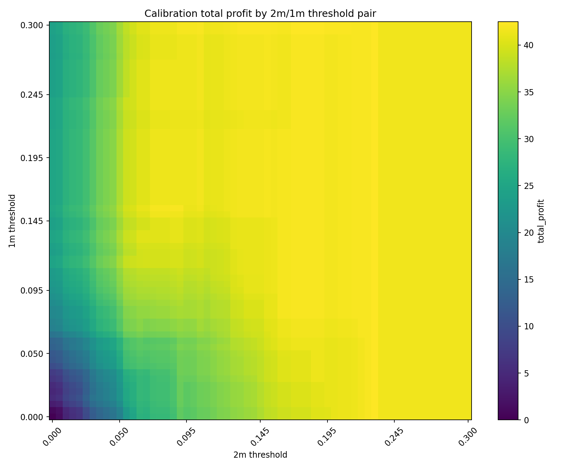
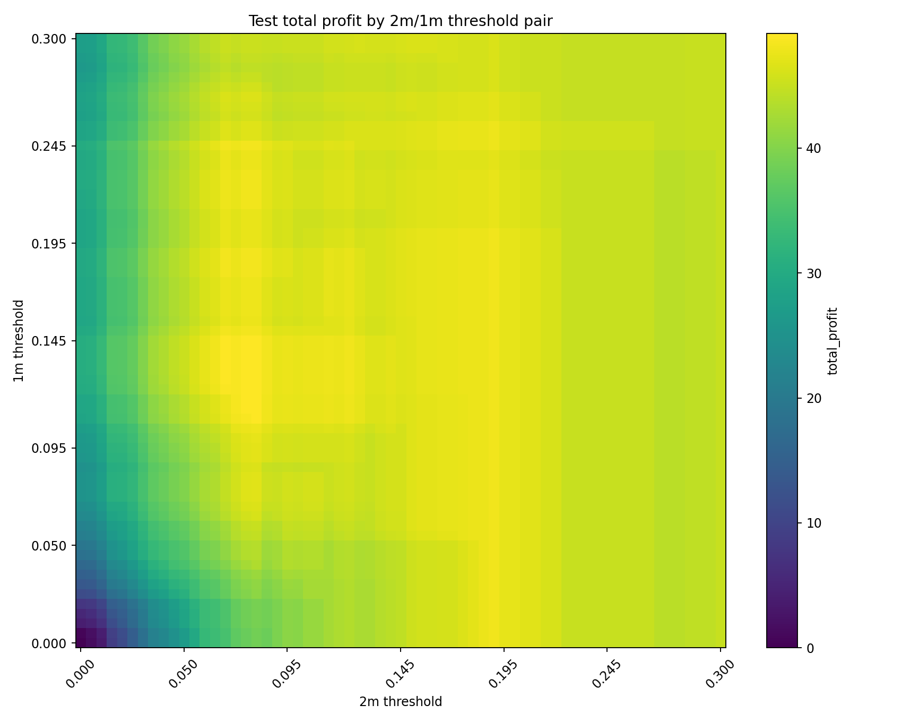
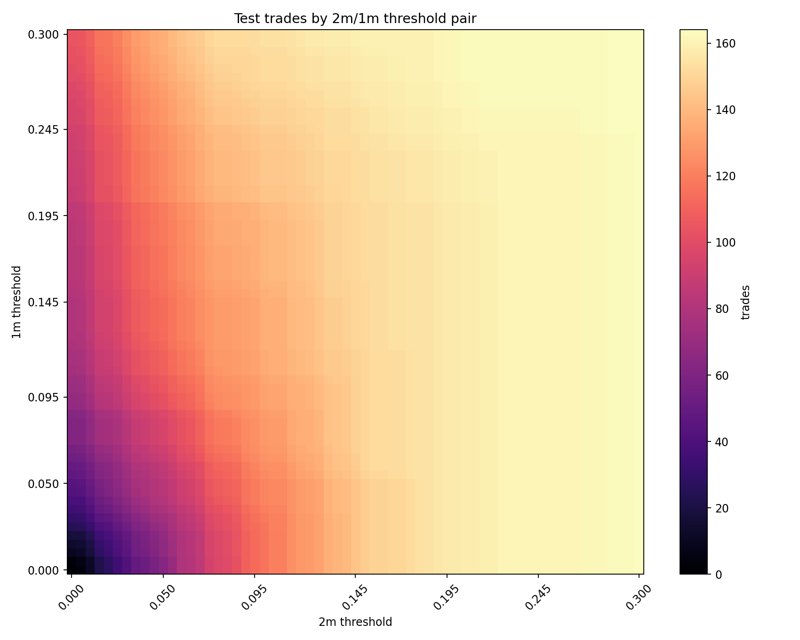

# Latch 2m/1m Threshold Pair Search At Profit Margin 18c

## Scope

- Strategy: `latch_2m_1m`, hold to settlement once entered.
- Profit margin fixed at `$0.18`; an opportunity qualifies when `best_all_in_cost < 0.82`.
- Fees use the odds-dependent equations from `cli_trader_v2.py`: `0.07*p*(1-p)` on Kalshi and `0.05*p*(1-p)` on Polymarket, with `N=1` per leg.
- If the 2m model passes, the contract latches at 2m and the 1m model does not revoke that permission. If the 2m model fails, the 1m model can still latch at 1m.
- Return rule: agreement pays `1.0 - all_in_cost`; divergence loses the stake and returns `-all_in_cost`.
- Thresholds were scanned from `0.000` through `0.300` in `0.005` increments, plus the saved per-horizon thresholds exactly.
- The recommended pair is selected on calibration only and then evaluated unchanged on the final test split.

## Recommendation

The calibration-optimal pair is `2m < 0.1700` and `1m < 0.2950`.
On calibration this pair produced `149` trades, total profit `42.4755`, and mean profit per trade `0.2851`.
Applied unchanged to test, it produced `160` trades, total profit `46.1050`, mean profit per trade `0.2882`, and divergence rate `0.0938`.

For comparison, the saved retrained thresholds are `2m < 0.0788` and `1m < 0.1329`. On test they produced `130` trades and total profit `49.1528`.

Operationally, this scan does not justify loosening the live thresholds yet: the saved pair beats the calibration-optimal pair on held-out test by `3.0478` total profit and has a lower test divergence rate (`0.0308` vs. `0.0938`). Treat the calibration-optimal pair as a candidate for forward paper trading, not as a direct replacement.

The test-optimal row is shown only as a diagnostic reference, not as the deployable recommendation.

## Selected Results

| selection | sample | threshold_2m | threshold_1m | contracts | model_signal_contracts | trades | trades_from_2m | trades_from_1m | divergences | divergence_rate | mean_all_in_cost | mean_fee_adjusted_edge | mean_predicted_diverge_prob | mean_profit_per_trade | total_profit | bootstrap_total_profit_ci_low | bootstrap_total_profit_ci_high |
| --- | --- | --- | --- | --- | --- | --- | --- | --- | --- | --- | --- | --- | --- | --- | --- | --- | --- |
| saved_thresholds_calibration | calibration | 0.0788 | 0.1329 | 232 | 206 | 126 | 88 | 38 | 7 | 0.0556 | 0.6221 | 0.3779 | 0.0501 | 0.3224 | 40.6167 | 32.5948 | 48.1822 |
| saved_thresholds_test | test | 0.0788 | 0.1329 | 232 | 199 | 130 | 97 | 33 | 4 | 0.0308 | 0.5911 | 0.4089 | 0.0445 | 0.3781 | 49.1528 | 41.4747 | 57.0304 |
| calibration_optimal_calibration | calibration | 0.1700 | 0.2950 | 232 | 229 | 149 | 142 | 7 | 12 | 0.0805 | 0.6344 | 0.3656 | 0.0727 | 0.2851 | 42.4755 | 33.6192 | 51.1844 |
| calibration_optimal_test | test | 0.1700 | 0.2950 | 232 | 229 | 160 | 150 | 10 | 15 | 0.0938 | 0.6181 | 0.3819 | 0.0715 | 0.2882 | 46.1050 | 36.3611 | 55.7339 |
| calibration_optimal_all | all | 0.1700 | 0.2950 | 1158 | 1139 | 775 | 729 | 46 | 67 | 0.0865 | 0.6211 | 0.3789 | 0.0777 | 0.2924 | 226.6089 | 205.8040 | 245.8708 |
| test_optimal_test_reference | test | 0.0788 | 0.1250 | 232 | 198 | 130 | 97 | 33 | 4 | 0.0308 | 0.5911 | 0.4089 | 0.0445 | 0.3781 | 49.1528 | 41.3799 | 57.3359 |

## Top Calibration Pairs

| threshold_2m | threshold_1m | trades | trades_from_2m | trades_from_1m | divergences | divergence_rate | mean_all_in_cost | mean_profit_per_trade | total_profit |
| --- | --- | --- | --- | --- | --- | --- | --- | --- | --- |
| 0.1700 | 0.2950 | 149 | 142 | 7 | 12 | 0.0805 | 0.6344 | 0.2851 | 42.4755 |
| 0.1700 | 0.3000 | 149 | 142 | 7 | 12 | 0.0805 | 0.6344 | 0.2851 | 42.4755 |
| 0.1750 | 0.2950 | 149 | 142 | 7 | 12 | 0.0805 | 0.6344 | 0.2851 | 42.4755 |
| 0.1750 | 0.3000 | 149 | 142 | 7 | 12 | 0.0805 | 0.6344 | 0.2851 | 42.4755 |
| 0.1800 | 0.2950 | 149 | 142 | 7 | 12 | 0.0805 | 0.6344 | 0.2851 | 42.4755 |
| 0.1800 | 0.3000 | 149 | 142 | 7 | 12 | 0.0805 | 0.6344 | 0.2851 | 42.4755 |
| 0.1850 | 0.2950 | 149 | 143 | 6 | 12 | 0.0805 | 0.6344 | 0.2851 | 42.4755 |
| 0.1850 | 0.3000 | 149 | 143 | 6 | 12 | 0.0805 | 0.6344 | 0.2851 | 42.4755 |
| 0.1900 | 0.2950 | 149 | 143 | 6 | 12 | 0.0805 | 0.6344 | 0.2851 | 42.4755 |
| 0.1900 | 0.3000 | 149 | 143 | 6 | 12 | 0.0805 | 0.6344 | 0.2851 | 42.4755 |
| 0.2300 | 0.0000 | 150 | 150 | 0 | 12 | 0.0800 | 0.6376 | 0.2824 | 42.3615 |
| 0.2300 | 0.0050 | 150 | 150 | 0 | 12 | 0.0800 | 0.6376 | 0.2824 | 42.3615 |

## Top Test Pairs

| threshold_2m | threshold_1m | trades | trades_from_2m | trades_from_1m | divergences | divergence_rate | mean_all_in_cost | mean_profit_per_trade | total_profit |
| --- | --- | --- | --- | --- | --- | --- | --- | --- | --- |
| 0.0788 | 0.1250 | 130 | 97 | 33 | 4 | 0.0308 | 0.5911 | 0.3781 | 49.1528 |
| 0.0788 | 0.1300 | 130 | 97 | 33 | 4 | 0.0308 | 0.5911 | 0.3781 | 49.1528 |
| 0.0788 | 0.1329 | 130 | 97 | 33 | 4 | 0.0308 | 0.5911 | 0.3781 | 49.1528 |
| 0.0788 | 0.1350 | 130 | 97 | 33 | 4 | 0.0308 | 0.5911 | 0.3781 | 49.1528 |
| 0.0788 | 0.1400 | 130 | 97 | 33 | 4 | 0.0308 | 0.5911 | 0.3781 | 49.1528 |
| 0.0788 | 0.1450 | 130 | 97 | 33 | 4 | 0.0308 | 0.5911 | 0.3781 | 49.1528 |
| 0.0800 | 0.1250 | 130 | 99 | 31 | 4 | 0.0308 | 0.5912 | 0.3781 | 49.1475 |
| 0.0800 | 0.1300 | 130 | 99 | 31 | 4 | 0.0308 | 0.5912 | 0.3781 | 49.1475 |
| 0.0800 | 0.1329 | 130 | 99 | 31 | 4 | 0.0308 | 0.5912 | 0.3781 | 49.1475 |
| 0.0800 | 0.1350 | 130 | 99 | 31 | 4 | 0.0308 | 0.5912 | 0.3781 | 49.1475 |
| 0.0800 | 0.1400 | 130 | 99 | 31 | 4 | 0.0308 | 0.5912 | 0.3781 | 49.1475 |
| 0.0800 | 0.1450 | 130 | 99 | 31 | 4 | 0.0308 | 0.5912 | 0.3781 | 49.1475 |

## Plots

## Output Files

- Full scan: `kp-0529-research/horizon_models/latch_2m_1m_threshold_pair_scan_pm018.csv`
- Selected rows: `kp-0529-research/horizon_models/latch_2m_1m_threshold_pair_selected_pm018.csv`
- Selected trade rows: `kp-0529-research/horizon_models/latch_2m_1m_threshold_pair_trades_pm018.csv`
- Calibration heatmap: `kp-0529-research/horizon_models/plots/latch_2m_1m_threshold_pair_calibration_profit_pm018.png`
- Test heatmap: `kp-0529-research/horizon_models/plots/latch_2m_1m_threshold_pair_test_profit_pm018.png`
- Test trade-count heatmap: `kp-0529-research/horizon_models/plots/latch_2m_1m_threshold_pair_test_trades_pm018.png`

## Interpretation

The threshold pair controls coverage before price-entry filtering. A looser 2m threshold tends to dominate because it opens the full 2-minute entry window. The 1m threshold mostly matters for contracts that fail at 2m but become acceptable at 1m; those entries have less time to find an 18c opportunity.

This remains a price-and-outcome backtest. It does not model live order failures, minimum Polymarket notional constraints, or queue priority.
