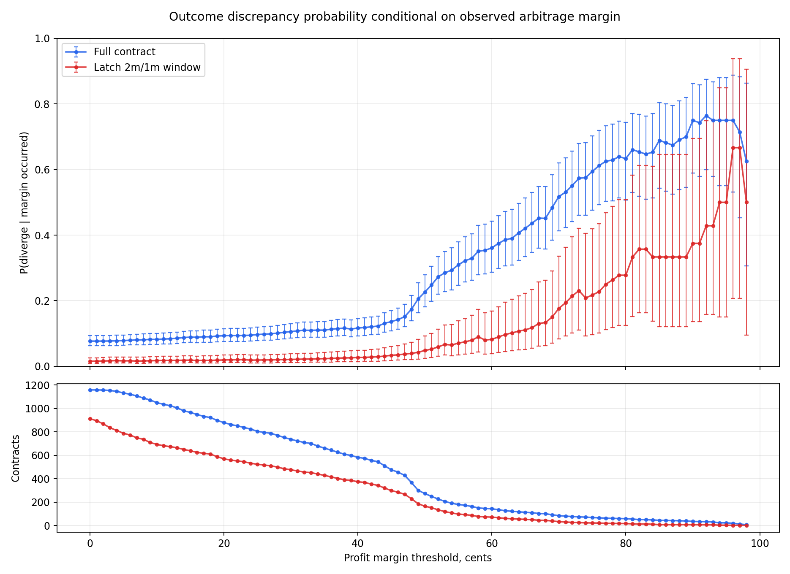

# Divergence Probability Conditional On Profit Margin Occurrence

## Definition

- `profit_margin_cents = x` means a fee-adjusted arbitrage edge of at least `x` cents appeared at least once.
- Fee-adjusted edge is `1 - best_all_in_cost`, using the same odds-dependent Kalshi and Polymarket fee equations as the prior profit-margin sweep.
- `full_contract` checks every available row up to contract close.
- `latch_2m_1m_window` checks only rows after the current strategy first latches tradable via the 2m or 1m model. Contracts that never latch cannot satisfy this condition.
- The probability reported is `P(contract diverged | edge >= x cents occurred at least once)`.

## Selected Margins

| sample | profit_margin_cents | occurrence_contracts | occurrence_rate | divergent_occurrence_contracts | p_diverge_given_margin_occurred | wilson_ci_low | wilson_ci_high |
| --- | --- | --- | --- | --- | --- | --- | --- |
| full_contract | 0 | 1159 | 1.0000 | 89 | 0.0768 | 0.0628 | 0.0936 |
| full_contract | 5 | 1133 | 0.9776 | 89 | 0.0786 | 0.0643 | 0.0957 |
| full_contract | 10 | 1050 | 0.9060 | 86 | 0.0819 | 0.0668 | 0.1001 |
| full_contract | 15 | 967 | 0.8343 | 86 | 0.0889 | 0.0726 | 0.1085 |
| full_contract | 18 | 923 | 0.7964 | 83 | 0.0899 | 0.0731 | 0.1101 |
| full_contract | 20 | 880 | 0.7593 | 82 | 0.0932 | 0.0757 | 0.1142 |
| full_contract | 25 | 806 | 0.6954 | 78 | 0.0968 | 0.0782 | 0.1191 |
| full_contract | 30 | 737 | 0.6359 | 78 | 0.1058 | 0.0856 | 0.1301 |
| full_contract | 40 | 583 | 0.5030 | 68 | 0.1166 | 0.0931 | 0.1452 |
| full_contract | 50 | 274 | 0.2364 | 62 | 0.2263 | 0.1807 | 0.2794 |
| latch_2m_1m_window | 0 | 914 | 0.7893 | 14 | 0.0153 | 0.0091 | 0.0255 |
| latch_2m_1m_window | 5 | 789 | 0.6813 | 13 | 0.0165 | 0.0097 | 0.0280 |
| latch_2m_1m_window | 10 | 694 | 0.5993 | 12 | 0.0173 | 0.0099 | 0.0300 |
| latch_2m_1m_window | 15 | 639 | 0.5518 | 12 | 0.0188 | 0.0108 | 0.0325 |
| latch_2m_1m_window | 18 | 611 | 0.5276 | 11 | 0.0180 | 0.0101 | 0.0319 |
| latch_2m_1m_window | 20 | 571 | 0.4931 | 11 | 0.0193 | 0.0108 | 0.0342 |
| latch_2m_1m_window | 25 | 524 | 0.4525 | 10 | 0.0191 | 0.0104 | 0.0348 |
| latch_2m_1m_window | 30 | 477 | 0.4119 | 10 | 0.0210 | 0.0114 | 0.0382 |
| latch_2m_1m_window | 40 | 375 | 0.3238 | 10 | 0.0267 | 0.0145 | 0.0484 |
| latch_2m_1m_window | 50 | 166 | 0.1434 | 8 | 0.0482 | 0.0246 | 0.0922 |

## Highest Available Margin In Each Sample

| sample | profit_margin_cents | occurrence_contracts | divergent_occurrence_contracts | p_diverge_given_margin_occurred |
| --- | --- | --- | --- | --- |
| full_contract | 98 | 8 | 5 | 0.6250 |
| latch_2m_1m_window | 98 | 2 | 1 | 0.5000 |

## Plot

The upper panel is the conditional divergence probability with Wilson 95% intervals. The lower panel shows how many contracts satisfy the margin condition at each threshold; high-margin points with few contracts are noisy.

## Output Files

- Full table: `profit_margin_divergence_probability.csv`
- Plot: `plots/profit_margin_divergence_probability.png`
