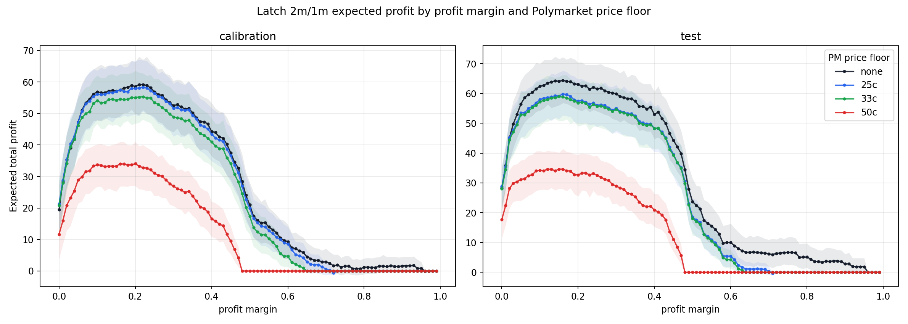
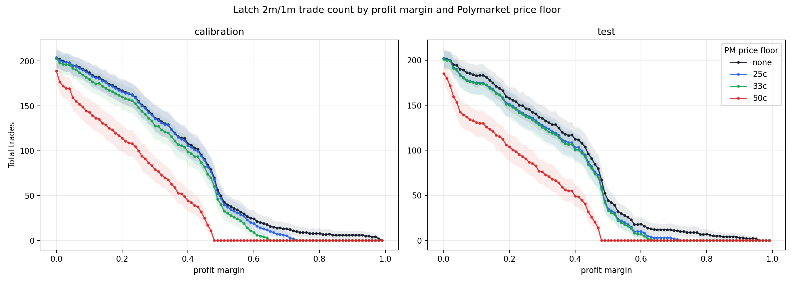

# Profit Margin Sweep With Polymarket Price Floors

## Scope

- Strategy: same `latch_2m_1m` logic as `profit_margin_latch_2m_1m_report.md`.
- Saved model thresholds: `2m=0.0788`, `1m=0.1378`.
- Entry rule: after the first passing latch model, enter at the first historical row where an arbitrage direction satisfies `all_in_cost < 1 - profit_margin`.
- New constraint: the Polymarket ask price for the Polymarket leg in that direction must be strictly greater than the configured floor.
- Tested floors: no floor, `>25c`, `>33c`, and `>50c`.
- If both arb directions qualify in the same row, the cheaper all-in direction is used.
- Return rule: if the platforms agree, profit is `1 - all_in_cost`; if they diverge, the full stake is lost and profit is `-all_in_cost`.

## Calibration-Optimal Margins

| sample | floor_label | polymarket_price_floor | profit_margin | contracts | model_signal_contracts | trades | trade_rate | divergences | divergence_rate | mean_polymarket_price | mean_all_in_cost | mean_fee_adjusted_edge | mean_profit_per_trade | total_profit | bootstrap_total_profit_ci_low | bootstrap_total_profit_ci_high |
| --- | --- | --- | --- | --- | --- | --- | --- | --- | --- | --- | --- | --- | --- | --- | --- | --- |
| calibration | none | 0.0000 | 0.2200 | 232 | 205 | 164 | 0.7069 | 10 | 0.0610 | 0.5506 | 0.5791 | 0.4209 | 0.3599 | 59.0201 | 51.1411 | 67.0662 |
| calibration | 25c | 0.2500 | 0.2200 | 232 | 205 | 163 | 0.7026 | 10 | 0.0613 | 0.5526 | 0.5812 | 0.4188 | 0.3574 | 58.2611 | 50.6792 | 66.9126 |
| calibration | 33c | 0.3300 | 0.2200 | 232 | 205 | 157 | 0.6767 | 9 | 0.0573 | 0.5629 | 0.5897 | 0.4103 | 0.3530 | 55.4186 | 48.1108 | 62.7817 |
| calibration | 50c | 0.5000 | 0.1600 | 232 | 205 | 125 | 0.5388 | 6 | 0.0480 | 0.6475 | 0.6800 | 0.3200 | 0.2720 | 33.9964 | 26.8555 | 40.9981 |

## Held-Out Test At Calibration-Optimal Margins

| floor_label | polymarket_price_floor | profit_margin | trades | trade_rate | divergences | divergence_rate | mean_polymarket_price | mean_all_in_cost | mean_profit_per_trade | total_profit | bootstrap_total_profit_ci_low | bootstrap_total_profit_ci_high |
| --- | --- | --- | --- | --- | --- | --- | --- | --- | --- | --- | --- | --- |
| none | 0.0000 | 0.2200 | 154 | 0.6638 | 4 | 0.0260 | 0.5286 | 0.5690 | 0.4051 | 62.3802 | 54.9280 | 69.5446 |
| 25c | 0.2500 | 0.2200 | 147 | 0.6336 | 4 | 0.0272 | 0.5533 | 0.5840 | 0.3887 | 57.1456 | 50.1104 | 64.1910 |
| 33c | 0.3300 | 0.2200 | 146 | 0.6293 | 4 | 0.0274 | 0.5557 | 0.5858 | 0.3868 | 56.4664 | 49.6780 | 63.9354 |
| 50c | 0.5000 | 0.1600 | 117 | 0.5043 | 4 | 0.0342 | 0.6427 | 0.6708 | 0.2950 | 34.5204 | 27.9244 | 41.3914 |

## Test-Set Best Margins

These are for reference only because they are selected on held-out test data.

| sample | floor_label | polymarket_price_floor | profit_margin | contracts | model_signal_contracts | trades | trade_rate | divergences | divergence_rate | mean_polymarket_price | mean_all_in_cost | mean_fee_adjusted_edge | mean_profit_per_trade | total_profit | bootstrap_total_profit_ci_low | bootstrap_total_profit_ci_high |
| --- | --- | --- | --- | --- | --- | --- | --- | --- | --- | --- | --- | --- | --- | --- | --- | --- |
| test | none | 0.0000 | 0.1600 | 232 | 203 | 171 | 0.7371 | 4 | 0.0234 | 0.5603 | 0.6006 | 0.3994 | 0.3760 | 64.2915 | 56.7868 | 72.1653 |
| test | 25c | 0.2500 | 0.1600 | 232 | 203 | 164 | 0.7069 | 4 | 0.0244 | 0.5845 | 0.6129 | 0.3871 | 0.3627 | 59.4873 | 52.6442 | 67.5947 |
| test | 33c | 0.3300 | 0.1500 | 232 | 203 | 167 | 0.7198 | 4 | 0.0240 | 0.5960 | 0.6235 | 0.3765 | 0.3526 | 58.8814 | 50.7460 | 65.6662 |
| test | 50c | 0.5000 | 0.1500 | 232 | 203 | 121 | 0.5216 | 4 | 0.0331 | 0.6536 | 0.6810 | 0.3190 | 0.2859 | 34.5938 | 28.0997 | 40.1423 |

## Plots

## Output Files

- Sweep table: `profit_margin_latch_2m_1m_poly_floor_sweep.csv`
- Trade table: `profit_margin_latch_2m_1m_poly_floor_trades.csv`
- Expected profit plot: `plots/profit_margin_latch_2m_1m_poly_floor_expected_profit.png`
- Total trades plot: `plots/profit_margin_latch_2m_1m_poly_floor_total_trades.png`
