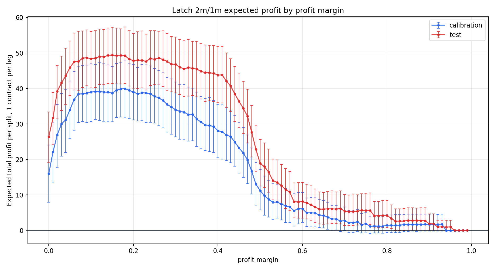
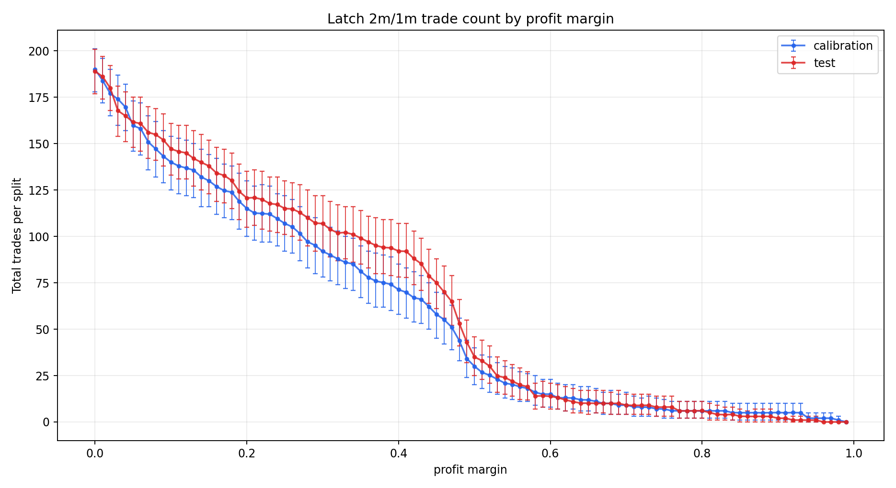
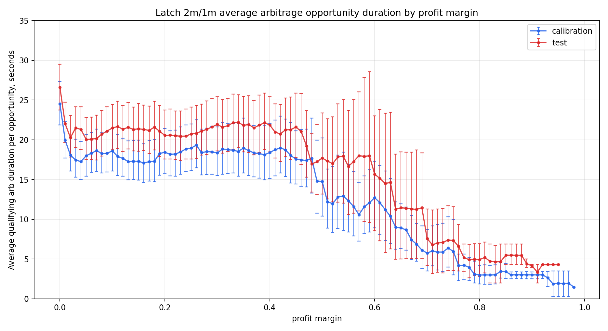

# Profit Margin Sweep For `latch_2m_1m`

## Scope

- Strategy: current latch-hold entry logic using only `2m` and `1m` as latch candidates.
- Saved model thresholds: `2m=0.0788`, `1m=0.1378`.
- Entry rule: after the first passing latch model, enter at the first historical row where `all_in_cost < 1 - profit_margin`.
- Profit margins swept from `$0.00` through `$0.99` in `$0.01` increments.
- Fees use the current odds-dependent equations from `cli_trader_v2.py`: `0.07*p*(1-p)` on Kalshi and `0.05*p*(1-p)` on Polymarket, with `N=1` per leg.
- Return rule: if the platforms agree, profit is `1 - all_in_cost`; if they diverge, the full stake is lost and profit is `-all_in_cost`.
- Arbitrage duration is measured after the latch point as average continuous opportunity length. One opportunity is a contiguous sampled run where `all_in_cost < 1 - profit_margin`; each row contributes time until the next snapshot, clipped at `5` seconds to avoid overstating stale data gaps.
- Historical CSVs do not contain reliable ask-side liquidity for every row, so this is a price-and-outcome backtest, not a live fill simulator.

## Recommendation

The calibration-optimal profit margin is `$0.18`. On calibration it produced `124` trades, total profit `39.9184`, and a 95% bootstrap interval of `[31.6875, 47.7809]`.

Applied unchanged to the held-out test split, `$0.18` produced `130` trades, total profit `49.1672`, and a 95% bootstrap interval of `[41.3159, 57.2787]`.

For reference only, the test-set best margin is `$0.14` with total profit `49.3734`. That value is not the recommended parameter because it is selected on the held-out test split.

## Best Margin By Split

| sample | profit_margin | contracts | model_signal_contracts | trades | trade_rate | divergences | divergence_rate | mean_all_in_cost | mean_fee_adjusted_edge | mean_profit_per_trade | total_profit | bootstrap_total_profit_ci_low | bootstrap_total_profit_ci_high | total_model_expected_profit |
| --- | --- | --- | --- | --- | --- | --- | --- | --- | --- | --- | --- | --- | --- | --- |
| calibration | 0.1800 | 232 | 205 | 124 | 0.5345 | 7 | 0.0565 | 0.6216 | 0.3784 | 0.3219 | 39.9184 | 31.6875 | 47.7809 | 40.5856 |
| test | 0.1400 | 232 | 203 | 140 | 0.6034 | 4 | 0.0286 | 0.6188 | 0.3812 | 0.3527 | 49.3734 | 41.3153 | 56.9897 | 47.2932 |
| all | 0.1200 | 1158 | 998 | 675 | 0.5829 | 12 | 0.0178 | 0.6320 | 0.3680 | 0.3503 | 236.4332 | 219.2786 | 252.5221 | 216.0698 |

## Calibration Margins Near The Optimum

| profit_margin | trades | divergences | mean_all_in_cost | mean_fee_adjusted_edge | mean_profit_per_trade | total_profit | bootstrap_total_profit_ci_low | bootstrap_total_profit_ci_high |
| --- | --- | --- | --- | --- | --- | --- | --- | --- |
| 0.1300 | 136 | 8 | 0.6538 | 0.3462 | 0.2873 | 39.0772 | 30.7649 | 46.9326 |
| 0.1400 | 132 | 8 | 0.6446 | 0.3554 | 0.2948 | 38.9073 | 30.7405 | 46.8323 |
| 0.1500 | 130 | 8 | 0.6409 | 0.3591 | 0.2975 | 38.6791 | 30.6265 | 46.1974 |
| 0.1600 | 127 | 7 | 0.6336 | 0.3664 | 0.3112 | 39.5282 | 31.7941 | 47.0352 |
| 0.1700 | 125 | 7 | 0.6263 | 0.3737 | 0.3177 | 39.7086 | 31.9641 | 47.3897 |
| 0.1800 | 124 | 7 | 0.6216 | 0.3784 | 0.3219 | 39.9184 | 31.6875 | 47.7809 |
| 0.1900 | 119 | 7 | 0.6099 | 0.3901 | 0.3313 | 39.4262 | 31.5572 | 46.9281 |
| 0.2000 | 115 | 7 | 0.6006 | 0.3994 | 0.3385 | 38.9328 | 31.0969 | 46.7641 |
| 0.2100 | 113 | 7 | 0.5971 | 0.4029 | 0.3409 | 38.5243 | 30.8400 | 45.8788 |
| 0.2200 | 112 | 7 | 0.5920 | 0.4080 | 0.3455 | 38.6973 | 30.9384 | 46.7051 |

## Test Margins Near The Calibration Optimum

| profit_margin | trades | divergences | mean_all_in_cost | mean_fee_adjusted_edge | mean_profit_per_trade | total_profit | bootstrap_total_profit_ci_low | bootstrap_total_profit_ci_high |
| --- | --- | --- | --- | --- | --- | --- | --- | --- |
| 0.1300 | 142 | 4 | 0.6282 | 0.3718 | 0.3436 | 48.7980 | 41.0744 | 56.6352 |
| 0.1400 | 140 | 4 | 0.6188 | 0.3812 | 0.3527 | 49.3734 | 41.3153 | 56.9897 |
| 0.1500 | 138 | 4 | 0.6136 | 0.3864 | 0.3574 | 49.3192 | 41.3704 | 57.2627 |
| 0.1600 | 134 | 4 | 0.6025 | 0.3975 | 0.3677 | 49.2692 | 41.5274 | 57.0034 |
| 0.1700 | 133 | 4 | 0.5994 | 0.4006 | 0.3705 | 49.2774 | 41.2576 | 56.8101 |
| 0.1800 | 130 | 4 | 0.5910 | 0.4090 | 0.3782 | 49.1672 | 41.3159 | 57.2787 |
| 0.1900 | 124 | 4 | 0.5785 | 0.4215 | 0.3892 | 48.2629 | 40.6852 | 56.2954 |
| 0.2000 | 121 | 4 | 0.5723 | 0.4277 | 0.3946 | 47.7461 | 40.0816 | 55.4226 |
| 0.2100 | 121 | 4 | 0.5704 | 0.4296 | 0.3965 | 47.9786 | 39.9530 | 55.9373 |
| 0.2200 | 120 | 4 | 0.5676 | 0.4324 | 0.3990 | 47.8833 | 40.1192 | 56.1611 |

## Plot

The error bars are contract-level bootstrap 95% intervals over each split. Contracts with no entry at a given margin contribute zero profit and zero trades in that bootstrap. For duration, each bootstrap resamples contracts and plots total qualifying seconds divided by the number of continuous qualifying opportunities.

## Output Files

- Sweep table: `kp-0529-research/horizon_models/profit_margin_latch_2m_1m_sweep.csv`
- Trade table: `kp-0529-research/horizon_models/profit_margin_latch_2m_1m_trades.csv`
- Plot: `kp-0529-research/horizon_models/plots/profit_margin_latch_2m_1m_expected_profit.png`
- Trades plot: `kp-0529-research/horizon_models/plots/profit_margin_latch_2m_1m_total_trades.png`
- Average arbitrage duration plot: `kp-0529-research/horizon_models/plots/profit_margin_latch_2m_1m_avg_arb_duration.png`

## Interpretation

A higher margin delays entry until the edge is larger, so per-trade profit rises while the number of entries falls. The selected margin is the point where the larger edge per trade outweighed the lost trade count on the calibration split.
