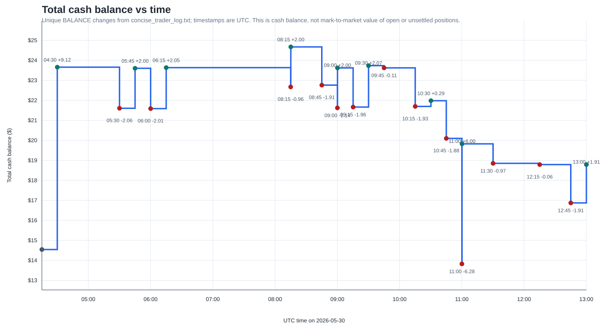

# Overnight Trading Bot Loss Report - 2026-05-30

## Executive Summary

The overnight loss was primarily an execution-recovery failure, not a simple model-selection failure and not something that can be diagnosed by comparing one shared "final price" across Kalshi and Polymarket. The two venues use different spot sources, and the strategy intentionally uses horizon models to predict when cross-venue outcome discrepancies may happen. Model-flipped exits are part of that risk control: they are meant to avoid holding a paired position when the model no longer thinks the discrepancy is tradable.

The concrete failures were:

1. One-legged entries were handled backwards. The bot placed both legs simultaneously, but when only one leg filled it immediately tried to sell the filled leg. It did not first retry the missing hedge leg while the same opportunity still existed.
2. Partial cleanup and emergency exits were exact-size FOK exits. Near expiry, a full-size FOK sell often failed because resting liquidity had moved or disappeared.
3. Emergency-exit retry state was stale. After one exit leg sold successfully, the old code did not decrement that leg's remaining size, so later retries could attempt to sell an already-exited side.
4. The bot entered too close to expiry. The 12:14 and 12:59 cleanup loops had less than a minute to recover, and the Kalshi exit book vanished before cleanup could complete.
5. Some model-flip exits realized losses. That is expected behavior when the model decides a position has become unsafe, but the exit machinery must avoid turning that risk-control decision into repeated stale-leg sells or stranded one-leg exposure.

The first visible balance was $14.5414 at 04:15:14 UTC. A +$9.1166 Polymarket cash credit appeared at 04:30:04 UTC with no visible prior trade in the concise log, so it is best treated as pre-existing settlement or a balance refresh outside the visible log window. After that credit, cash fell from $23.6580 to $18.7875, a loss of $4.8705. From the high-water mark of $24.6706 at 08:15:11 UTC, final cash was down $5.8831.

I patched both `../cli_trader_v2.py` and the copied `cli_trader_v2.py` in this directory. The patch keeps simultaneous order placement, keeps model-flip exits enabled by default, blocks entries at or inside the final 30 seconds, retries a missing entry leg up to 10 times while the same arbitrage candidate remains profitable and liquid, tracks residual exit quantities, and uses gradual emergency-exit chunks.

## Portfolio Value Plot

The plot is the combined `BALANCE` cash total from `concise_trader_log.txt`. It is not full mark-to-market portfolio value: open contracts and pending settlement credits are only visible after exchange balances report them.



## Balance Change Ledger

| UTC time | Total | Delta | What happened |
|---|---:|---:|---|
| 04:15:14 | $14.5414 | - | First recorded balance after start. No trade had occurred in the visible concise log. |
| 04:30:04 | $23.6580 | +$9.1166 | Polymarket cash jumped with no preceding in-log trade. Best explanation is pre-existing settlement or balance refresh. |
| 05:30:04 | $21.6025 | -$2.0555 | 05:27 `NK+P` trade cost hit balance after earlier partial cleanup attempts. |
| 05:45:03 | $23.6025 | +$2.0000 | Delayed payout/settlement. Net from 04:30 to 05:45 was -$0.0555. |
| 06:00:04 | $21.5879 | -$2.0146 | 05:57 `NK+P` entry cost hit balance after two failed/cleaned partial attempts. |
| 06:15:03 | $23.6342 | +$2.0463 | Delayed payout/credit. Net from 05:45 to 06:15 was +$0.0317. |
| 08:15:03 | $22.6706 | -$0.9636 | 08:10 `NK+P` position was emergency-exited after the model flipped. Exit proceeds were weak versus entry cost. |
| 08:15:11 | $24.6706 | +$2.0000 | Delayed Kalshi credit/settlement arrived a few seconds later. This was the run high-water mark. |
| 08:45:03 | $22.7615 | -$1.9091 | 08:42 `K+NP` held to expiry and lost cash. |
| 09:00:04 | $21.6206 | -$1.1409 | 08:55 and 08:58 `K+NP` positions were churned through model-flip exits and partial cleanup. |
| 09:00:11 | $23.6206 | +$2.0000 | Delayed credit restored part of the 09:00 drawdown. |
| 09:15:13 | $21.6629 | -$1.9577 | 09:12 `NK+P` entry cost hit balance after partial cleanup noise. |
| 09:30:04 | $23.7351 | +$2.0722 | Settlement/credit. Net from 09:00:11 to 09:30:04 was +$0.1145. |
| 09:45:03 | $23.6220 | -$0.1131 | 09:41 `K+NP` was emergency-exited at 90c combined against 93c all-in. Small realized loss. |
| 10:15:05 | $21.6954 | -$1.9266 | 10:13 `NK+P` cost hit near expiry. Payout attribution is mixed with later overlapping trades. |
| 10:30:13 | $21.9821 | +$0.2867 | Net of settlements plus 10:25 and 10:29 entries. Positive cash flow, but attribution is mixed. |
| 10:45:03 | $20.0989 | -$1.8832 | 10:44 `K+NP` entered with only about 35 seconds left and then expired. Significant loss event. |
| 11:00:04 | $13.8235 | -$6.2754 | 10:56 `K+NP` triggered repeated incomplete emergency exits and stale residual handling. Largest temporary drawdown. |
| 11:00:13 | $19.8235 | +$6.0000 | Delayed credits restored most, but not all, of the 11:00 cash drop. Net from 10:45 to 11:00 was -$0.2754. |
| 11:30:06 | $18.8514 | -$0.9721 | 11:27 `K+NP` exit sold Polymarket NO once at 37c but could not exit Kalshi YES; retries kept targeting stale residuals until expiry. |
| 12:15:04 | $18.7868 | -$0.0646 | 12:14 one-legged Kalshi YES fill could not be cleaned up before expiry. |
| 12:45:03 | $16.8731 | -$1.9137 | 12:42 `NK+P` entry cost hit balance. |
| 13:00:04 | $18.7875 | +$1.9144 | Delayed payout/credit from late positions. Final balance was $18.7875. |

## Trade Outcome Summary

The table below treats "captured" as realized cash behavior in the log, not as proof that a deterministic cross-venue settlement identity existed. Because Kalshi and Polymarket use different spot sources, a pair that looks cheap from order books is still exposed to basis/model risk. The model may intentionally select such cases; the execution code must then keep the downside small.

| UTC entry | Pair | All-in | Outcome |
|---|---|---:|---|
| 05:27:17 | `NK+P` | 92.2c | Nearly flat/slightly negative cash window after partial cleanup slippage: -$0.0555 from 04:30 to 05:45. |
| 05:57:22 | `NK+P` | 92.9c | Successfully captured small gain: +$0.0317 from 05:45 to 06:15. |
| 08:10:01 | `NK+P` | 92.5c | Not captured. Model flipped and emergency exit sold at weak combined proceeds. |
| 08:42:04 | `K+NP` | 95.4c | Not captured. Held to expiry and balance dropped about $1.91. |
| 08:55:05 | `K+NP` | 83.7c | Not captured. Model-flip exit sold Kalshi YES at 5.1c and Polymarket NO at 51c. |
| 08:58:14 | `K+NP` | 81.9c | Not captured. Re-entry after partial cleanup, then model-flip exit at roughly 62c combined. |
| 09:12:07 | `NK+P` | 89.8c | Captured gain in cash window: +$0.1145 from 09:00:11 to 09:30:04. |
| 09:41:05 | `K+NP` | 93.0c | Not captured. Emergency exit at 90c combined before fees. |
| 10:13:41 | `NK+P` | 96.3c | Mixed attribution because later trades overlapped settlement. |
| 10:25:43 | `NK+P` | 92.5c | Not cleanly captured. Model-flip exit at roughly 88c combined. |
| 10:29:16 | `NK+P` | 54.9c | Positive combined cash window with the 10:25 settlement, but entered very late. |
| 10:44:25 | `K+NP` | 93.6c | Not captured. Entered around 35 seconds before close and expired into a large cash loss. |
| 10:56:29 | `K+NP` | 90.6c | Not captured. Emergency-exit residual accounting caused repeated failed/stale-leg retries. |
| 11:27:01 | `K+NP` | 89.6c | Not captured. Polymarket exited once; Kalshi exit failed until expiry. |
| 12:42:02 | `NK+P` | 95.5c | Roughly offset by later payout, but late-window risk remained. |
| 12:59:06 | partial `NK+P` attempt | - | One-legged Kalshi NO fill could not be cleaned up before expiry; delayed payout offset prior 12:42 cash drop. |

The successful profit captures were small: 05:57 and 09:12 are the clearest positive windows, with 10:25/10:29 mixed and harder to attribute. The failed opportunities were not failed because a single "final price" landed in a target gap; that framing is too simple for two different spot sources. They failed because model-driven entries/exits and live execution left the bot exposed to poor exit prices, missing hedge legs, and stale residual retries.

## Clarification: "Gap-Exposed Directional Bets"

My earlier wording that several "arbs" were actually gap-exposed directional bets was imprecise. The better statement is:

The bot was not executing risk-free arbitrage. It was executing model-approved paired bets whose payoff can diverge across venues because Kalshi and Polymarket settle against different references. A cheap `K YES + Polymarket NO` or `K NO + Polymarket YES` pair is only a true arbitrage under stronger assumptions than the bot can rely on live. The horizon model is the right place to estimate that discrepancy risk; hard-coded target-overlap or source-spread rules alone are not accurate enough and should not replace the model.

The code changes therefore do not add a target-overlap/source-divergence hard filter. They focus on the real operational failure: keeping a model-approved position paired, exiting gradually when the model says to exit, and never letting stale state turn one risky exit into multiple risky exits.

## Root Cause In Code

### 1. One-Leg Entry Failure Went Directly To Cleanup

`execute_entry()` placed Kalshi and Polymarket orders concurrently. That part is desirable and is preserved. The old failure path was:

```text
place both orders simultaneously
if one side fills and the other side fails:
    immediately sell the filled side
    if sell fails:
        create partial_position(needs_exit=True)
```

That is too aggressive. If the same arbitrage candidate is still profitable and liquid, the safer first recovery step is to retry the missing hedge leg. The old code instead locked in exit slippage or stranded the filled side near expiry.

The patch changes the path to:

```text
place both orders simultaneously
if one side fills and the other side fails:
    retry the missing side up to 10 times
    each retry requires the same candidate name and fee-adjusted profitability
    each retry rechecks fresh ask liquidity, minimum order size, and Polymarket notional minimum
    only after retries stop/fail, attempt to exit the filled residual
```

### 2. Exact-Size FOK Exits Were Brittle

`kalshi_exit_position()` and `polymarket_exit_position()` sell at the best bid that can satisfy the requested size. If the book cannot satisfy the whole requested size, the FOK order fails. That is correct behavior for a full-size FOK, but it is bad recovery behavior near expiry.

This caused:

- Kalshi HTTP 409 `fill_or_kill_insufficient_resting_volume`.
- Polymarket `"order couldn't be fully filled. FOK orders are fully filled or killed."`
- `Kalshi YES/NO exit liquidity 0 < 2`.

The patch allows emergency exits to work in chunks with `EMERGENCY_EXIT_MAX_CHUNK_CONTRACTS`, defaulting to 1 contract. It also tracks `KALSHI_MIN_ORDER_CONTRACTS` and `POLYMARKET_MIN_EXIT_CONTRACTS` so a chunk below venue minimum is not submitted.

### 3. Emergency Exit Did Not Decrement Successful Legs

The old `execute_emergency_exit()` returned incomplete if either venue failed, but it did not subtract the successful side from the tracked residual. Evidence:

- At 10:57:00, Polymarket NO sold successfully once at 58c.
- Later retries kept trying to sell Polymarket NO and hit balance/allowance errors.
- The same 10:56 position logged multiple successful Kalshi YES sells at 10c, 7.1c, 7.1c, and 4.8c during repeated incomplete exits.
- At 11:29:09, Polymarket NO sold once at 37c, then retries kept trying to sell Polymarket NO even though balance was zero.

This could compound gains/losses because a retry loop may attempt to liquidate a leg that is already gone. Even when the exchange prevents an extra sell, the stale state keeps the bot focused on the wrong action until expiry.

The patch records successful exit fill counts with `exit_filled_contracts()` and decrements `position["kalshi_contracts"]` or `position["polymarket_contracts"]` after each successful leg.

### 4. Late Entries Left No Time For Recovery

The bot entered at 10:44:25 for a 10:45:00 close, then at 12:14:28 for a 12:15:00 close, and again at 12:59:06 for a 13:00:00 close. Those trades had no practical recovery window after a one-leg fill or FOK failure.

The patch adds `MIN_ENTRY_SECONDS_TO_EXPIRY=30` and applies it in both the main run loop and the preflight/retry path. Entries at or inside 30 seconds to expiry are skipped. If this still proves too tight after live dry-run, raise the environment variable rather than changing code.

### 5. Model-Flip Exits Should Stay, But Be Safer

The log shows losses when model-flip exits sold at poor prices, for example 08:55, 08:58, 09:41, 10:25, and 10:56. That does not mean the model-flip exit should be removed. Given the strategy, it is a risk-control signal intended to avoid losing both legs when the model no longer supports the discrepancy.

The fix is to make model-flip exits mechanically safer:

- exit in chunks instead of requiring full-size best-price liquidity all at once;
- track residuals after each successful leg;
- stop retrying already-exited sides;
- keep re-entry blocked while an unresolved partial position exists.

## `PARTIAL CLEANUP EXIT INCOMPLETE`

These cleanups happened because entry became one-legged. The bot had bought one venue's contract, failed to buy the matching hedge on the other venue, and then tried to close the filled leg.

Detailed sequence:

1. `execute_entry()` submitted both entry orders concurrently.
2. One exchange filled and the other returned an exception or no fill.
3. Old code immediately tried an exact-size FOK sell of the filled side.
4. The FOK cleanup failed because full-size exit liquidity was not resting at the selected price, the token balance was still reserved, or the market was too close to expiry.
5. The bot set `needs_exit=True` and retried cleanup roughly every two seconds until it completed or the market expired.

Specific cases:

| UTC time | What caused cleanup | What happened |
|---|---|---|
| 05:27 | Polymarket YES filled while Kalshi failed. | First cleanup had balance/allowance problems, then FOK failed, then cleanup completed at 80c before a later full entry succeeded. |
| 08:58 | Kalshi YES filled while Polymarket failed. | First Kalshi cleanup failed with HTTP 409 FOK insufficient resting volume, then completed at 4c. |
| 12:14 | Kalshi YES filled while Polymarket failed. | Filled at 12:14:28 UTC, about 31 seconds before expiry. Cleanup failed repeatedly with HTTP 409, then with Kalshi YES exit liquidity 0 < 2, until expiry. |
| 12:59 | Kalshi NO filled while Polymarket failed. | Filled at 12:59:06 UTC, about 54 seconds before expiry. Cleanup failed repeatedly with HTTP 409, then with Kalshi NO exit liquidity 0 < 2, until expiry. |

The reason for the 12:14 and 12:59 cleanups is therefore not that the model wanted to close a normal hedged trade. They were emergency cleanup attempts for a one-legged entry. The missing Polymarket leg failed, so the bot tried to sell the filled Kalshi leg. Because the market was close to expiry and FOK required the full size, Kalshi could not sell the full two-contract residual.

The patch avoids the worst version of this by retrying the missing hedge leg first. Only if the same candidate no longer remains profitable/liquid, or the 10 retries fail, does the bot try to unwind the filled leg. If unwind is still needed, subsequent emergency exits can proceed in smaller chunks and residual state is updated after each successful leg.

## Errors And PnL Impact

| Error pattern | Meaning | Did it compound gains/losses? |
|---|---|---|
| Kalshi HTTP 409 `fill_or_kill_insufficient_resting_volume` | The requested full-size FOK order could not execute against resting volume. | Yes. It left one-legged cleanup and model exits unresolved near expiry. |
| Polymarket FOK not fully filled | Same failure mode on Polymarket. | Yes. It blocked immediate cleanup/emergency exit and forced retries at later prices. |
| Polymarket not enough balance/allowance | Tokens were reserved, unsettled, already sold, or smaller than the requested sell. | Mostly operational, but it delayed cleanup and exposed stale residual tracking. |
| Conditional balance/allowance below exit size | The code attempted to sell more Polymarket conditional tokens than were still available. | Yes as a symptom. It shows the bot retried already-exited Polymarket legs. |
| Exit liquidity 0 < 2 | No displayed bid depth for the full two-contract residual. | Yes. Exact-size exits became impossible near expiry. |

The errors did not create the model signal, and they did not explain the whole overnight PnL by themselves. They compounded losses by delaying exits, preventing one-legged cleanup, and allowing stale retry state to keep firing at already-exited or no-liquidity legs.

## Fixes Applied

Applied to both `../cli_trader_v2.py` and `cli_trader_v2.py` in this directory:

1. Kept simultaneous entry placement.
   - The initial Kalshi and Polymarket buy orders are still submitted with `asyncio.gather(...)`.

2. Added last-30-seconds entry gating.
   - `MIN_ENTRY_SECONDS_TO_EXPIRY=30` by default.
   - The main run loop skips new entries at or inside the buffer.
   - `preflight_trade()` and `retry_entry_plan()` enforce the same buffer.

3. Added missing-leg entry retries.
   - `ENTRY_MISSING_LEG_RETRY_ATTEMPTS=10` by default.
   - `ENTRY_MISSING_LEG_RETRY_DELAY_SECONDS=0.5` by default.
   - Retries only place the missing side.
   - Retries require the same candidate name (`K+NP` or `NK+P`), current fee-adjusted profitability, fresh liquidity, minimum order size, and Polymarket minimum notional.

4. Added gradual emergency exits.
   - `EMERGENCY_EXIT_MAX_CHUNK_CONTRACTS=1` by default.
   - `KALSHI_MIN_ORDER_CONTRACTS=1`, `POLYMARKET_MIN_ORDER_CONTRACTS=1`, and `POLYMARKET_MIN_EXIT_CONTRACTS=1` are configurable.
   - Exits skip chunks below configured minimums rather than submitting invalid orders.

5. Added residual exit accounting.
   - Successful Kalshi exit fills decrement `position["kalshi_contracts"]`.
   - Successful Polymarket exit fills decrement `position["polymarket_contracts"]`.
   - Future retries only attempt still-open residual legs.

6. Kept model-flip exits enabled.
   - `MODEL_EXIT_ON_NONTRADABLE=1` by default.
   - This preserves the strategy's model-led risk control while making exits less brittle.

7. Removed the earlier target/source hard-filter edits.
   - The revised patch does not rely on target overlap or source divergence as a substitute for the horizon model.

## Remaining Recommendations

1. Run the patched code in dry-run for a full overnight window and inspect every `ENTRY SKIP`, retry, and emergency-exit line.
2. Persist active positions and residual counts to disk so a process restart cannot forget one-legged exposure.
3. Add exchange reconciliation at startup: query Kalshi positions and Polymarket conditional balances before placing new orders.
4. Add trade IDs to balance logs so delayed settlement credits can be attributed to a specific entry.
5. Consider raising `MIN_ENTRY_SECONDS_TO_EXPIRY` above 30 if live logs still show fills with too little recovery time.
6. Keep size at one contract until the missing-leg retry and residual accounting paths are observed live.

## Verification

- `portfolio_value_timeline.svg` was generated from `concise_trader_log.txt`.
- The report was regenerated from the concise log, with CSVs used as supporting context where needed.
- `python3 -m py_compile cli_trader_v2.py` passes for both the root file and the copied file in this directory.
- `diff -u ../cli_trader_v2.py cli_trader_v2.py` shows the two patched files are identical.
