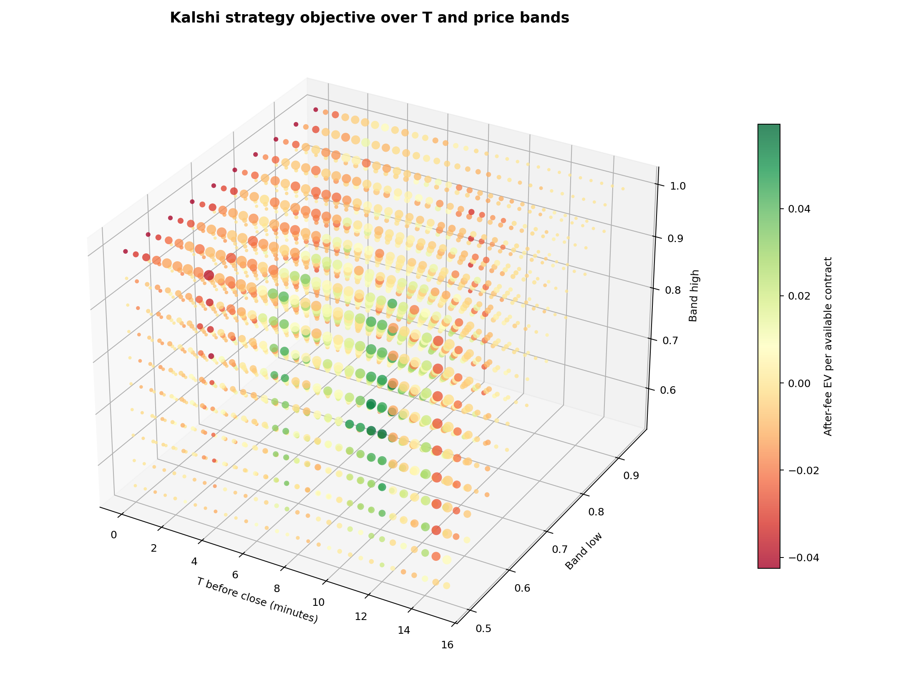
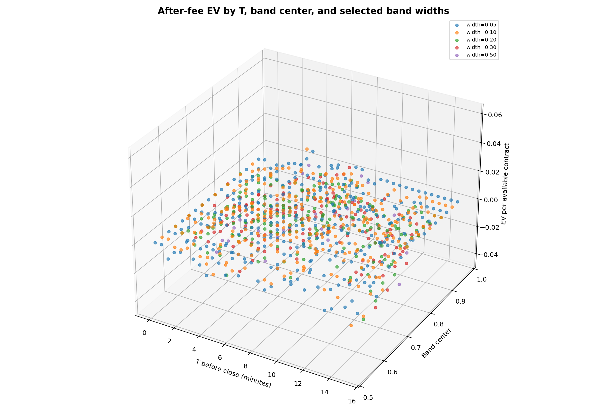
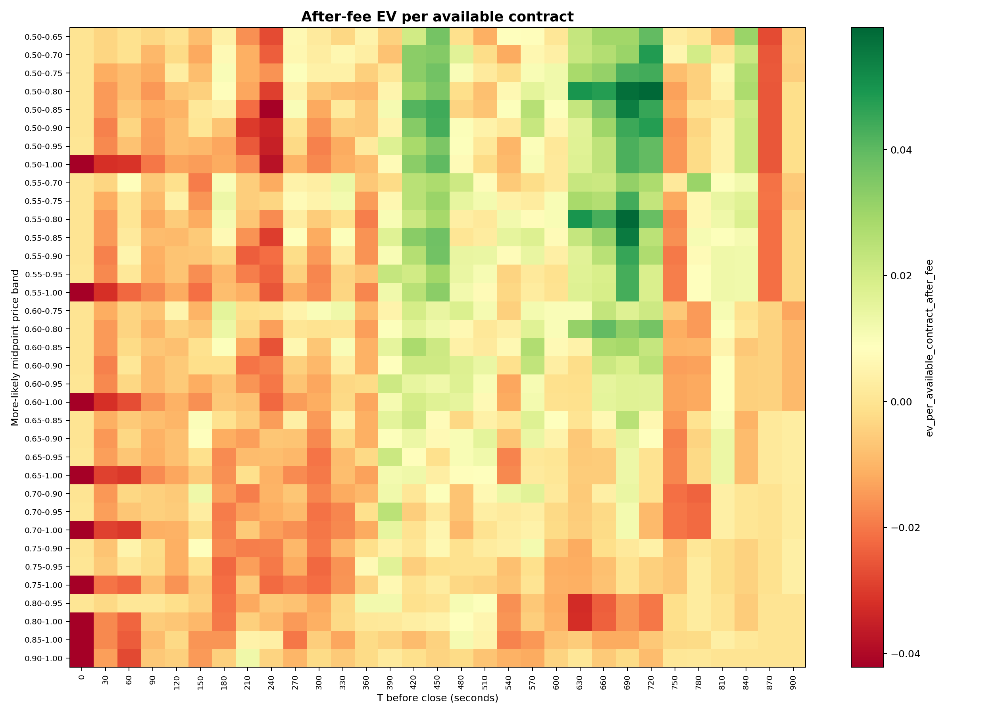
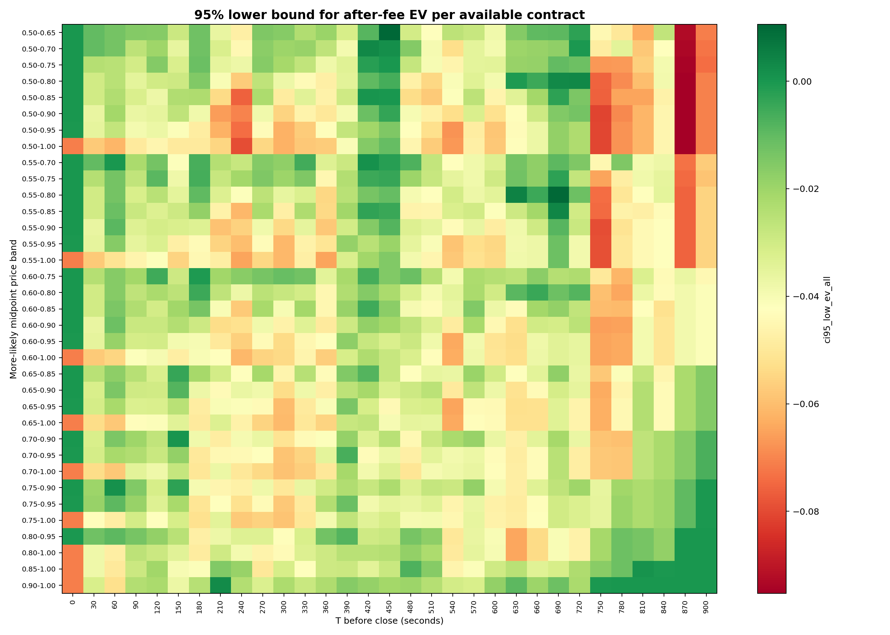
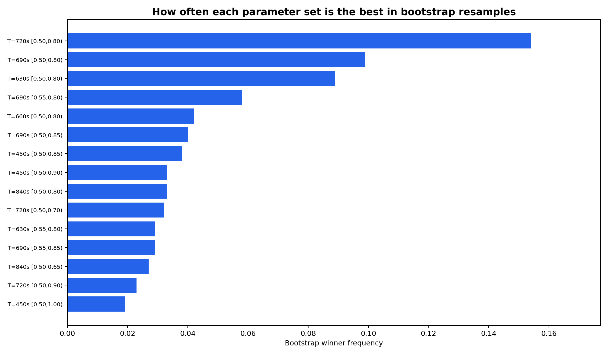
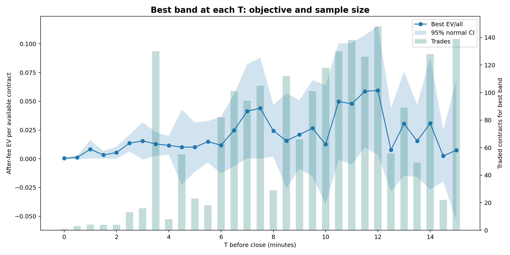

# Kalshi More-Likely Strategy Parameter Optimization

Date: 2026-06-04

## Executive Summary

Objective metric: **after-fee EV per available contract**, not per traded contract. A skipped contract contributes `0`, so the score is:

```text
objective = sum(realized after-fee P&L over traded contracts) / total contracts in dataset
```

This matches the intended optimization target: maximize average profit opportunity across all contracts, while accounting for both profitability and trade frequency.

Main result:

- Raw best parameter set: `T=720s [0.50,0.80)`, objective `+0.0594` per available contract.
- Best 95% lower-bound parameter set with at least `20` trades: `T=450s [0.50,0.65)`, lower bound `+0.0106`.
- Stability-adjusted recommendation: `T=630s [0.55,0.80)`, objective `+0.0496`, local-min `+0.0027`, bootstrap P(EV>0) `98.40%`.
- Current live default-like strategy `T=600s [0.60,0.80)` scores `+0.0101` per available contract after fees, with `80` trades and `68.70%` bootstrap P(EV>0).

The raw optimum is useful, but the stable optimum is the safer trading candidate. The raw best has the highest point estimate, but nearby parameter sets include negative outcomes. The stability-adjusted recommendation sacrifices some point-estimate EV for a fully positive local neighborhood.

## Method

Input data:

- Source: `p-0604-research/data/*.csv`
- Contract files: `186`
- Raw rows: `30,095`
- Valid entry observations after quote/liquidity checks: `5,184`

Strategy family:

1. Choose a time `T` from `0` to `900` seconds before expiry, in 30-second steps.
2. At `T`, choose the Kalshi more-likely side from midpoint:
   - YES if `kalshi_yes_mid >= 0.5`
   - NO otherwise
3. Define `p = max(kalshi_yes_mid, 1 - kalshi_yes_mid)`.
4. Trade if `p` is inside a price band `[low, high)`.
5. Buy the selected side at its best ask.
6. Require at least `2` contracts of derived best-ask liquidity.
7. Reject invalid Kalshi books, including complement-crossed books where `yes_bid + no_bid > 1`.

Fee and P&L:

```text
fee = 0.07 * cost * (1 - cost)
win P&L = 1 - cost - fee
loss P&L = -cost - fee
```

Every table below reports the objective as **EV per available contract after fees** unless explicitly labeled per-traded-contract.

Uncertainty:

- Normal 95% intervals are computed on the full per-contract P&L vector, including zeros for skipped contracts.
- Bootstrap uses `1000` contract-level resamples.
- `bootstrap P(EV>0)` estimates how often a parameter set remains profitable under resampling.
- `bootstrap winner frequency` estimates how often a parameter set is the raw best in resampled datasets.
- Local stability compares neighboring parameters within `±60s` and `±0.05` on both band endpoints.

## Visualizations

### 3D Objective Scatter



Axes are `T`, band low, and band high. Color is after-fee EV per available contract. Marker size is trade rate.

### 3D Width View



This plot slices by selected band widths and shows how the objective changes with `T` and band center.

### Profit Heatmap



Only the 35 most active bands are shown to keep labels readable. Values are after-fee EV per available contract.

### Lower Confidence Bound Heatmap



This shows the 95% lower confidence bound on the objective. It is more conservative than the point estimate.

### Bootstrap Winners



A stable optimum should win frequently or at least appear near other positive, high-confidence parameter sets. A low winner frequency means the top point estimate is fragile.

### Best Band At Each T



This shows the best point-estimate band at each `T`, with the 95% normal confidence interval and trade count.

## Top Parameter Sets By Point Estimate

| label | n_traded | trade_rate | ev_per_available_contract_after_fee | ci95_low_ev_all | ci95_high_ev_all | ev_per_traded_contract_after_fee | success_rate_traded | avg_cost_traded | bootstrap_prob_ev_positive | bootstrap_raw_winner_frequency |
| --- | --- | --- | --- | --- | --- | --- | --- | --- | --- | --- |
| T=720s [0.50,0.80) | 148 | 79.57% | +0.0594 | +0.0034 | +0.1154 | +0.0747 | 74.32% | +0.6532 | 98.10% | 15.40% |
| T=690s [0.55,0.80) | 126 | 67.74% | +0.0586 | +0.0099 | +0.1074 | +0.0866 | 78.57% | +0.6844 | 99.10% | 5.80% |
| T=690s [0.50,0.80) | 150 | 80.65% | +0.0577 | +0.0027 | +0.1126 | +0.0715 | 74.67% | +0.6599 | 97.60% | 9.90% |
| T=690s [0.55,0.85) | 141 | 75.81% | +0.0554 | +0.0039 | +0.1069 | +0.0730 | 78.72% | +0.6999 | 98.50% | 2.90% |
| T=690s [0.50,0.85) | 165 | 88.71% | +0.0544 | -0.0030 | +0.1118 | +0.0613 | 75.15% | +0.6755 | 96.70% | 4.00% |
| T=630s [0.50,0.80) | 130 | 69.89% | +0.0497 | -0.0008 | +0.1003 | +0.0711 | 75.38% | +0.6678 | 96.90% | 8.90% |
| T=630s [0.55,0.80) | 110 | 59.14% | +0.0496 | +0.0047 | +0.0945 | +0.0839 | 79.09% | +0.6925 | 98.40% | 2.90% |
| T=720s [0.50,0.70) | 102 | 54.84% | +0.0481 | -0.0006 | +0.0968 | +0.0877 | 71.57% | +0.6116 | 97.70% | 3.20% |
| T=660s [0.50,0.80) | 138 | 74.19% | +0.0478 | -0.0051 | +0.1007 | +0.0644 | 74.64% | +0.6669 | 95.60% | 4.20% |
| T=720s [0.50,0.90) | 175 | 94.09% | +0.0477 | -0.0131 | +0.1084 | +0.0507 | 74.86% | +0.6835 | 94.30% | 2.30% |
| T=690s [0.55,0.90) | 151 | 81.18% | +0.0455 | -0.0088 | +0.0998 | +0.0560 | 78.15% | +0.7116 | 95.80% | 0.50% |
| T=720s [0.50,0.85) | 163 | 87.63% | +0.0454 | -0.0145 | +0.1054 | +0.0518 | 73.62% | +0.6694 | 93.30% | 0.80% |
| T=690s [0.50,0.90) | 175 | 94.09% | +0.0445 | -0.0154 | +0.1045 | +0.0473 | 74.86% | +0.6869 | 92.40% | 0.50% |
| T=450s [0.50,0.85) | 105 | 56.45% | +0.0439 | -0.0000 | +0.0879 | +0.0778 | 80.00% | +0.7084 | 96.90% | 3.80% |
| T=720s [0.50,0.75) | 134 | 72.04% | +0.0437 | -0.0120 | +0.0995 | +0.0607 | 71.64% | +0.6399 | 93.50% | 0.00% |

## Top Parameter Sets By 95% Lower Confidence Bound

| label | n_traded | trade_rate | ev_per_available_contract_after_fee | ci95_low_ev_all | ci95_high_ev_all | ev_per_traded_contract_after_fee | success_rate_traded | avg_cost_traded | bootstrap_prob_ev_positive | bootstrap_raw_winner_frequency |
| --- | --- | --- | --- | --- | --- | --- | --- | --- | --- | --- |
| T=450s [0.50,0.65) | 32 | 17.20% | +0.0365 | +0.0106 | +0.0624 | +0.2122 | 81.25% | +0.5834 | 99.70% | 0.70% |
| T=690s [0.55,0.80) | 126 | 67.74% | +0.0586 | +0.0099 | +0.1074 | +0.0866 | 78.57% | +0.6844 | 99.10% | 5.80% |
| T=390s [0.90,0.95) | 33 | 17.74% | +0.0123 | +0.0084 | +0.0161 | +0.0691 | 100.00% | +0.9261 | 100.00% | 0.00% |
| T=480s [0.85,0.90) | 22 | 11.83% | +0.0135 | +0.0082 | +0.0189 | +0.1143 | 100.00% | +0.8782 | 100.00% | 0.00% |
| T=450s [0.55,0.65) | 25 | 13.44% | +0.0300 | +0.0077 | +0.0522 | +0.2229 | 84.00% | +0.6004 | 99.50% | 0.00% |
| T=210s [0.95,1.00) | 101 | 54.30% | +0.0077 | +0.0060 | +0.0093 | +0.0141 | 100.00% | +0.9849 | 100.00% | 0.00% |
| T=690s [0.55,0.60) | 22 | 11.83% | +0.0266 | +0.0049 | +0.0483 | +0.2247 | 81.82% | +0.5764 | 99.30% | 0.00% |
| T=630s [0.55,0.80) | 110 | 59.14% | +0.0496 | +0.0047 | +0.0945 | +0.0839 | 79.09% | +0.6925 | 98.40% | 2.90% |
| T=690s [0.55,0.85) | 141 | 75.81% | +0.0554 | +0.0039 | +0.1069 | +0.0730 | 78.72% | +0.6999 | 98.50% | 2.90% |
| T=720s [0.50,0.80) | 148 | 79.57% | +0.0594 | +0.0034 | +0.1154 | +0.0747 | 74.32% | +0.6532 | 98.10% | 15.40% |
| T=420s [0.50,0.70) | 42 | 22.58% | +0.0331 | +0.0033 | +0.0629 | +0.1465 | 76.19% | +0.5988 | 99.10% | 0.60% |
| T=420s [0.95,1.00) | 37 | 19.89% | +0.0047 | +0.0032 | +0.0062 | +0.0238 | 100.00% | +0.9745 | 100.00% | 0.00% |
| T=690s [0.50,0.80) | 150 | 80.65% | +0.0577 | +0.0027 | +0.1126 | +0.0715 | 74.67% | +0.6599 | 97.60% | 9.90% |
| T=630s [0.75,0.80) | 33 | 17.74% | +0.0213 | +0.0027 | +0.0400 | +0.1203 | 90.91% | +0.7767 | 98.90% | 0.00% |
| T=450s [0.95,1.00) | 30 | 16.13% | +0.0042 | +0.0027 | +0.0057 | +0.0259 | 100.00% | +0.9723 | 100.00% | 0.00% |

## Top Stability-Eligible Parameter Sets

These rows have at least `20` trades, a locally positive neighborhood, and no negative local neighbor under the `±60s` / `±0.05` endpoint perturbation rule.

| label | n_traded | ev_per_available_contract_after_fee | ci95_low_ev_all | local_mean_ev_all | local_min_ev_all | local_positive_fraction | stability_score | bootstrap_prob_ev_positive |
| --- | --- | --- | --- | --- | --- | --- | --- | --- |
| T=630s [0.55,0.80) | 110 | +0.0496 | +0.0047 | +0.0259 | +0.0027 | 100.00% | -0.0114 | 98.40% |
| T=630s [0.65,0.80) | 70 | +0.0270 | -0.0063 | +0.0149 | +0.0000 | 100.00% | -0.0163 | 94.50% |
| T=630s [0.50,0.80) | 130 | +0.0497 | -0.0008 | +0.0290 | +0.0027 | 100.00% | -0.0184 | 96.90% |
| T=660s [0.60,0.80) | 104 | +0.0393 | -0.0044 | +0.0219 | +0.0000 | 100.00% | -0.0190 | 96.40% |
| T=660s [0.55,0.80) | 118 | +0.0427 | -0.0049 | +0.0299 | +0.0046 | 100.00% | -0.0208 | 96.10% |
| T=660s [0.50,0.80) | 138 | +0.0478 | -0.0051 | +0.0342 | +0.0073 | 100.00% | -0.0215 | 95.60% |
| T=630s [0.60,0.80) | 92 | +0.0315 | -0.0089 | +0.0199 | +0.0000 | 100.00% | -0.0235 | 93.40% |
| T=660s [0.55,0.75) | 89 | +0.0264 | -0.0177 | +0.0275 | +0.0014 | 100.00% | -0.0339 | 87.70% |
| T=660s [0.50,0.75) | 109 | +0.0315 | -0.0184 | +0.0318 | +0.0018 | 100.00% | -0.0347 | 88.00% |
| T=660s [0.50,0.85) | 155 | +0.0359 | -0.0210 | +0.0333 | +0.0036 | 100.00% | -0.0388 | 88.10% |
| T=630s [0.50,0.85) | 148 | +0.0228 | -0.0342 | +0.0286 | +0.0036 | 100.00% | -0.0519 | 79.20% |
| T=600s [0.50,0.85) | 139 | +0.0093 | -0.0457 | +0.0198 | +0.0017 | 100.00% | -0.0596 | 62.60% |

## Best Band At Each T

| label | n_traded | ev_per_available_contract_after_fee | ci95_low_ev_all | success_rate_traded | avg_cost_traded |
| --- | --- | --- | --- | --- | --- |
| T=0s [0.70,0.95) | 1 | +0.0004 | -0.0004 | 100.00% | +0.9220 |
| T=30s [0.90,0.95) | 3 | +0.0012 | -0.0002 | 100.00% | +0.9237 |
| T=60s [0.55,0.65) | 4 | +0.0082 | +0.0002 | 100.00% | +0.6025 |
| T=90s [0.80,0.85) | 4 | +0.0033 | +0.0001 | 100.00% | +0.8350 |
| T=120s [0.70,0.75) | 4 | +0.0053 | +0.0001 | 100.00% | +0.7400 |
| T=150s [0.70,0.85) | 13 | +0.0136 | +0.0063 | 100.00% | +0.7946 |
| T=180s [0.60,0.75) | 16 | +0.0155 | -0.0006 | 87.50% | +0.6794 |
| T=210s [0.90,1.00) | 130 | +0.0129 | +0.0025 | 99.23% | +0.9720 |
| T=240s [0.65,0.75) | 8 | +0.0116 | +0.0037 | 100.00% | +0.7163 |
| T=270s [0.50,0.85) | 55 | +0.0101 | -0.0226 | 76.36% | +0.7162 |
| T=300s [0.60,0.75) | 23 | +0.0101 | -0.0112 | 78.26% | +0.6857 |
| T=330s [0.60,0.70) | 18 | +0.0148 | -0.0033 | 83.33% | +0.6650 |
| T=360s [0.80,0.95) | 82 | +0.0118 | -0.0129 | 92.68% | +0.8935 |
| T=390s [0.70,0.95) | 101 | +0.0248 | -0.0064 | 90.10% | +0.8466 |
| T=420s [0.50,0.85) | 94 | +0.0413 | +0.0005 | 79.79% | +0.7022 |
| T=450s [0.50,0.85) | 105 | +0.0439 | -0.0000 | 80.00% | +0.7084 |
| T=480s [0.60,0.70) | 29 | +0.0244 | +0.0019 | 82.76% | +0.6555 |
| T=510s [0.65,0.90) | 112 | +0.0156 | -0.0256 | 83.04% | +0.7934 |
| T=540s [0.70,0.85) | 66 | +0.0210 | -0.0088 | 86.36% | +0.7930 |
| T=570s [0.60,0.85) | 101 | +0.0265 | -0.0153 | 80.20% | +0.7401 |
| T=600s [0.50,0.80) | 118 | +0.0125 | -0.0392 | 69.49% | +0.6601 |
| T=630s [0.50,0.80) | 130 | +0.0497 | -0.0008 | 75.38% | +0.6678 |
| T=660s [0.50,0.80) | 138 | +0.0478 | -0.0051 | 74.64% | +0.6669 |
| T=690s [0.55,0.80) | 126 | +0.0586 | +0.0099 | 78.57% | +0.6844 |
| T=720s [0.50,0.80) | 148 | +0.0594 | +0.0034 | 74.32% | +0.6532 |
| T=750s [0.60,0.70) | 56 | +0.0077 | -0.0285 | 69.64% | +0.6552 |
| T=780s [0.55,0.70) | 89 | +0.0305 | -0.0148 | 70.79% | +0.6279 |
| T=810s [0.65,0.75) | 49 | +0.0154 | -0.0158 | 77.55% | +0.7024 |
| T=840s [0.50,0.65) | 128 | +0.0308 | -0.0267 | 63.28% | +0.5711 |
| T=870s [0.65,0.75) | 22 | +0.0024 | -0.0199 | 72.73% | +0.6918 |
| T=900s [0.50,0.60) | 139 | +0.0074 | -0.0537 | 58.27% | +0.5556 |

## Interpretation

The optimization surface is not smooth enough to trust a single point estimate blindly. The profitable area is concentrated in moderate-confidence bands, not in the highest-confidence `0.9-1.0` region. This is consistent with the earlier backtest: very high confidence is directionally accurate, but the ask price is usually too expensive after fees.

The raw best, `T=720s [0.50,0.80)`, has strong average EV and wins the most bootstrap resamples, but its local minimum is negative. The stable recommendation, `T=630s [0.55,0.80)`, has lower point-estimate EV but a positive local minimum and a 100% locally positive neighborhood in this grid.

The objective definition changes the ranking materially. A high per-traded-contract EV band can still be weak if it trades rarely. Conversely, a slightly lower per-trade edge can be superior if it appears across many contracts.

The stability-adjusted candidate is preferable to the raw winner because it has:

- positive point-estimate EV per available contract,
- a positive or less fragile lower confidence bound,
- enough trades to avoid tiny-sample artifacts,
- a positive local neighborhood rather than a single isolated spike.

## Recommendation

Use `T=630s [0.55,0.80)` as the first candidate for paper/live shadow validation, not the raw winner. Keep the current `T=600s [0.60,0.80)` rule as a baseline because it remains profitable after fees in this dataset and is simpler, but the optimizer suggests that a slightly earlier entry and broader lower band may improve all-contract EV.

Before increasing size:

1. Run the Kalshi trader in dry-run/shadow mode and compare realized fills to backtest assumed best asks.
2. Track realized slippage and rejected orderbooks separately.
3. Re-run this optimizer daily as new contracts are added.
4. Require the selected parameter set to remain positive on the all-contract after-fee objective for multiple non-overlapping date blocks.
5. Keep `--contracts 2` until the live fill distribution confirms enough liquidity at the selected band.

## Artifacts

- Grid CSV: `kalshi_strategy_optimization_grid.csv`
- Summary JSON: `kalshi_strategy_optimization_summary.json`
- Plots: `plots/kalshi_strategy_*`
